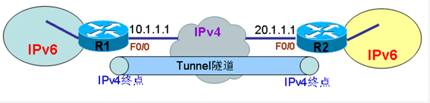
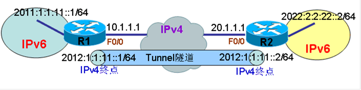
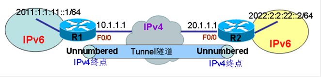

# IPv6隧道

IPv6隧道

2011年6月27日

17:32

**IPv6隧道**

> 如上图所示，当两个IPv6网络需要通信时，如果中间需要穿越IPv4网络，而由于IPv4网络中只能识别IPv4包头，并不能为IPv6数据提供正确的路径传输，这时就需要在IPv4网络中为IPv6创建一条隧道，来提供IPv6在IPv4中的传递，这样的隧道，就是把IPv6的数据全部封装在IPv4中，将IPv4当作链路层来传递的隧道形式，称为覆盖型隧道（Overlay Tunnels ）。由于隧道是建立在IPv4基础上的，隧道又必须有起点和终点来明确隧道的路径，所以覆盖型隧道的起点和终点最好是使用IPv4地址，有时必须是IPv4地址，并且隧道在传输IPv6数据时，也应该在隧道的两端添加IPv6地址，来完成两端IPv6网络的通信。隧道的起点和终点必须同时支持IPv4和IPv6。
> 
> 
> **当前在IOS中支持的覆盖型隧道共有以下几种：**
> 

**Manual**

**点对点，只传递IPv6数据包。**

**模式为：ipv6ip**

**Generic routing encapsulation (GRE)**

**点对点，可以传递多种协议。**

**模式为：gre ip**

**IPv4-compatible**

**点到多点的，思科不建议使用。**

**模式为：ipv6ip auto-tunnel**

**6to4**

**点到多点的，使用地址为2002::/16。**

**模式为：ipv6ip 6to4**

**Intra-Site Automatic Tunnel Addressing Protocol (ISATAP)**

**是点到多点的。**

**模式为：ipv6ip isatap**

**以上隧道中，所有隧道的源均为IPv4地址，但是只有点对点隧道的终点为IPv4地址,其它都不需要。更多的是，点对点隧道必须要有IPv6地址，点对点隧道如下图：**

**注：CCIE考试中，IPv6隧道的考点为Manual 类型的隧道。**

**配置IPv6隧道：**

**说明：原来R1上的IPv6网络无法与R2上的IPv6网络通信，通过配置IPv6隧道之后，在隧道与相应IPv6接口上启用IPv6路由协议，如OSPFv3，使得两端IPv6网络可以通信。**

**1.初始配置**

**（1）R1初始配置：**

**r1(config)#int f0/0**

**r1(config-if)#ip address 10.1.1.1 255.255.255.0**

**r1(config-if)#exi**

**r1(config)#ip route 0.0.0.0 0.0.0.0 f0/0**

**r1(config)#**

**r1(config)#ipv6 unicast-routing**

**r1(config)#int loopback 0**

**r1(config-if)#ipv6 address 2011:1:1:11::1/64**

**（2）R2初始配置：**

**r2(config)#int f0/1**

**r2(config-if)#ip add 20.1.1.1 255.255.255.0**

**r2(config-if)#exit**

**r2(config)#ip route 0.0.0.0 0.0.0.0 f0/0**

**r2(config)#ipv6 unicast-routing**

**r2(config)#int loopback 0**

**r2(config-if)#ipv6 address 2022:2:2:22::2/64**

**测试IPv4连通性：**

**r1#ping 20.1.1.1**

**Type escape sequence to abort.**

**Sending 5, 100-byte ICMP Echos to 20.1.1.1, timeout is 2 seconds:**

**!!!!!**

**Success rate is 100 percent (5/5), round-trip min/avg/max = 64/108/196 ms**

**r1#**

**说明：R1与R2之间的IPv4连通性正常。**

**2.配置Manual 类型的IPv6隧道**

**（1）在R1上配置IPv6隧道**

**说明：配置的IPv6隧道的类型为Manual 类型，即模式为ipv6ip**

**r1(config)#int tunnel 0**

**r1(config-if)#ipv6 address 2012:1:1:11::1/64**

**r1(config-if)#tunnel source f0/0**

**r1(config-if)#tunnel destination 20.1.1.1**

**r1(config-if)#tunnel mode ipv6ip**

**（2）在R2上配置IPv6隧道**

**r2(config)#int tunnel 0**

**r2(config-if)#ipv6 address 2012:1:1:11::2/64**

**r2(config-if)#tunnel source f0/0**

**r2(config-if)#tunnel destination 10.1.1.1**

**r2(config-if)#tunnel mode ipv6ip**

**(3)查看两端隧道情况**

**r1#sh ipv6 interface brief tunnel 0**

**Tunnel0                    [up/up]**

**FE80::A01:101**

**2012:1:1:11::1**

**r1#**

**r2#show ipv6 interface brief tunnel 0**

**Tunnel0                    [up/up]**

**FE80::1401:101**

**2012:1:1:11::2**

**r2#**

**（4）测试隧道连通性：**

**r1#ping 2012:1:1:11::2**

**Type escape sequence to abort.**

**Sending 5, 100-byte ICMP Echos to 2012:1:1:11::2, timeout is 2 seconds:**

**!!!!!**

**Success rate is 100 percent (5/5), round-trip min/avg/max = 212/279/332 ms**

**r1#**

**说明：隧道通信正常。**

**3.配置IPv6路由协议**

**说明：在路由器之间启用IPv6路由协议，在隧道之上传递两端IPv6网络信息。**

**(1)在R1上配置OSPFv3**

**r1(config)#ipv6 router ospf 2**

**r1(config-rtr)#router-id 1.1.1.1**

**r1(config)#int loopback 0**

**r1(config-if)#ipv6 ospf network point-to-point**

**r1(config-if)#ipv6 ospf 2 area 0**

**r1(config)#int tunnel 0**

**r1(config-if)#ipv6 ospf 2 area 0**

**(2)在R2上配置OSPFv3**

**r2(config)#ipv6 router ospf 2**

**r2(config-rtr)#router-id 2.2.2.2**

**r2(config)#int loopback 0**

**r2(config-if)#ipv6 ospf network point-to-point**

**r2(config-if)#ipv6 ospf 2 area 0**

**r2(config)#int tunnel 0**

**r2(config-if)#ipv6 ospf 2 area 0**

**4.查看结果**

**（1）查看邻居状态**

**R1：**

**r1#show ipv6 ospf neighbor**

**Neighbor ID     Pri   State           Dead Time   Interface ID    Interface**

**2.2.2.2           1   FULL/  -        00:00:31    14              Tunnel0**

**r1#**

**R2：**

**r2#show ipv6 ospf neighbor**

**Neighbor ID     Pri   State           Dead Time   Interface ID    Interface**

**1.1.1.1           1   FULL/  -        00:00:38    14              Tunnel0**

**r2**

**说明：两端OSPFv3邻居正常。**

**（2）查看路由信息**

**R1：**

**r1#show ipv6 route ospf**

**IPv6 Routing Table - 7 entries**

**Codes: C - Connected, L - Local, S - Static, R - RIP, B - BGP**

**U - Per-user Static route**

**I1 - ISIS L1, I2 - ISIS L2, IA - ISIS interarea, IS - ISIS summary**

**O - OSPF intra, OI - OSPF inter, OE1 - OSPF ext 1, OE2 - OSPF ext 2**

**ON1 - OSPF NSSA ext 1, ON2 - OSPF NSSA ext 2**

**D - EIGRP, EX - EIGRP external**

**O   2022:2:2:22::/64 [110/11112]**

**via FE80::1401:101, Tunnel0**

**r1#**

**R2：**

**r2#show ipv6 route ospf**

**IPv6 Routing Table - 7 entries**

**Codes: C - Connected, L - Local, S - Static, R - RIP, B - BGP**

**U - Per-user Static route**

**I1 - ISIS L1, I2 - ISIS L2, IA - ISIS interarea, IS - ISIS summary**

**O - OSPF intra, OI - OSPF inter, OE1 - OSPF ext 1, OE2 - OSPF ext 2**

**ON1 - OSPF NSSA ext 1, ON2 - OSPF NSSA ext 2**

**D - EIGRP, EX - EIGRP external**

**O   2011:1:1:11::/64 [110/11112]**

**via FE80::A01:101, Tunnel0**

**r2#**

**说明：两端通过OSPFv3学习到的IPv6路由正常。**

**5.测试两端IPv6网络通信情况**

**（1）测试R1到R2端IPv6网络的通信情况**

**r1#ping 2022:2:2:22::2**

**Type escape sequence to abort.**

**Sending 5, 100-byte ICMP Echos to 2022:2:2:22::2, timeout is 2 seconds:**

**!!!!!**

**Success rate is 100 percent (5/5), round-trip min/avg/max = 120/181/268 ms**

**r1#**

**说明：由于隧道成功建立，并且通过OSPFv3正常学习到路由，到对端IPv6网络通信正常。**

**（2）测试R2到R1端IPv6网络的通信情况**

**r2#ping 2011:1:1:11::1**

**Type escape sequence to abort.**

**Sending 5, 100-byte ICMP Echos to 2011:1:1:11::1, timeout is 2 seconds:**

**!!!!!**

**Success rate is 100 percent (5/5), round-trip min/avg/max = 88/164/284 ms**

**r2#**

**说明：由于隧道成功建立，并且通过OSPFv3正常学习到路由，到对端IPv6网络通信正常。**

**隧道借用地址**

**说明：在现有IPv4网络上创建覆盖型IPv6隧道，隧道的起点和终点都使用了IPv4地址来定义，然后要使隧道运行正常，使隧道具有路由协议的连接功能，需要赋予隧道两端IPv6地址，从而提供IPv6的连通性，而隧道两端的IPv6地址可以不属于同一网段，当然属于同一网段是最好的选择。无论隧道两端的IPv6地址是否属于同一网段，IPv6路由协议都是可以正常使用的。如果隧道两端的IPv6地址属于同一网段，那么一切正常，隧道两端的地址可以相互ping通，路由协议也无须更多操作，而当隧道两端的IPv6地址不属于同一网段时，那么两端的地址是无法ping通的，但IPv6路由协议可以照常使用，这时，路由协议需要将隧道的地址当作额外路由进行重新通告一次。**

**下面在创建隧道时，将隧道两端的IPv6地址改为无编号借用地址（unnumbered），这时两端地址不属于同网段，再使用IPv6路由协议连通两端IPv6网络。**

**1.初始配置**

**r1:**

**r1(config)#int f0/0**

**r1(config-if)#ip address 10.1.1.1 255.255.255.0**

**r1(config-if)#exi**

**r1(config)#ip route 0.0.0.0 0.0.0.0 f0/0**

**r1(config)#**

**r1(config)#ipv6 unicast-routing**

**r1(config)#int loopback 0**

**r1(config-if)#ipv6 address 2011:1:1:11::1/64**

**R2**

**r2(config)#int f0/1**

**r2(config-if)#ip add 20.1.1.1 255.255.255.0**

**r2(config-if)#exit**

**r2(config)#ip route 0.0.0.0 0.0.0.0 f0/0**

**r2(config)#ipv6 unicast-routing**

**r2(config)#int loopback 0**

**r2(config-if)#ipv6 address 2022:2:2:22::2/64**

**测试IPv4连通性：**

**r1#ping 20.1.1.1**

**Type escape sequence to abort.**

**Sending 5, 100-byte ICMP Echos to 20.1.1.1, timeout is 2 seconds:**

**!!!!!**

**Success rate is 100 percent (5/5), round-trip min/avg/max = 64/108/196 ms**

**r1#**

**说明：R1与R2之间的IPv4连通性正常。**

**2.配置unnumbered地址的IPv6隧道**

**（1）在R1上配置IPv6隧道**

**r1(config)#int tunnel 0**

**r1(config-if)#ipv6 unnumbered loopback 0**

**r1(config-if)#tunnel source f0/0**

**r1(config-if)#tunnel destination 20.1.1.1**

**r1(config-if)#tunnel mode ipv6ip**

**（2）在R2上配置IPv6隧道**

**r2(config)#int tunnel 0**

**r2(config-if)#ipv6 unnumbered loopback 0**

**r2(config-if)#tunnel source f0/0**

**r2(config-if)#tunnel destination 10.1.1.1**

**r2(config-if)#tunnel mode ipv6ip**

**(3)查看两端隧道情况**

**r1#show ipv6 interface brief tunnel 0**

**Tunnel10                   [up/up]**

**FE80::A01:101**

**unnumbered (Loopback0)**

**r1#**

**r2#show ipv6 interface brief tunnel 0**

**Tunnel10                   [up/up]**

**FE80::1401:101**

**unnumbered (Loopback0)**

**r2#**

**（4）测试隧道连通性：**

**r1#ping 2022:2:2:22::2**

**Type escape sequence to abort.**

**Sending 5, 100-byte ICMP Echos to 2022:2:2:22::2, timeout is 2 seconds:**

**.....**

**Success rate is 0 percent (0/5)**

**r1#**

**说明：由于隧道两端地址不属于同一网段，所以没有对端路由信息，无法ping通。**

**3.配置IPv6路由协议**

**(1)在R1上配置OSPFv3**

**r1(config)#ipv6 router ospf 10**

**r1(config-rtr)#router-id 1.1.1.1**

**r1(config)#int loopback 0**

**r1(config-if)#ipv6 ospf network point-to-point**

**r1(config-if)#ipv6 ospf 10 area 0**

**r1(config)#int tunnel 0**

**r1(config-if)#ipv6 ospf 10 area 0**

**(2)在R2上配置OSPFv3**

**r2(config)#ipv6 router ospf 10**

**r2(config-rtr)#router-id 2.2.2.2**

**r2(config)#int loopback 0**

**r2(config-if)#ipv6 ospf network point-to-p**

**r2(config-if)#ipv6 ospf 10 area 0**

**r2(config)#int tunnel 10**

**r2(config-if)#ipv6 ospf 10 area 0**

**4.查看结果**

**（1）查看邻居状态**

**r1#show ipv6 ospf neighbor**

**Neighbor ID     Pri   State           Dead Time   Interface ID    Interface**

**2.2.2.2           1   FULL/  -        00:00:37    15              Tunnel10**

**r1#**

**r2#show ipv6 ospf neighbor**

**Neighbor ID     Pri   State           Dead Time   Interface ID    Interface**

**1.1.1.1           1   FULL/  -        00:00:36    15              Tunnel10**

**r2#**

**说明：两端OSPFv3邻居正常。**

**（2）查看路由信息**

**R1：**

**r1#show ipv6 route ospf**

**IPv6 Routing Table - 7 entries**

**Codes: C - Connected, L - Local, S - Static, R - RIP, B - BGP**

**U - Per-user Static route**

**I1 - ISIS L1, I2 - ISIS L2, IA - ISIS interarea, IS - ISIS summary**

**O - OSPF intra, OI - OSPF inter, OE1 - OSPF ext 1, OE2 - OSPF ext 2**

**ON1 - OSPF NSSA ext 1, ON2 - OSPF NSSA ext 2**

**D - EIGRP, EX - EIGRP external**

**O   2022:2:2:22::/64 [110/11112]**

**via FE80::1401:101, Tunnel10**

**r1#**

**R2：**

**r2#show ipv6 route ospf**

**IPv6 Routing Table - 7 entries**

**Codes: C - Connected, L - Local, S - Static, R - RIP, B - BGP**

**U - Per-user Static route**

**I1 - ISIS L1, I2 - ISIS L2, IA - ISIS interarea, IS - ISIS summary**

**O - OSPF intra, OI - OSPF inter, OE1 - OSPF ext 1, OE2 - OSPF ext 2**

**ON1 - OSPF NSSA ext 1, ON2 - OSPF NSSA ext 2**

**D - EIGRP, EX - EIGRP external**

**O   2011:1:1:11::/64 [110/11112]**

**via FE80::A01:101, Tunnel10**

**r2#**

**说明：两端通过OSPFv3学习到的IPv6路由正常。**

**5.测试两端IPv6网络通信情况**

**r1#ping 2022:2:2:22::2**

**Type escape sequence to abort.**

**Sending 5, 100-byte ICMP Echos to 2022:2:2:22::2, timeout is 2 seconds:**

**!!!!!**

**Success rate is 100 percent (5/5), round-trip min/avg/max = 120/181/268 ms**

**r1#**

**说明：由于隧道成功建立，并且通过OSPFv3正常学习到路由，到对端IPv6网络通信正常。**

**（2）测试R2到R1端IPv6网络的通信情况**

**r2#ping 2011:1:1:11::1**

**Type escape sequence to abort.**

**Sending 5, 100-byte ICMP Echos to 2011:1:1:11::1, timeout is 2 seconds:**

**!!!!!**

**Success rate is 100 percent (5/5), round-trip min/avg/max = 88/164/284 ms**

**r2#**

**说明：由于隧道成功建立，并且通过OSPFv3正常学习到路由，到对端IPv6网络通信正常。**