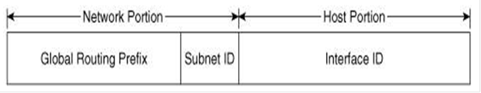
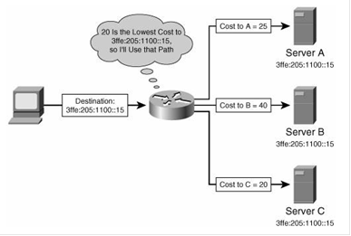

# 关于IPv6地址

关于IPv6地址

2011年6月27日

15:55

**点分十进制**

**关于IPv6地址**

**IPv6地址占128位，口诀：8个16位**

**例如：**

**3ffe：1944：0100：000a：0000：00bc：2500：0d0b**

**ff02：0000：0000：0000：0000：0000：0000：0005--------ff02：：5**

**有两种规则可以简写IPv6地址：**

**1.在每个16位的段中如果开头是0，可以省去**

**即上面的例子可以缩写为：**

**3ffe：1944：100：a：0：bc：2500：d0b**

**ff02：0：0：0：0：0：0：5**

**2．如果有一个或者是多个16位的段是全0，则可以用：：表示**

**即上面的例子可以进一步缩写为：**

**3ffe：1944：100：a：：bc：2500：d0b**

**ff02：：5**

**注意点：**

**（1）每个16位的段尾部的0不能省去，防止混淆**

**（2）每个缩写的IPv6地址中最多出现一次：：，防止混淆**

**例子：2001：0d02：0000：0000：0014：0000：0000：0095**

**则下面两种缩写都是正确的：**

**2001：d02：：14：0：0：95**

**2001：d02：0：0：14：：95**

**但是如果写成下面的就是错的**

**2001：d02：：14：：95**

**原因是计算机无法还原出源地址，计算机会误认为下面几种地址：**

**2001：0d02：0000：0000：0014：0000：0000：0095**

**2001：0d02：0000：0000：0000：0014：0000：0095**

**2001：0d02：0000：0014：0000：0000：0000：0095**

**关于IPv6的掩码**

**IPv6不使用“全1表示网络位，全0表示主机位”的方法表示掩码**

**而是使用“/xx”的方法**

**即3ffe：1944：100：a：：bc：2500：d0b/64**

**如果表示路由条目的话就是：**

**3ffe：1944：100：a：：/64**

**记几种特别的：**

**：：/0 表示缺省路由 0.0.0.0**

**：：/128 表示未指定地址，一般用在NDP协议中**

**：：1/128 表示回环地址，相当于IPv4中的127.0.0.1**

**关于IPv6地址类型**

**口诀：单播，组播，任意播**

**注意：IPv6中没有广播地址**

**IPv6中的单播按范围分为：**

**（1）本地链路单播地址（Link-Local Unicast）：FE80::/10**

**（2）本地站点单播地址（Site-Local Unicast）：FEC0::/10**

**（3）全局单播地址（Global Unicast Addresses）：2xxx::/4或3xxx::/4====2::/3**

**1.关于全局单播地址（Global Unicast Addresses）**

**地址格式：**

**一般来说，Subnet ID是16位，Interface ID是64位**

**地址范围：前3位是001，也就是说全局单播地址第一个16位段的第一个十六进制位是2或者3，表示为2xxx::/4或3xxx::/4**

**现在**

**2001是正在使用的全局单播地址，**

**2002用来做6-to-4隧道的**

**3ffe是使用在6Bone网（国际IPv6实验网）中的**

**2.本地链路单播地址（Link-Local Unicast Addresses）**

**口诀：本地有效**

**以FE80::/10开头，即1111111010**

**说明：本地链路地址是非常有用的，与IPv4中不同，通信和标识都是使用一个地址，而在IPv6中，通信使用的是本地链路地址，标识使用的是全局单播地址。NDP协议中也是使用到了本地链路地址**

**链路单播地址是根据MAC地址形成**

**串口没有MAC地址，以太口有MAC地址**

**如果路由器（模拟）没有以太口，链路单播地址用到的MAC地址是从IOS当中提取的**

**如果有以太口，所有的串口链路单播地址所用到的MAC地址都从以太口当中学习**

**如果一条链路上的链路本地地址相同，则无法通信**

**如果一台路由器上所有接口的链路本地地址相同，则互不影响**

**3.本地站点地址（Site-Local Unicast）**

**口诀：类似于IPv4中的私有地址**

**以FEC0::/10开头，即1111111011**

**什么是站点？说白了就是一个管理域，例如矿大，南大等等**

**在不同的站点可以使用相同的地址，所以说本地站点地址有点像IPv4中的私有地址**

**4.关于任意播地址（Anycast Addresses）**

**口诀：多个设备，单个地址**

**例子：**

**注意：**

**（1）路由器每次都是选择最近的**

**（2）任意播使用的地址和全局单播地址是一样的**

**5.关于组播地址（Multicast Addresses）**

**地址格式：**