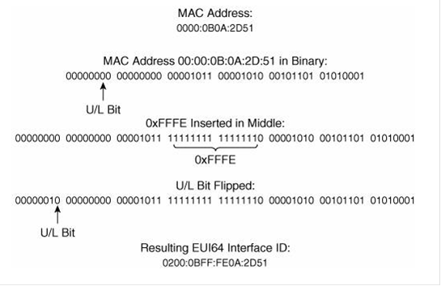

# 关于MAC-to-EUI64

关于MAC-to-EUI64

2011年6月27日

16:55

**地址自动配置**

**当一台IPv6的主机第一次连接到链路上时，它能够自我配置其自己的接口地址。这个过程的第一步就是确定地址的64位接口ID部分。**

**关于MAC-to-EUI64**

**口诀：分、插、改**

**3步走：**

**1.将MAC地址写成二进制并且从中间分开**

**2.将FFFE插入**

**3.改第7位为1**

**第7位被称为全局/本地位（U/L）（0为L，1为U），用于指出接口标识符在链路上是本地唯一还是全局唯一的。使用以太网的MAC地址创建接口标识符时，由于MAC地址是全局唯一的，因此接口标识符也是唯一的，所以U/L被设置成1**