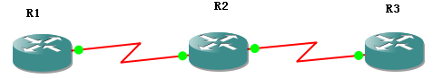

# PIM-DM实验

PIM-DM实验

2011年6月27日

14:15

ip cgmp //该命令的作用是向路由器所连接的交换机发送CGMP

反向路径转发（ Reverse Path Forwarding ）RPF

单播是基于目的地址的转发

组播是基于源的转发

组播路由协议的功能是确定上行接口，也就是最靠近源的接口。这是因为组播路由协议关心的是去往源最近的路径，而不是去往目的地最近的路径，多播包的转发进程也被称为反向路径转发

PIM-DM的配置

首先要开启ip multicast-routing //开启组播功能

第一：必须要运行单播路由协议（例如OSPF）

第二：在接口下必须要启用PIM-DM协议，命令：ip pim dense-mode

PC下：接口下：Ip igmp join-group 224.1.1.1

R1作为源，R3作为接收者

R1，R2运行RIP

R3不允许任何协议，而是指一条静态到R2

R1，R2

首先开启IP组播路由协议的命令：ip multicast-routing

接口模式下开启 ip pim dense-mode

R3接收者

手工加入一个组 ip igmp join-group 224.1.1.1

此命令在接口下运行