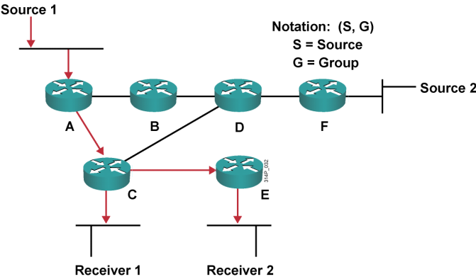
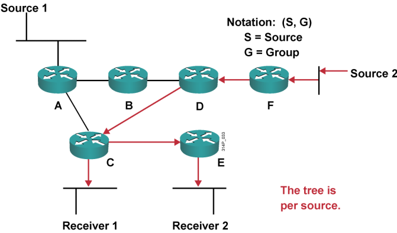
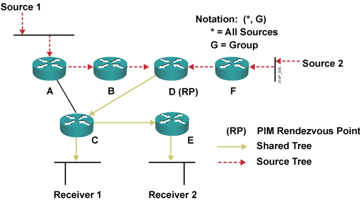
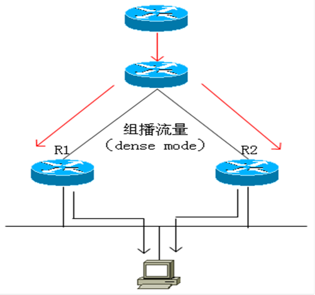
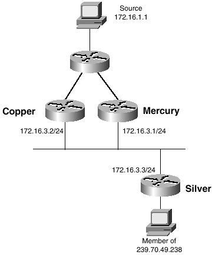
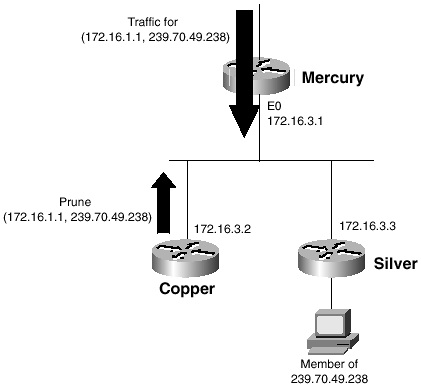
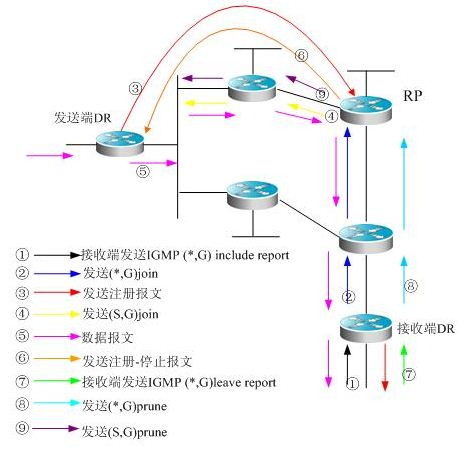

# PIM

PIM

2011年6月27日

14:13

**关于PIM**

**PIM：Protocol Independent Multicast，协议无关组播**

**PIM是路由器和路由器之间的协议**

**注意点：关于组播的路由协议有很多，如DVMRP，MOSPF，CBT，PIM等等，其中思科的路由器仅支持DVMRP的接入和PIM协议，并且PIM协议是集大成者，所以我们的研究重点放在PIM上**

**PIM协议分为两种模式：PIM-DM和PIM-SM**

types of multicast distribution trees 组播分布树的类型

1、source-rooted；also called shortest path trees（SPTs）源树（最短路径树）

2、Rooted at a meeting point in the network; shared trees（RPT） 共享树

组播中的RPF是什么？

RPF是反向路径转发，它的最终目的是使组播包不走“次优路径”或者出现环路，使得对于每一个路由器来说都是以最优路径从源接收数据报，然后转发出去，为了达到这个目的，就需要RPF check即RPF检测，就是在每一个路由器上运行检测机制，如果每一台路由器都做了该检测那么就保证了RPF，也就是防止了“次优路径”或者环路。

RPF检测：当一台路由器接收到一个数据报，并且这个数据报是从源过来的，那么路由器就会查单播路由表，如果该数据报进来的那个接口在单播路由表中是本路由器到源的下一跳出口那就是通过了RPF检测，否则失败。为什么这样做呢？因为单播路由表指示的到达的源的下一跳肯定是最优到达源的路径，所以就达到了RPF的目的。

**SPT**

notation（S，G）

S=Source

G=Group

Receive到达Source的路径是最短的，隐式模型

源树的优点，能保证源跟客户路径最短

**通过泛洪，泛洪到网络的每一个位置，看看是否有人接收，如果有就继续，如果没有就修剪**

Shortest Path Trees — Source Trees

> A Shortest path or source distribution tree is a minimal spanning tree with the lowest cost from the source to all leaves of the tree.
> 
> 
> We forward packets on the Shortest Path Tree according to both the Source Address that the packets originated from and the Group address G that the packets are addressed to. For this reason we refer to the forwarding state on the SPT by the notation (S,G) (pronounced “S comma G”).
> 
> where:
> 
> “S” is the IP address of the source.
> 
> “G” is the multicast group address
> 
> Example 1:
> 
> The shortest path between Source 1 and Receiver 1 is via Routers A and C, and shortest path to Receiver 2 is one additional hop via Router E.
> 

**RPT**

SPT的缺点泛洪，修剪，占带宽资源，因为他们不知道客户在哪，所以网络的每个地方他们都去

RPT就知道客户在哪

**RP是SPT和RPT的汇聚点（像一个中介，不管你买房还是卖房，都要通过中介）**

**RPT：所有事情都找中介**

（*，G）

- 代表所有的源

我能提前知道我是哪个组的RP，所以我已经有了表项，但是SPT没有提前创建

但也会有（S，G）的表项，这个只有在源确定的情况下才有的，在源跟RP之间

**所以这个网络模型被分割成两部分，源跟RP之间是SPT，RP跟客户之间是RPT**

**RP一般选择在网络的中间节点**

**（*，G）是（S，G）的父项，首先创建（*，G）然后才是（S，G）**

SPT的特点：提供最佳路径（最短的距离和最小的延迟）从源到所有的接收者，但是需要更多的内存来维持

RPT的特点：提供次优路径（不一定是最短的距离，并且还可能加入额外的延迟），但是需要较小的内存来维持

**SPT优点：在源和接收方之间创建一条最优路径，可以最大限度的降低转发多播流量的网络延迟**

**SPT缺点：增加了开销，路由器要针对每个信源存储路径信息，在包含数千个信息源的网络中，这种开销是庞大的**

==========================================**关于PIM**

> PIM：protocol independent multicast：协议无关组播
> 
> 
> PIM是路由器和路由器之间的协议
> 

> 注：
> 
> 
> PIM协议分两种模式，PIM-DM（PIM Dense Mode，密集模式）和PIM-SM（PIM Sparse Mode稀疏模式）
> 

当前PIM的版本为PIMv2，**版本1的IP包头中协议号为2（IGMP），采用多播地址224.0.0.2**，**PIMv2协议号为103，保留多播地址为224.0.0.13**。

当PIMv2路由器与PIMv1通信时，他自动设置这个接口为PIMv1.

PIM-DM工作机制：

PIM-DM 的工作过程可以概括为：邻居发现、构建SPT树、嫁接阶段、Assert机制

**PIM-DM使用5个PIMv2消息：**

> 1. Hello
> 
> 
> a) 使用hello消息来**发现邻居**，一旦pim路由器启动，他就周期性地在每个配置PIM的接口上发送hello消息。
> 
> b) PIMv1路由器有相同的功能，但他们采用query消息。
> 
> c) Hello消息中有一个**保持时间，**这个时间定义了邻居等待下一个消息的最长时间，如果没有等到这个消息，邻居就宣布这个发起路由器已经死亡。默认为30s，可以用ip pim query-interval命令加以改变，**保持时间自动设为hello消息间隔的3.5倍。**
> 
> **2. Join/prune（加入/剪除）（**join/prune消息的目标地址是224.0.0.13**）**
> 
> a) Prune消息的目的地址为224.0.0.13，**上游路由器的地址封装在这个消息中**。
> 
> **3. Graft（嫁接）**
> 
> **a) 该消息是以单播方式传送到上游邻居，当上游路由器受到Graft消息，就把收到这个消息的接口加到他的输出接口列表中。这个接口设为前传状态，并且马上用单播方式给新的下游邻居发送一个graft ack消息，。**
> 
> b) 如果路由器已经把自己从多播树中剪除，那么他必须向自己的上游路由器发送一个graft消息
> 
> c) 当路由器发送了graft消息，就会等待graft-ack消息，等待时间为3s，如果在这段时间内没有收到确认信号，路由器就重新发送graft消息
> 
> **4. Graft-ack（嫁接确认）**
> 
> a) 参考上面
> 
> **5. Assert（声明）**
> 
> a) 选举**指定前转器**
> 

邻居发现：

在PIM-DM 网络中，组播路由器需要使用Hello 消息来发现邻居，并维护邻居关系。通过比较Hello 消息上携带的优先级和IP 地址，各路由器为多路由器网段选举指定路由器DR，充当IGMPv1 的查询器。通过各路由器之间周期性地使用Hello 消息保持联系，从而构建和维护了SPT 树。

注意：发送hello消息的目的IP地址是224.0.0.13，其实是向所有接口都发送。

发送join/prune消息的目的IP地址也是224.0.0.13，只向有PIM邻居关系的接口发送。

构建SPT 树：

构建SPT 树的过程也就是扩散/修剪过程（Flooding/Prune）。

PIM-DM 假设网络上的所有主机都准备接收组播数据，当某组播源S开始向组播组G发送数据时，路由器接收到组播报文后，首先根据单播路由表进行RPF 检查，

(1)如果检查通过则创建一个（S，G）表项，然后将数据向网络上所有下游PIM-DM 节点转发，这个过程称为扩散（Flooding）

(2)如果没有通过RPF 检查，则将报文丢弃。经过这个过程，PIM-DM 组播域内每个路由器上都会创建（S，G）表项

(3)如果下游节点没有组播组成员，则向上游节点发Prune 剪枝消息，通知上游节点不用再转发数据到该分支

(4)上游节点收到Prune 剪枝消息后，就将相应的接口从其组播转发表项（S，G）对应的输出接口列表中删除

(5)剪枝过程继续直到PIM-DM 中仅剩下了必要的分支，这就建立了一个以组播源S 为根的SPT.

剪枝过程最先由叶路由器发起，没有接收者的叶路由器主动向上游发起剪枝过程。

泛洪修剪的过程默认每3分钟flood一次。

PIM-DM会在多路访问环境中选举一个DR（指派路由器）

。但其实PIM-DM本身不需要DR，只是由于IGMPv1没有查询进程，为了管理IGMP查询包，IGMP需要依赖路由协议来选举DR，这就是PIM-DM DR的作用。

原则：PIM-DM路由器每隔30s发送一条PIMv2 Hello消息或者PIMv1 query消息，以发现邻居。先选优先级，再比较IP地址，最大的为PIM-DM路由器称为DR，其他路由器监控DR发出的Hello包。如果105s内没有收到该Hello包，认为DR失效，重新选举。

Assert机制：主要为了防止复制包问题。（选举转发路由器）

解决这种复制包问题的方法就是Assert机制：当一个组播路由器从一个OIL接口收到组播包后表示除了自己之外，还有别的组播路由器在转发这个组播流量。这时如果路由器在接口上启动了assert机制，就会发送assert包带上distance，metric，这个distance，metric是指单播路由表中组播包源的路由的管理距离和度量值。用于选举出一个路由器来转发这个组播包，选举失败的路由器会停止转发组播包，并向源prunes。

选举机制如下：首先比较distance，然后比较metric，选小的；如果都一样，就比较发送assert包的接口地址，选大的。

**剪除覆盖**

**过程：**copper向mercury发送一个prune消息，但mercury得地址是封装在这个消息中的，目的地址为224.0.0.13，当mercury受到这个消息，并不立即剪除这个接口，而是设置一个3s的计时器，同时，因为prune消息的目的地址是多播地址，silver也受到这个消息，他看到这个要剪除的组时他要继续接收的那个，而这个消息也已经发送到了他的上游邻居处，因此，silver向mercury发送一个join消息，如上图所示，这样silver发出的join消息就覆盖了copper发出的prune消息，只要mercury在3s定时结束前收到这个join消息，流量就不会中断。

**口诀：3s，join覆盖prune**

**什么时候使用PIM-DM？什么时候使用PIM-SM？**

答：若多组播的接收者占网络的总体比例较大，则使用PIM-DM；

> 若多播的的接收者占网络的总体比例较小，则使用PIM-SM。
> 
> 
> PIM-DM：1、flood & prune；
> 
> 2、3分钟一次。
> 
> PIM-SM：谁要加入跟中间人说。
> 

**PIMv2**：协议号是**103**，除某些情况下使用单播的消息外，是用组播地址224.0.0.13，TTL=1。**PIMv1**：协议号是2，和IGMP共用一个协议号，使用多播地址224.0.0.2

=======================================================

关于PIM-SM

PIM-SM工作机制：邻居发现、DR选举、RP发现、RPT生成、组播源注册、RPT向SPT切换

**PIM-SM采用了7种PIMv2的消息**

> 1. Hello
> 
> 
> 2. Bootstrap（引导）
> 
> a) BSR每隔60s发送一次
> 
> b) 自举计时器为130s（类似于死亡时间）
> 
> c) 多播地址为224.0.0.13，TTL为1
> 
> 3. Candidate-RP-Advertisement（候选RP宣告）
> 
> C-RP**单播**向BSR发送，该消息含有C-RP的地址和优先级
> 
> **4. Join/prune（加入/剪除）**
> 
> **5. Assert（声明）**
> 
> 6. Register（注册）
> 
> 7. Register-stop（注册终止）
> 

**其中hello、join/prune和Assert 3条消息在PIM-DM中也有，其余4条就是其特有消息**

**关于邻居的发现**

邻居发现机制与PIM-DM 中的描述相同，也是通过各路由器之间彼此发送Hello 消息实现的

**关于DR的选举**

注意：

（1）DR在PIM-DM中只是替IGMPv1做查询者，因为IGMPv1没有查询者机制。

（2）DR在PIM-SM中负责为其直连组成员朝着组播分发树根节点方向发送“join/prune”消息，或是将直连组播源的数据发向组播分发树。所以在PIM-SM中DR也就相当于是接收者侧的叶路由器，源侧的第一跳路由器。

**关于RP的发现**

RP 是PIM-SM 域中的核心路由器，在小型并且简单的网络中，组播信息量少，全网络仅依靠一个RP 进行信息转发即可，此时可以在SM 域中各路由器上静态指定RP 位置。但是更多的情况下，PIM-SM 网络规模都很大，通过RP 转发的组播信息量巨大，为了缓解RP 的负担同时优化共享树的拓扑结构，不同组播组应该对应不同的RP。

1.关键问题是如何选举RP

2.有3中方法选举RP：

a) 静态指定，注意点是所有的路由器都需要指定；

b) Auto-RP：思科私有；

c) BootStrap（自举协议）：公有的。

> 
> 

**BootStrap公有的：**

**首先指派C-BSR（候选引导路由器）和C-RP**

**从C-BSR中选出BSR（引导路由器）**

**C-BSR：发送bootstrap消息，60s一次，只有被选举出来的BSR发送，其他的C-BSR侦听，保持时间是130s（现在有的版本是150s，不必深究），使用地址224.0.0.13，TTL=1，被选举出的BSR整理“RP集（RP-set）”，不会直接选出RP，而是将RP集发给大家，让大家自己选出RP，而auto-RP是直接自己选出RP然后通知大家。**

**BSR选举规则：**

> 1. 比较优先级（0～255，默认是0）（低）
> 
> 
> 2. 比较BSR IP地址（高）
> 

**C-RP：**一台C-RP配置一个RP-IP地址和0～255之间的优先级，**单播**向BSR发送Candidate-RP-Advertisement消息

**RP选举规则：**

> 1. 较优先级（低）
> 
> 
> 2. 比较哈希值（高）
> 
> 3. 比较C-RP IP地址（高）
> 

注意点：默认情况下优先级都相同，IP地址低的哈希值算出来会比较高，除非想办法调整哈希值让大家一样，才会比较IP地址大的胜出。但是一般不需要调整，所以默认情况下“相当于”IP地址小的会先成为RP。

Ip pim bsr-candidate lo0 //设置C-BSR

Ip pim rp-candidate lo0 //设置C-RP

Show ip pim bsr-route //看谁选举为bsr

**补充：**

同auto-rp一样，可以用访问表在多个RP间分配RP任务，例如：

> Ip pim rp-candidate loopback0 group-list 20
> 
> 
> Ac 20 deny 228.13.0.0 0.0.255.255
> 
> Ac 20 per any
> 

一个分配RP任务更好的方法是在PIMv2自举协议中使用hash掩码。

例如：ip pim bsr-candidate loopback0 **30（哈希掩码长度）**

**注：**设置哈希值实验现象并不一定交替进行，可能是连续几组RP都是某一个，但每组的个数相同

**关于Auto-RP协议**

**Mapping Agent（映射代理）**：向地址224.0.1.40发送RP-discover消息：60s一次。**（所有PIM路由器都会监听224.0.1.40这个地址）**

> 注意点：Mapping Agent不选举，手工指定，每个Mapping Agent都有效（意味着有多个），并且Mapping Agent发送选举出的RP
> 

**CRP（候选RP）**：向地址224.0.1.39发送RP：RP-Announce消息：60s一次，（死亡时间为180s，总是其3倍），Mapping Agent默认是属于224.0.1.39这个组的，也就是会监听这个组地址。

注意：所有PIM路由器都会监听224.0.1.40这个地址

**Auto-RP选举原则：最大的IP地**址

Auto-RP的RP是如何进行故障切换的？

首先要为任何或全部多播组配置多个C-RP，映射代理将基于RP地址最大的规则为多播组选RP，如果该RP出现故障（3个RP-Announce周期内没有收到RP发送的RP-Announce消息），那么映射代理将选择地址次大的RP并宣告该变更情况。

如何缩短RP故障切换时间？这样做的影响是什么？

在命令ip pim send-rp announce 后加入关键字interval xx，xx如果为10，这样可以将故障切换时间缩短到30秒，但路由器要需要发出6倍于默认RP-Announce数量的消息。

**第二十二条军规（军规困境）出现原因：映射代理在RP-Discovery消息中向所有的路由器宣告RP，使用了保留地址224.0.1.40。所有的PIM-SM路由器都在监听这个地址。在稀疏模式中，多播包必须选从一个共享树上进行前转。这意味着收听地址224.0.1.40的路由器必须通知他们的RP，他们要加入到这个组中，来接收RP-Discovery消息。不过他们没有收到RP-Discovery消息之前不知道RP的位置。同理，对C-RP也会起作用，映射代理为了选出RP，必须收到C-RP的RP-Announce消息，为了完成这一目的，C-RP必须加入组224.0.1.39，不过，如果他不知道RP的位置，他就不能加入到这个组中，除非收到了RP-Announce消息。这里面有个特例：就是当C-RP 和MA直连且下游路由器也和MA直连的情况下，因为默认时MA会监听224.0.1.39这个地址，所以当C-RP向外发送RP-Announce消息MA能收到，然后MA能够选出RP，然后MA会向224.0.1.40这个地址发送RP-Discovery消息，所有跟MA直连的下游路由器能够收到这个小心，因为默认所有PIM路由器都会监听这个地址。**

**注意点：由于“第二十二条军规”，所以要用ip pim sparse-dense-mode**

所以，潜规则：**auto-RP一定要和sparse-dense-mode配对**。

Ip pim send-rp-discovery loopback0 scope 255 //设置mapping agent

Ip pim send-rp-announce loopback0 scope 255 //设置C-RP

**补充：**

1. C-RP在RP-Announce中宣告，他可以作为哪些组的RP。

例如：

> Ip pim send-rp-announce loopback0 scope 5 group-list 30
> 
> 
> Ac 30 per 232.0.0.0 7.255.255.255
> 
> Ac 30 per 228.13.0.0 0.0.255.255
> 

2. 亦可以设置RP-Announce消息过滤器，防止映射代理接受收无意间配置成C-RP的路由器发出的消息：

例如：

Ip pim rp-announce-filter rp-list 1 group-list 11

Ip pim send-rp-discovery loopback0 scope 5

Ac 1 per 10.224.1.2

Ac 1 per 10.224.1.1

3. 若采用auto－rp协议来动态学习RP信息，会出现军规困境。

为了保证autorp能够正常工作，除了配置密集稀疏模式，还可在路由器上配置**autorp Listener**后，此路由器上会将224.0.1.39和224.0.1.40两个组播组强制工作在dense模式，使得auto rp能够正常工作。这样其他组播组（除39和40以外）就可以利用autorp学习到的rp信息来工作!

**稀疏-密集模式：当一个接口配置成这个模式时，他在知道组RP的位置时使用稀疏模式，如果不知道RP的位置，他使用密集模式。**

**关于静态指定：注意点是所有的路由器都要指定**

Ip pim rp-address 2.2.2.2 //配置静态RP

**静态RP缺点：**

> 1.因现有的RP的地址改变或安装了新的RP，RP的地址必须改变；
> 

2. RP产生故障，静态配置的PIM域不会简单选择备用的RP。

**RPT 生成：**

当接收者加入一个组播组时，通过IGMP 报文知会与该主机直接相连的叶子路由器，叶子路由器掌握组播组的接收者信息，然后朝着RP 方向往上游节点发送加入组播组的Join 消息（地址：224.0.0.13）。

从叶子路由器到RP 之间途经的每个路由器都会在转发表中生成（*，G）表项，**这些沿途经过的路由器就形成了RP 共享树（RPT）的一个分支**。其中（*，G）表示从任意源来的信息去往组播组G。**RPT 共享树以RP 为根，以接收者为叶子**。

当从组播源来的发往组播组的报文流经RP 时，报文就会沿着已经建立好的RPT共享树路径到达叶子路由器，进而到达接收者。

当某接收者退出组播组时，接收者侧DR 会逆着RPT 树朝RP 方向逐跳发送Prune剪枝消息。第一个上游路由器接收到该剪枝消息，在其出接口列表中删除连接此下游路由器的接口，并检查下游是否还存在组播组 成员，如果没有则继续向上游转发该剪枝消息。

**组播源注册：**

为了向RP通知组播源的存在，当组播源向组播组发送了一个组播报文时，与组播源直接相连的路由器接收到该组播报文后，就将该报文封装成Register 注册报文，并单播发送给对应的RP 。

当RP 接收到来自组播源的注册消息后，一方面解封装注册消息并将组播信息沿着RPT 树转发到接收者，另一方面朝组播源逐跳发送（S，G）加入消息，**从而让RP和组播源之间的所有路由器上都生成了（S，G）表项**，这些沿途经过的路由器就形成了SPT 树的一个分支。**SPT 源树以组播源为根，以RP为目的地**。

组播源发出的组播信息沿着已经建立好的SPT树到达RP，然后由RP将信息沿着RPT 共享树进行转发。当RP 收到沿着SPT 树转发的组播流量后，向与组播源直连的路由器单播发送注册停止报文。组播源注册过程结束。

**RPT 向SPT 切换：**

针对特定的源，PIM-SM 通过指定一个利用带宽的SPT 阈值可以实现将最后一跳路由器(即离接收者最近的DR)从RPT 切换到SPT。**当最后一跳路由器发现从RP 发往组播组的组播报文速率超过了该阈值时，就向单播路由表中到组播源的下一跳路由器发送（S，G）加入消息，加入消息经过一个个路由器后到达第一跳路由器（即离组播源最近的DR），沿途经过的所有路由器都拥有了（S，G） 表项，从而建立了SPT 树分支。**随后，最后一跳路由器向RP 逐跳发送Prune 剪枝消息，RP 收到消息后会向组播源反向转发Prune 剪枝消息，从而最终实现组播信息流从RPT 树切换到SPT 树。

切换到SPT 树后，组播信息将直接从组播源发送到接收者。通过RPT 树到SPT 树的切换，PIM-SM 能够以比PIM-DM 更经济的方式建立SPT 转发树。

**Cisco规定，cisco路由器从共享树（RPT）上收到某一个（S,G）组的第一个包，马上加入到SPT。可以通过ip pim spt-threshold来改变，默认为0kbit/s**

**PIM-SM模式工作基本流程：**

PIM-SM通过建立组播分发树来进行组播数据包的转发。组播分发树分为两种：以组G的RP(汇聚点)为根的共享树(Shared Tree，即RPT)和以组播源为根的最短路径树(Shortest Path Tree，即SPT)。PIM-SM通过显式地加入/剪枝机制来完成组播分发树的建立与维护。如上图所示：

1）   当接收端的DR（在PIM-SM中，DR就是接收端的叶路由器和源端得第一跳路由器）收到一个来自接收端的IGMP (*,G)include report报文；

2）   如果接收端的DR不是这个组G的RP，接收端的DR就会向RP方向发送一个(*.G)join报文（目标地址是224.0.0.13，实际上会向所有的PIM邻居发送该消息），收到这个(*,G)join报文的上游路由器，又会向RP方向发送(*,G)join报文，这样(*,G)join报文逐跳发送，直到组G的RP收到了(*,G)join报文，表示加入共享树；

3）   数据源主机向组发送组播数据时，源数据被封装在注册消息内，并由数据源端的DR单播至RP，RP再将注册报文解封，取出其中的数据报文，然后沿着共享树转发到各个组成员；

4）   RP朝着数据源端的DR发送（S，G）join报文，用以加入此源的最短路径树；

5）   这样当RP到数据源端的DR的SPT建好后，数据源的数据包将沿着其最短路径树不加封装地发送到RP；

6）   当第一个组播数据沿SPT到达时，RP向源的DR发送注册-停止消息，以使DR停止注册封装过程。当数据源端的DR收到注册-停止消息后，不再封装注册数据报文，而是只沿着源的最短路径树发送到RP，再由RP将其沿着共享树转发各个组成员。

7）   当某个接收端不再需要组播数据时，接收端发送IGMP leave报文。

8）   接收端的DR向着组G的RP逐跳组播prune消息用以剪除共享树，这个prune消息最后会到达RP或是到达去RP路上的某个路由器且这个路由器上还有其他(*,G)接收者。这样，数据报文就不会再往这个接收端的方向发送。

9）   若RP上已没有下游接收者，那么RP就会向数据源方向发送(S,G)prune报文，(S,G)prune报文逐跳发送到数据源端的DR，于是数据源的DR就会剪掉收到这个(S,G)剪枝报文的接口；于是，数据报文在数据源端的DR就被过滤掉。

注意：

当上游路由器接收到Join/Prune消息后，可能会执行以下4种操作之一：

（1）如果该路由器不是RP，但位于共享树上，那么该路由器会将接收到Join/Prune消息的接口加入到该多播组的OIL中；

（2）如果该路由器不是RP，且不位于共享树上，那么该路由器将创建一个(*,G)表项，并沿着RP方向向上游邻居发送自己的Join/Prune消息；

（3）如果该路由器是RP，且其路由表中已经存在该多播组的路由表项，那么该路由器会将接收到Join/Prune消息的接口加入到该多播组的OIL中；

（4）如果该路由器是RP，但其路由表中没有该多播组的路由表项，那么该路由器将创建一个(*,G)表项，并将接收到Join/Prune消息的接口加入到该多播组的OIL中。