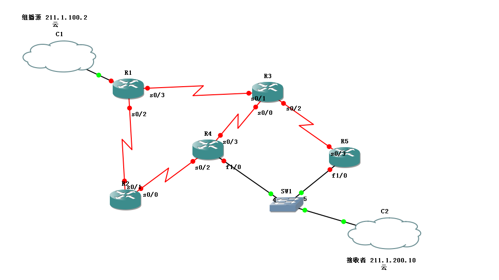

# 组播综合实验

组播综合实验

2011年6月27日

15:48

<<组播拓扑_TY.net>>

一 PIM-DM实验

1 路由器上开启ip multicast-routing之后，所有的以太口都启用了IGMPv2，如果想改成v1，接口下： ip igmp version

2 路由器每个接口上都打入ip pim dense-mode

实际上在PIM-DM模式中，也会存在（*,G）表项，不过（*,G）不是PIM-DM规范的一部分，也不用于转发组 播包，IOS创建该表项目的是作为（S,G）数据结构的“父类”。所有连接PIM邻居的接口以及所有直连了 组成员的接口都被加入到（*,G）表项的OIL（出站接口列表中），如果仅运行了PIM-DM，那么该表项的 IIL（入站接口列表）将始终为空。（S,G）表项的入站和出站接口均取自于该列表。

3 接收者开始接收组播数据包（其实就是向路由器发送了report消息），查看叶路由器中相应接口的状态 ，同时debug ip igmp，查看接收者发送的消息。

4 R4与R5之间验证IGMPv2查询者选举（IP地址最小的）

R5上：show ip igmp interface f1/0（此处没有运行IGMPv1，所以DR没有意义，而查询路由器是IP地址 小的）

5 接收者停止接收组播包（点了结束按钮之后，主机会发送leave消息，这点在路由器上debug能看到）。 发送者开始发送组播包，查看每一台路由器上的组播路由表，看到OIL都是prune状态。

6 接收者接收组播包，能看到组播数据正常被接收到。验证选举PIM转发路由器（选择离组播源最近的--> 选择IP地址大的）：

此例中，R4和R5离组播源一样远（在两台路由器上分别show ip route），比较IP地址大的

分别在R4、R5上：show ip mroute 224.1.1.1，查看哪些接口被剪除了，哪些接口是处于转发状态。

注意：此例中R4为查询者，而R5却为转发者，这一点都不矛盾，R4向组地址发出组成员查询操作会让子网 中的组成员回应IGMP membership report，而R5收到report消息之后就开始转发组播流量。如果组员想 离开该组播组，则向224.0.0.2发送IGMP leave消息，此时R5也会收到。

7 PIM每隔50s向其邻居发送hello消息，保持时间为hello时间3.5倍，如果在保持时间内没有收到hello 消息，认定邻居失效。

将R5的f1/0接口shutdown，看接收者此时收不到组播包。

等待一定时间，或者手工干预保持时间

在R4上:debug ip pim 224.1.1.1,可以看到graft消息正在建立

在R4上：show ip mroute 224.1.1.1 看到f1/228.13.20.216态，变为forward状态。

8 IGMP默认60s发送一次查询，保持时间为120s。

将R4的f1/0接口shutdown，在R5和R4上debug ip igmp，隔一段时间由于R5收不到R4发来的query消息， 认为R4已经挂了，开始发送query消息。在R5上show ip igmp interface f1/0，看到R5显示自己为 queryer（R4上看自己还是queryer）。把R4接口打开，看到R5收到query消息后，就不在是查询路由器了 。

RPF检测如果遇见负载的情况，默认会选择最大的IP地址！

show ip pim neighbor //查看pim邻居

show ip pim interface //观察端口上的pim信息

show ip mroute //观察multicast路由表

debug ip pim //显示pim的debug信息

debug ip igmp //显示igmp信息

二 PIM-SM实验

1 与开启PIM-DM相似，在所有接口上打入ip pim sparse-mode

2 研究RP的配置：

（1）静态RP配置（让R2为RP）

所有路由器上打入：ip pim rp-address 2.2.2.2，作用是告诉路由器如何发现RP，注意：RP路由器本 身也要打入这句话，但这个环回接口不需要运行PIM，目的是让自己知道自己是RP。实际中，都使用环回 接口作为RP地址。

验证RP，show ip mroute，查看RP邻居和入站、出站接口列表

当主机第一次请求加入某组时，DR将加入RPT，从R5到RP需经过的接口会出现在相应路由器（*,G）表项的 OIL中，R5的OIL为空且带有剪除标记。

在收到第一个组播包后，默认情况下叶路由器试图切换到SPT

在R5上：debug ip mpacket 224.1.1.1

在R4上：debug ip mpacket 224.1.1.1

用ip pim spt-threshold [infinity]

(2)Auto-RP

配置Auto-RP步骤：

第一步：必须配置所有C-RP：ip pim send-rp-announce ,后面需要跟指定接口（路由器通过该接口取得 RP地址）和TTL值（定界），配置后60s向224.0.1.39发送一条RP-announce消息。

第二步：必须配置所有MA（映射代理），MA负责侦听来自C-RP的RP-announce消息并选出RP，之后向 224.0.1.40每60s发送一次RP-discovery消息。

本例中R2和R3配置为C-RP，R4为MA

R2、R3：ip pim send-rp-announce loopback0 scope 5

R4:

interface loopback0

ip pim sparse-mode(必须配置，否则会报错)

ip pim send-rp-discovery loopback0 scope 5

在R4上：debug ip pim auto-rp

可以看到，R4接收R2和R3的RP-announce消息

在R5上：show ip pim rp之后，可以看到路由器正在接收多播组以及这些多播组所映射RP情况。

ip pim send-rp-announce loopback0 scope 5 interval 10 更改RP-announce消息发送间隔。

C-RP在RP-announce中向多播组宣告其可以充当RP角色，默认为宣告到224.0.0.0/24（表示全部多播组） 。

如果希望将不同的多播组映射到不同的RP，例如希望224.0.0.0-231.255.255.255的多播组全部映射到R2 ，而将232.0.0.0-239.255.255.255全部映射到R3上：

R2：

access-list 10 permit 224.0.0.0 7.255.255.255

ip pim send-rp-announce loopback0 scope 5 group-list 10

R3:

access-list 10 permit 232.0.0.0 7.255.255.255

ip pim send-rp-announce loopback0 scope 5 group-list 10

show ip pim rp 查看group-to-rp映射情况

//sparse-dense 模式

上例中，C-RP和MA是直连的。

现在改换R1当做MA：R1在RP-discovery消息中将RP宣告给域中所有的路由器，但在sparse环境中，组播 流量必须首先在共享树上进行转发，意味着侦听224.0.1.40的路由器为了接收RP-discovery消息，必须 向RP通告希望加入该多播组，但现在连discovery消息都木有收到，就肯定不知道谁是RP，同样道理，如 果C-RP木有直连到MA也会出现这种矛盾情形（“军规困境”）。

所以使用sparse-dense模式，如果知道了RP就直接稀疏模式，如果不知道RP就密集模式。

R1上：

接口下：ip pim sparse-dense-mode（现在最建议的pim模式）

show ip mroute ，查看是神马模式

（3）Bootstrap

第一步：必须配置所有C-RP

第二步：必须配置所有C-BSR

在R2、R3上配置：

ip pim bsr-candidate loopback0

ip pim rp-candidate loopback0

首先，需要从所有C-BSR中选择BSR，这些C-BSR会向整个PIM域发送Bootstrap消息（224.0.0.13）

在R5上：show ip pim bsr-router 查看BSR

C-RP接收到Bootstrap消息并确定了BSR之后，单播向BSRCandidate-RP-Advertisement消息，BSR将C-RP 集合到RP-Set中，RP-Set又包含在Bootstrap中。这也是Bootstrap和Auto-RP之间的主要区别。

show ip pim rp 查看RP的情况