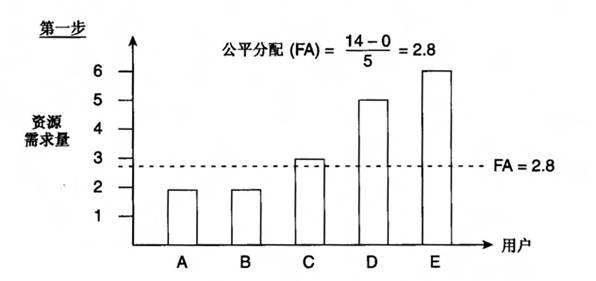
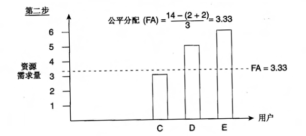
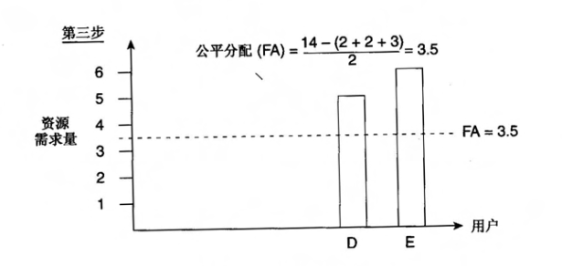
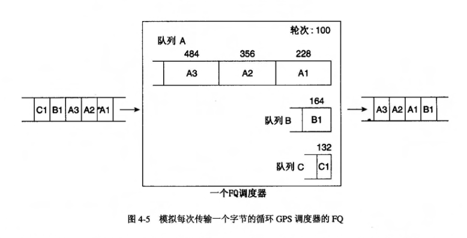
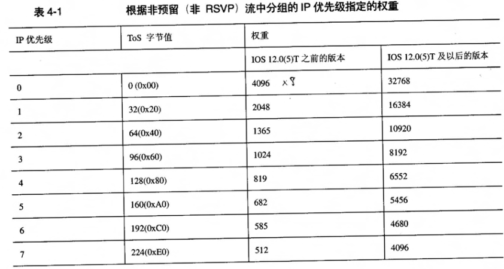

# WFQ

WFQ

2011年7月7日

15:30

**接口有两种队列，一种叫做硬件队列，永远是FIFO，一种是软件队列（FIFO，PQ，WFQ等）。如果硬件队列没有满，表明没有拥塞，如果硬件队列满了才表明有拥塞。典型的硬件接口缓冲区可以保存1到5个分组。在启用WFQ后，大部分接口会自动将他们的硬件传输队列缩短到2.可以使用tx-queue-limit命令修改接口传输队列的长度。**

**硬件队列只有一种：FIFO**

**软件队列：FIFO，WFQ**

**首先理解一个概念：就是调度规则**

**调度规则决定接下来传输队列中的哪个分组。流的分组得到服务的频率决定了流的带宽，或者说资源分配。**

**关于调度技术：**

**网络不拥塞时，所有的调度方案都不管用，因为路由器上根本没有建立队列。但当网络出现拥塞时，路由器上将建立队列**

**Interne上传统的分组调度机制一直是先进先出（FIFO）调度，它按照分组到达输出队列的顺序来区分分组。FIFO的实现很简单，但不能区分流。**

**口诀：FIFO不区分流**

**加权公平队列（WFQ，Weighted Fair Queuing）是一种在调度时区分对待不同流的调度规则。在WFQ中，每个流或者通信类被指定一个权重，流或者通信类得到服务的频率与权重成正比。WFQ为不同权重的流提供不同的优先级；对于权重相同的流，则根据最大-最小公平-份额分配方案（max-min fair-share allocation scheme）提供公平和保护。**

**WFQ比FIFO排队更难实现，但是它能够满足QoS支持的其他需求，而这个是FIFO不能提供的。**

**WFQ还可以和RSVP一起，提供对使用RSVP的流的信令资源需求的许可控制。**

**排队理论中的守恒定律：**

**任何调度规则只能增加其他流的延迟来降低某个流的平均延迟。**

**关于最大-最小公平-份额分配方案**

**例子：假设资源总量为14个单位，要为5个用户A，B，C，D，E提供服务，他们要求的资源分别为2，2，3，5以及6.**

**即**

**A：2 2**

**B：2 2**

**C：3 3**

**D：5 3.5**

**E：6 3.5**

**如果按公平的方法话，那么每个用户分配的量应该为14/5=2.8个资源，但是A和B用户只需要2个资源，余下的1.6个资源（A和B各能剩下0.8个）被平均分配给其他3个用户，这样用户C，D和E分别获得的资源是2.8+1.6/3=3.33，而C需要的资源是3个，所以C会剩下0.33个资源未用，而这些资源将平均的分配给D和E，所以他们两个获得的资源是3.33+0.33/2=3.5.**

**公平分配的公式可以总结为（资源总量-已经分配给用户的资源总量）/（还需要资源的用户数）**

**所以上面的计算过程分为3步：**

**这种方案之所以被成为最大-最小公平-份额分配，是因为它将需求未满足的用户的份额最大化了。**

**把这个方案扩展一下，为每个用户指定一个权重，就是加权最大-最小公平-分和分配（weighted max-min fair-share allocation），用户的份额与其权重成正比。**

**最大-最小公平-份额分配方案是一种理论的方案，而实现的时候需要广义处理器共享（GPS，Generalized Processor Sharing）。**

**GPS是一种实现上述方案的理想机制。**

**GPS将每个流放在各自的逻辑队列中，然后依次为每个非空队列传输无穷小的数据量。每一轮只传输无穷小的数据量，因此在任何有限的时间间隔内，所有的非空队列都会被访问，因此在任何时候都是公平的。**

**如果为每个流都指定了权重，则GPS每一轮传输的数据量都与权重成正比，这就实现了加权最大-最小公平-份额方案。**

**补充一句：虽然GPS是一种理想的最大-最小公平-份额模型，但却无法实现。实际使用的调度算法是那些与GPS接近并且可以实现的模型。WFQ就是其中的一种，它尽量模拟GPS方案，但却没有做到分组无穷小的假设。**

**总结一句话：最大-最小公平-份额分配是理想的理论分配方案，GPS是理想的实际分配方案。**

**关于WFQ**

**WFQ有以下几种：**

**1.基于序列号计算的WFQ（其实就是FQ）**

**2.基于流的WFQ（其实就是WFQ）**

**3.基于流的分布式WFQ**

**4.基于类的WFQ**

**平时所说的WFQ是特指基于流的WFQ**

**关于基于序列号计算的WFQ**

**注意点：基于序列号的WFQ就是FQ**

**先理解两个概念：一个是轮次，一个是队列当前状态。**

**轮次：说白了就是最后获得服务的分组的序列号(SN)**

**队列当前状态：说白了就是到达时这个流队列中是否有分组，如果有分组这个流就处于活动状态，如果没有分组这个流就处于非活动状态**

**关于分组的序列号的分配：**

**根据到达时流是否处于活动状态，给分组指定序列号（SN）的方法总结如下：**

**到达时流处于非活动状态，SN=分组的字节数+分组到达时的轮次（即最后获得服务的分组的序列号）**

**到达时流处于活动状态，SN=分组的字节数+流队列中最大的序列号**

**例子：假设有3个流A、B和C，它们的分组长度分别是128、64和32字节。分组一个紧接一个到达FQ服务路由器，次序为A1，A2，A3，B1，C1。当前的轮次是100，A1到达时序列号是100+128=228，A2到达时A的流处于活动状态，所以A2的序列号是228+128=356，同样，A3到达时序列号是356+128=484，而当B1和C1到达时，B流和C流都是非活动状态，所以B1的序列号分别是100+64=164，C1是100+32=132.**

**如果D1在A1被传输时到达，该分组就属于一个新流，长为32字节，则轮次将为228，而D1的序列号将为260（228+32）。因为D1的序列号比A2，A3都小，所以它将被调度到A2和A3之前传输。**

**关于基于流的WFQ**

**通常会有一些流被认为比其他流更重要，因此调度器需要优先处理这种流。可以扩展FQ的概念，为每个流指定权重，这样每个流获得的服务就与权重成正比了，这种队列叫做基于流的WFQ。**

**在WFQ中，权重是根据IP每组包头中的优先级来指定的，计算方法是：**

**在IOS 12.0（4）T或者之前的版本中 ：权重=4096/（IP优先级+1）**

**在IOS 12.0（5）T或者更高的版本中 ：权重=32768/(IP优先级+1)**

**在基于流的WFQ实现中，权重严格的基于优先级，不能改变，但当到达调度器的所有通信的优先级相同时，WFQ实际上就变成了FQ**

**关于流的概念：**

**流是使用哈希实现的，该哈希是有源和目标IP地址、IP协议号、端口号以及ToS字节中的5位（3个IP优先级位除外）定义的。所以一个流中，优先级可能不同。同一流队列中的分组将按FIFO的顺序获得服务。**

**流：**

**1.源IP地址**

**2.目的IP地址**

**3.协议号**

**4.ToS**

**5.源TCP/UDP端口号**

**6.目TCP/UDP端口号**

**其实流就是五元组加一个ToS**

**WFQ，公平队列**

**FIFO是先进先出，FQ是根据时间跟长度的和来计算的，越小越排前**

**以前的网络数据包大的基本上不重要，小的重要。所以让小数据包先传，这也是FQ的优点，但是它的缺点是大的数据包被延迟。刚才也说，大小包只是在以前是那样的。比如说现在的语音包，数据包很大，对延迟很敏感，但是很重要。现在用的基本上用WFQ**

**在FQ中，FT=时间+数据包大小。在WFQ中FT=时间+数据包大小/(W+1)，这里的W就是数据包的优先级。FT越小，越先转发。注：这里的时间是到达接口的时间，就是8点到还是10点到。**

**案例部分：**

**案例一：**

**需求：假设在部署了基于流的WFQ的串口中传送了8个流，其中每个流的优先级各不相同，问在拥塞的时候每个流分到多少带宽？**

<<WFQ案例一的答案.txt>>

**案例二：**

**需求：假设有25个流，其中18个流的优先级为1，其余7个流分布在其他7个优先级上，问在拥塞的时候每个流分到多少带宽？**

<<WFQ案例二的答案.txt>>

**案例三：语音和FTP流分组之间的WFQ调度**

**需求：一台路由器的串行链路同时传输语音和FTP，语音信号的分组长度是64字节，FTP数据的长度是1472字节，如果想让语音获得的带宽是FTP获得的带宽的6倍，问如何设置？设置成功后每调度一个FTP分组，将调度多少个语音分组？**

**分析：默认情况下语音分组和FTP分组的优先级是一样的，所以带宽之间的比率是1：1，那么传输一个FTP分组将传输1472/64=23个分组。如果想让语音获得的带宽是FTP获得的带宽的6倍，设语音的优先级是x，FTP的优先级是y**

**（x+1）/(y+1)=6 ,可以推出x-6y=5，其中x，y的范围都是0到7.所以y只能取0，此时x为5，也就是说设置语音的优先级为5就可以了。此时传输一个FTP分组，将传输6*23=138个语音分组。**

**题外话：当网络中只有很少的通信流时，WFQ可以用于语音，而在负载比较大的网络中，WFQ将无法满足交互式语音通信的低抖动的要求。对于像语音这样的应用程序，人们对WFQ进行了改进，使用优先级队列（PQ）。**

**关于基于类的WFQ（CBWFQ）**

**很好理解，对于基于流的WFQ的每个队列中放的是流（对源目IP地址、源目端口号，协议号做的hash，hash相同的就是一个流），而基于类的WFQ可以手工进行分类。**

**关于WFQ的配置：**

**1.Router(config-if)#fair-queue [cdt [dynamic-queues[reservable-queues]]]**

**解释：**

**cdt（拥塞丢弃门限）：设置每个队列允许的包数，默认是64，**

**dynamic-queues：设置WFQ系统所能允许的活动流的个数，默认是256， reservable-queues：设置所允许的保留会话数，默认是0，可以在0到1000之间任意设置，保留队列用于那些被配置了RSVP等功能的接口**

**2.Router(config-if)#hold-queue max-limit out**

**解释：**

**max-limit：设置可以在其输出软件队列中保持的数据包的数量，默认是1000**

**R1# sh int s1/0**

**Serial1/0 is administratively down, line protocol is down**

**Hardware is M4T**

**MTU 1500 bytes, BW 1544 Kbit, DLY 20000 usec,**

**reliability 255/255, txload 1/255, rxload 1/255**

**Encapsulation HDLC, crc 16, loopback not set**

**Keepalive set (10 sec)**

**Restart-Delay is 0 secs**

**Last input never, output never, output hang never**

**Last clearing of "show interface" counters never**

**Input queue: 0/75/0/0 (size/max/drops/flushes); Total output drops: 0**

**Queueing strategy: weighted fair**

**Output queue: 0/1000/64/0 (size/max total/threshold/drops)**

**Conversations 0/1/256 (active/max active/max total)**

**Reserved Conversations 0/0 (allocated/max allocated)**

**Available Bandwidth 1158 kilobits/sec**

**5 minute input rate 0 bits/sec, 0 packets/sec**

**5 minute output rate 0 bits/sec, 0 packets/sec**

**0 packets input, 0 bytes, 0 no buffer**

**Received 0 broadcasts, 0 runts, 0 giants, 0 throttles**

**0 input errors, 0 CRC, 0 frame, 0 overrun, 0 ignored, 0 abort**

**4 packets output, 96 bytes, 0 underruns**

**0 output errors, 0 collisions, 1 interface resets**

**0 output buffer failures, 0 output buffers swapped out**

**2 carrier transitions DCD=down DSR=down DTR=up RTS=up CTS=down**

**sh int s1/0**

**Output queue: 0/1000/64/0 (size/max total/threshold/drops)**

**size：当前所有队列中有多少个包**

**max total：其实就是hold queue，所有队列中最多可以有多少个包，在命令hold-queue中设置**

**threshold：其实就是CDT，拥塞丢弃门限，在命令fair-queue中设置**

**drops：丢弃了多少个包了**

**Conversations 0/1/256 (active/max active/max total)**

**active：当前的会话数为0**

**max active：最大活动会话数曾经达到过多大**

**max total：最多可以允许的会话数，其实就是最大的活动流的个数，在命令fair-queue中设置**

**可以这么理解：会话=队列**

**allocated：当前分配给RSVP的队列数**

**max allocated：最多可以分配给RSVP的队列数，在命令fair-queue中设置**