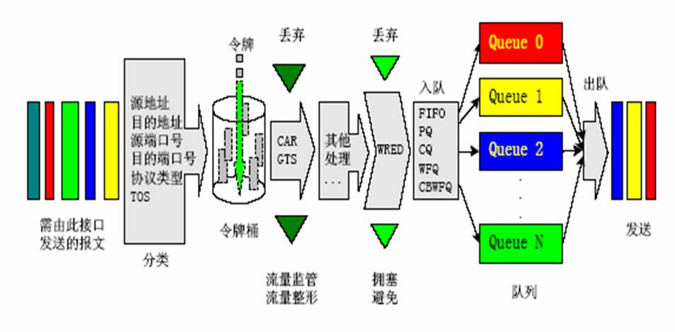

# 整体架构

整体架构

2011年7月7日

15:33

**学习QoS（特指区分式服务模型）的整体架构：**

**1.分类和标记**

**2.预防机制----流量监管（CAR），流量整形**

**3.轻度拥塞----队列技术（PQ，CQ，CBWFQ，LLQ）**

**4.重度拥塞----丢弃技术（尾丢弃，RED，变种WRED，CBWRED）**

**队列技术也叫做拥塞管理**

**丢弃技术也叫做拥塞避免**

上图是QoS的整体结构图