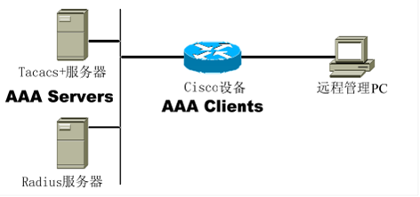

# AAA

AAA

2011年8月2日

21:42

AAA

AAA：Authentication Authorization Accounting 认证授权与审计

关于AAA的基础知识

Authentication(认证)：对用户的身份进行验证，决定是否允许该用户访问网络

Authorization（授权）：给不同的用户分配不同的权限，限制每个用户可使用的网络服务

Accounting（审计）：对用户的行为进行审计和计费

AAA由两部分组成：AAA服务器端（AAA Server）和AAA客户端（AAA Client）。

如下图：

思科公司的AAA服务器端产品使用Cisco Secure ACS实现。

AAA客户端一般是路由器，交换机或者防火墙等设备。

**AAA使用的安全协议有：TACACS+、RADIUS、Kerberos。**这3个都是通信协议，用来保证AAA客户端与AAA服务器端协同工作。

Cisco ACS的安装过程：

**Cisco Secure ACS**支持的操作系统有：Windows 2000 Server（sp4）、Windows 2000 Advanced Server（sp4）、Windows Server 2003标准版、Windows Server 2003企业版、Solaris系统。

**安装JRE（Java run time）------**这个不装可能很多功能用不了

安装Cisco Secure ACS

安装完成后，使用”[http://IP](http://ip/) address:2002”进行访问

关于RADIUS与TACACS+的区别

TACACS+是思科私有的，RADIUS是公有的

TACACS+使用TCP，RADIUS使用UDP

TACACS+加密整个消息，RADIUS仅加密密码部分

关于RADIUS

RADIUS是在RFC2865中定义的

**RADIUS使用UDP端口号1812和1813**。Cisco Secure ACS使用1645和1646。新的端口号是1812和1813；旧端口号是1645和1646

RADIUS使用4种类型的消息

Access-Request

Access-Challenge

Access-Accept

Access-Reject

RADIUS的工作过程：

关于TACACS+

1.TACACS+使用TCP端口49

2.TACACS+的工作过程：

关于AAA的配置过程

1.命令aaa new-model用来全局开启AAA

2.如果有需要，配置RADIUS和TACACS+

例：

tacacs-server host 10.1.1.2 key cisco

或者

radius-server host 10.1.1.2 key cisco

3.配置认证

aaa authentication login {default | list_name} group {group_name | tacacs+ | radius} [method2 [method3 [method4]]]

解释：略

注意点：方法列表如果是default就不需要应用，如果方法列表的名称是自己取的需要应用。

例：

Router(config)#aaa authentication login default group tacacs+ local line

4.配置授权

aaa authorization {network | exec | commands level | config-commands | reverse-access} {default|list-name} method1 [method2...]

例：

router(config)#aaa authorization exec default group radius local none

5.配置审计

aaa accounting {command level | connection | exec | network | system} {default | list-name} {start-stop | stop-only | wait-start} group {tacacs+ | radius}

例：

R2(config)#aaa accounting exec default start-stop group tacacs+

实验部分：

1.认证实验

2.授权实验：对用户可以使用的命令进行授权

Aaa authorization exec default group tacacs+ 对用户级别进行授权

Aaa authorization command 1 default group tacacs+ 对用户命令进行授权

Aaa authorization command 15 default group tacacs+

补充：

默认情况下，Cisco IOS设备使用三种权限级别：

等级0：包括5个命令：disable、enable、exit、help、logout

等级1：用户模式，提示符为>,他是用户登录后的默认级别

等级15：特权模式，提示符为#，它拥有最高的权限

使用show privilege命令可以查看用户当前的权限级别

3.审计实验：对管理员的行为进行审计

Aaa accounting exec default start-stop group tacacs+ 对用户的登录进行审计

Aaa accounting command 1 default start-stop group tacacs+ 对用户所使用的命令进行审计

Aaa accounting command 15 default start-stop group tacacs+

aaa authen ppp {default|list-name} method1 method2...

default = 当用户登陆后使用参数后的认证方法作为默认列表

list-name= 用来命名用户登陆后所使用的认证方法作为默认列表

method:if-needed = 如果用户已经认证就不再认证

local = 使用本地数据库认证

aaa authorization {network|exec|commands level|reverse-access} xx method

network = 为所有用户与网络相关的服务请求进行授权

exec = 进行授权以确认用户是否被授权执行exec外壳

commands= 为所有命令在制定级别惊醒授权

level = 制定应该被授权的命令级别，范围0-15

reverse-access = 为反向接入连接（反向telnet）进行授权