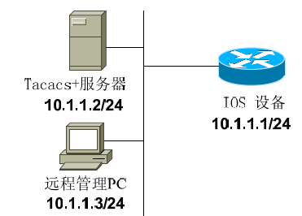
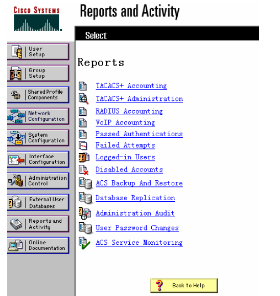
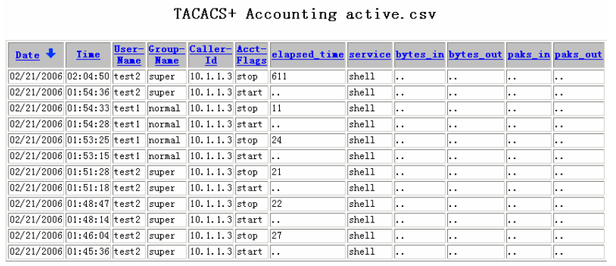

# 配置AAA审计

配置AAA审计

2011年8月2日

21:48

配置AAA审计

本节将采用以下实例来讲述Cisco IOS和PIX OS中AAA审计的配置方法：

1、使用AAA在Cisco IOS中对管理员的行为进行审计

2、使用AAA在PIX中对用户行为进行审计

使用AAA在Cisco IOS中对管理员的行为进行审计 本节将接着“使用AAA在Cisco IOS中对用户可使用的命令进行授权”一节继续讨论，因此关于认证和授权部分的配置，本节不再列出。

如上图所示，假如我们想在ACS服务器上记录管理员每次登陆的时间和所使用的命令，此时就必须在IOS设备上配置AAA审计，配置命令如下：

Router(config)# aaa accounting exec default start-stop group tacacs+ !对用户的登陆进行审计

Router(config)# aaa accounting commands 1 default start-stop group tacacs+

Router(config)# aaa accounting commands 15 default start-stop group tacacs+ !对用户所使用的命令进行审计

完成设置后，在ACS的管理页面上点击“Report and activity”，可以看到以下界面：

其中“TACACS + Accounting”中记录了用户登陆的记录，“TACACS + Administration”中记录了用户曾经使用的命令记录，如下图所示：

