# ACL

ACL

2011年8月2日

22:11

ACL

提纲：

1.关于交换机中的ACL

2.关于增强的ACL修改功能

3.关于ACL中的established参数

4.关于自反ACL

5.关于动态ACL

6.关于基于时间的ACL

7.关于基于上下文的访问控制

关于交换机中的ACL

交换机中使用2种ACL：**VLAN之间的ACL**和**VACL**

一、VLAN之间的ACL和路由器中应用ACL是一样的

不同的地方是路由器挂到物理接口下，VLAN之间的ACL应用到SVI接口下

二、VACL

口诀：VACL配置3步走

1.定义ACL

access-list 110 per ip 10.1.1.0 0.0.0.255 10.1.2.0 0.0.0.255 ------抓流量

2.编写VACL

vlan access-map ccnp 10 //ccnp是定义的名字

match ip address 110

action drop //表示ACL抓出的流量丢弃

vlan access-map ccnp 20

action forward //表示其他所有流量转发

3.调用VACL

全局命令：vlan filter ccnp vlan-list **10** //将VACL ccnp应用到**vlan10**中

注意点：

1.VACL在应用的时候没有方向之分，这点和ACL有很大的不同。所以

（1.）当要拒绝的时候写单方向的ACL就可以了

（2.）当要允许的时候要写双向的ACL，

比如，要允许vlan 10（10.1.1.0/24）

和vlan 20（10.1.2.0/24）之间访问，要写

access-list 110 per ip 10.1.1.0 0.0.0.255 10.1.2.0 0.0.0.255

access-list 110 per ip 10.1.2.0 0.0.0.255 10.1.1.0 0.0.0.255

案例一：

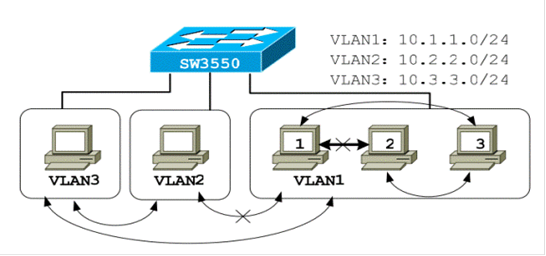

需求：

1.VLAN1和VLAN3、VLAN2和VLAN3可以互相访问

2.VLAN1和VLAN2不能互相访问

3.VLAN1内部的主机1和主机2不能互相访问，其它主机都能互相访问

思路：

凡是做VACL的思路是先将不能访问的用单向ACL抓出来

能访问的不要管

解法：

ac 110 per ip host 10.1.1.2 host 10.1.1.3

ac 110 per ip 10.1.1.0 0.0.0.255 10.2.2.0 0.0.0.255

vlan access-map ccnp 10

match ip address 110

action drop

vlan access-map ccnp 20

action forward

vlan filter ccnp vlan-list 1-3

//此处个人觉得只应用到vlan 1就可以了

进一步理解：VLAN之间的ACL应用到3层交换机中，而VACL应用到二层交换机中

但是有一种需求，就是同一个VLAN之间主机相互访问或者拒绝只能使用VACL来实现

案例二：版本60中的一个关于VACL的考题

需求：在Sw1 SVI VLAN_TEST上写一个命名访问列表，名字是大写的ACL1，必须用permit语句，deny 172.16.10.0/24到VLAN_TEST的流量，Permit 172.16.0.0/16的流量到VLAN_TEST，并且允许拓扑中其他所有流量通过

其中：VLAN_TEST的网络是11.11.80.0/28,VLAN号是801

解法：

ip access-list extended ACL1

permit ip 172.16.10.0 0.0.0.255 11.11.80.0 0.0.0.15

vlan access-map ccnp 10

match ip address ACL1

action drop

vlan access-map ccnp 20

action forward

vlan filter ccnp vlan-list 801

**关于增强的ACL修改功能**

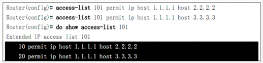

使用命令：

ip access-list extended 101

15 permit ip host 1.1.1.1 host 4.4.4.4

则：

重新编号，使用命令：

ip access-list resequence access-list-number start-number increase-number

则：

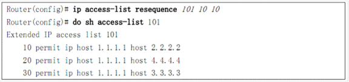

案例三：版本90中的一个关于ACL修改功能的考题

需求：R1上预配置了一个ACL，如下：

ip access-list standard ICMP

deny 30.1.1.0 0.0.0.255

deny 30.1.2.0 0.0.0.255

deny 30.1.3.0 0.0.0.255

deny 30.1.5.0 0.0.0.255

permit any

网管忘记添加deny 30.1.4.0 0.0.0.255，要求你添加上去，并且出现在3.0和5.0之间，不能重启路由器，不能移除条目，不能重新调用ACL

解法：'ip access-list standard ICMP

35 deny 30.1.4.0 0.0.0.255

关于ACL中的established参数

补充：TCP的3次握手知识

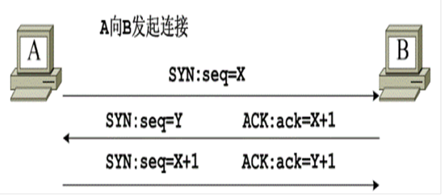

A发给B的第一个数据包中没有ACK位，通过这点可以判断出A在向B发起连接。

扩展ACL中的established参数可以根据数据包中是否设置了ACK位来对分组进行过滤，没有ACK为的不符合established条件

口诀：

established=ack位,外接口，in方向

案例三：单向访问实验

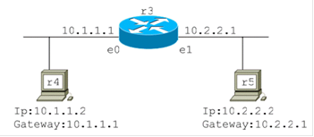

需求：

允许10.1.1.0/24网络中的主机向10.2.2.0/24网络中的主机发起TCP连接，禁止10.2.2.0/24网络中的主机向10.1.1.0/24网络中的主机发起TCP连接

解法：

access-list 110 per tcp 10.2.2.0 0.0.0.255 10.1.1.0 0.0.0.255 established

int e1

ip access-group 110 in

使用telnet测试一下，会发现R4可以远程登录到R5，但R5不可以远程登录到R4

扩展ACL中的established参数的缺点：仅用于基于TCP的上层协议，而对于其他上层协议，如UDP，ICMP等等则无法实现单向访问控制

关于自反ACL

**反射ACL的工作原理：**当内部网络发起一个会话并且将数据发送给外部网络时反射ACL就被触发并且**生成一个临时条目**

如果从外部网络过来的数据流符合临时条目，则允许其进入内部网络,否则禁止进入内部网络

注意点：

1.弥补了established的不足

2.只能使用扩展命名访问列表来做

3.临时条目的生存期：

对于TCP会话，

如果路由器检测到两组FIN标记的分组，则在5秒内将临时条目删除；

如果路由器检测到RST位的分组，则立刻删除临时条目。

对于**UDP和其他协议**，由于没有专门的机制来判断会话是否结束

默认会存300s，可以使用命令ip reflexive-list timeout *seconds*来修改

案例四：自反ACL

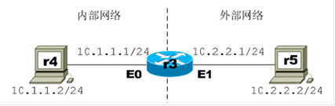

需求：允许R4连接R5，不允许R5连接R4

有两种方法：

第一种在外接口下配置：

ip access-list extended E1OUT

per ip any any reflect TAG //此处类似于打标签

ip access-list extended E1IN

evaluate TAG //此处是检查标签

int e1

ip access-group E1OUT out

ip access-group E1IN in

第二种在内接口下配置：

ip access-list extended E0IN

per ip an an reflect CCNP

ip access-list extended E0OUT

evaluate CCNP

int e0

ip access-group E0OUT out

ip access-group E1IN in

思考题：

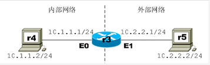

需求：内网可以访问外网，外网只能访问内网的10.1.1.5的HTTP服务器

并且可以ping10.1.1.5，使用自反访问列表实现

解法：

ip access-list extended ACLOUT

per ip any any ref CCNP

ip access-list extended ACLIN

per tcp any host 10.1.1.5 eq www

per icmp any host 10.1.1.5

evaluate CCNP //相于对所有的包进行检查

然后挂到出接口下就可以了

**关于动态ACL**

动态ACL一般用于控制外网用户对内网服务器的访问

如下图：当internet上的用户需要访问内网的服务器时

首先向路由器发起一个telnet会话，并且提供相应的用户名和密码

在用户被认证后，路由器关闭telnet会话

并且将一个临时的ACL语句置于E0口的ACL中

以允许源地址为认证用户工作站地址的数据包通过

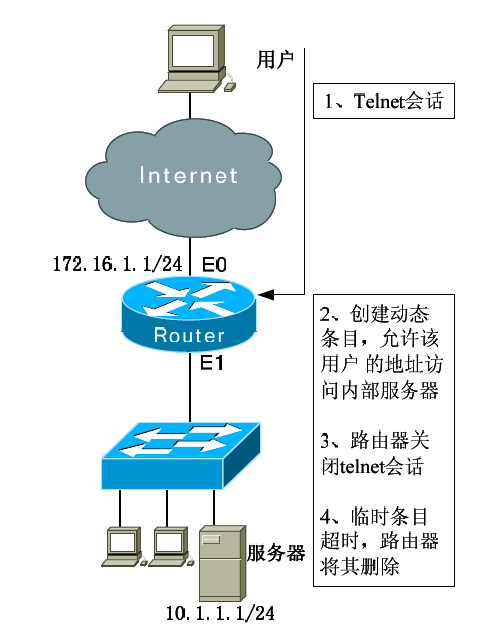

和自反访问列表一样，动态ACL也会创建临时条目，其生存周期有两个参数：**空闲时间和绝对时间**。当路由器产生临时条目时，该临时条目的空闲计时器和绝对计时器同时启动。**每当有临时条目的数据包时，空闲计时器被复位**。绝对计时器永远不会复位。当空闲计时器超时的时候，临时条目被设置为非活动状态，当绝对计时器超时的时候，临时条目才被删除。通常情况下，绝对时间应设置的大一些，例如：12小时、一天等等

空闲时间设置的小一些，例如：10分钟，1小时等等。

注意点：

必须手工设置空闲时间和绝对时间，否则均为无穷

即临时条目永不删除，除非重启路由器

2.只能使用扩展的访问列表做

==============================

这种情况会带来一个问题：

所有的telnet请求都会被路由器认为是要开启一个动态ACL条目

当用会被认证之后，telnet会话很快就会被关闭

这带来的问题就是网络管理员不再能够通过telnet对路由器进行管理。

解决方案：在一部分VTY线路上使用rotary命令开启其他的telnet端口

例如：rotary 1命令开启3001端口，rotary 2命令开启3002端口，以此类推

==============================

案例五：动态ACL

需求：10.1.1.0/24的用户能够访问internet，同时internet上的用户需要访问www服务器时，需要先到路由器上认证

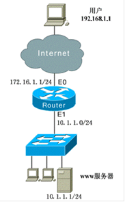

路由器上的配置：

access-list 110 per tcp any host 172.16.1.1 eq telnet

access-list 110 per tcp any host 172.16.1.1 eq 3001

access-list 110 per tcp any 10.1.1.0 0.0.0.255 gt 1023 established

access-list 110 per udp any 10.1.1.0 0.0.0.255 gt 1023

**access-list 110 dynamic CCNP timeout 720 permit tcp any host 10.1.1.1 eq www** //注意这里的timeout设置的是绝对时间，720代表720分钟，即12小时

username cisco password surpass

line vty 0 2

login local

**autocommand access-enable host timeout 10** //这里的timeout设置的是空闲时间，10代表10分钟

line vty 3 4

login local

rotary 1

int e0

ip access-group 110 in

案例六：版本80中的动态ACL考点

VLAN_D中的工程师有时需要连接到全网进行调试

但他们必须通过R4的检验方可访问全网，R4使用本地验证方式

要求：进行验证，用户名：ccie，密码：cisco

这样的行为可以持续10分钟，如果两分钟没有动作，就中断会话

不能影响ping和路由

其中：R4的访问点是11.11.13.4，VLAN_D是11.11.13.0

解法：

access-list 110 per icmp an an

access-list 110 per ospf an an

access-list 110 per tcp 11.11.13.0 0.0.0.255 host 11.11.13.4 eq telnet

access-list 110 dynamic CCNP timeout 10 permit tcp 11.11.13.0 0.0.0.255 11.11.0.0 0.0.255.255 eq telnet

username ccie password cisco

username ccie autocommand access-enable host timeout 2

line vty 0 4

login local

int e0

ip access-group 110 in

关于基于时间的ACL

命令：

time-range *time-range-name*

absolute [start hh:mm] [end hh:mm] //注意：时间参数必须以24小时制来表示

periodic days-of-the-week hh:mm [days-of-the-week] hh:mm

注意：只能使用扩展的访问列表做

案例七：基于时间的访问列表

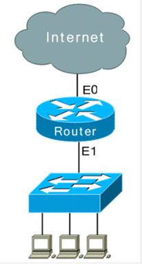

需求：某企业要求周一到周五的上午9:00到下午17:00不允许任何访问internet的IP流量

解法：

time-range T

periodic weekdays 9:00 to 17:00

ip access-list extended CCNP

deny ip an an time-range T

permit ip an an

int e1

ip acce CCNP in

案例八：版本60中的考点

需求：

At weekdays,from 8:00 am to 6:00 pm,don't permit any www traffic on VLAN_G.configure on R5 for it and use minimum commands to finish this.

配置：

time-range T

periodic weekdays 8:00 to 18:00

ip access-list exxtended G

deny tcp any any eq www time-range T

permit ip any any

int e0

ip access-group G in

关于基于上下文的访问控制（CBAC）

CBAC：Context-Based Access Control

================================

补充：CBAC是Cisco IOS防火墙特性集中的一个特性。

Cisco防火墙特性集包括3个部分：

1.Cisco IOS Firewall：其实就是CBAC

2.Authentication proxy：认证代理

3.IPS

==============================

CBAC是相当的强大的，它具有很多的特点.

特点一：设置审计跟踪和警告

logging on

logging 10.1.1.3

ip inspect audit-trail //打开审计跟踪功能

no ip inspect alert-off //打开警告功能

特点二：设置全局超时时间

ip inspect tcp synwait-time xxx //定义在丢弃会话之前，CBAC将等待多长时间使TCP会话达到已建立状态，默认30秒

ip inspect tcp finwait-time xxx //定义当防火墙检测到TCP会话的FIN信号时，它还将管理这个会话多长时间，默认5秒

ip inspect tcp idle-time xxx //定义TCP的空闲超时值，默认1小时

ip inspect udp idle-time xxx //定义UDP的空闲超时值，默认是30秒

ip inspect dns-timeout xxx //定义DNS的空闲超时值，默认是5秒

============================

补充

术语：半打开会话---对于TCP来讲，半打开会话指会话没有达到建立状态，即TCP三次握手还没有完成；对UDP来讲，半打开会话是指防火墙在一定时间内没有检测到返回的流量。如果路由器检测到过多的半打开会话，说明网络中可能存在DoS攻击

================================

特点三：设置全局阀值

ip inspect max-incomplete high xxx //用于定义半打开会话数量的最大值，当半打开会话的数量超过此阀值时，CBAC开始删除现有的半打开会话，默认值是500

ip inspect max-incomplete low xxx //用于定义半打开会话的最小值，当半打开会话的数量降低到此阀值时，CBAC停止删除半打开会话，默认是400

注意：上面两个命令每1分钟查看一次统计信息，但有可能一分钟之内的半开会话时600，但是1分钟以后才能知道，此时才开始删除半开会话。下面两个命令用于解决这个问题

ip inspect one-minute high xxx //定义新连接的尝试速率的最大值，当新连接的尝试速率超过此阀值时，CBAC开始删除现有的半打开会话，默认值是500

ip inspect one-minute low xxx //定义新连接尝试速率的最小值，当新连接的尝试速率降低达到此阀值时，CBAC停止删除半打开会话，默认值是400

特点四：设置主机限制的半开连接

ip inspect tcp max-incomplete host number block-time minutes //number表示同一目的主机所允许的半开TCP连接数量，范围是1-250，默认是50；minutes指删除新连接请求所持续的时间，默认值是0，代表当会话数达到此阀值时，每一个新连接请求到达此主机，CBAC就删除一个最老的半打开会话，以确保新的连接。

如果该参数的值设置的大于0，当会话数达到此阀值时，CBAC会删除所有到达该主机的半打开会话，并阻塞所有到该主机的新连接请求，直到block-time超时

特点五：PAM

PAM：Port-to-Application Mapping端口到应用的映射，可以用命令show ip port-map命令查看

ip port-map appl_name port port_num:很好理解，不用多说了

以上5个特点可以可选的配置

下面是必须要进行配置的命令

ip inspect name inspection-name protocol [alert {on | off}] [audit-trail {on | off}][timeout seconds]

int s1/1

ip inspect inspect-name [in | out]

例子：

1.定义一个审查规则，对ftp协议进行审查，开启告警和审查跟踪，将FTP的空闲超时时间设置为30秒

ip inspect name CCNP ftp alert on audit-trail on timeout 30

2.定义一个审查规则，对tcp和udp流量进行审查

ip inspect name CCNP tcp

ip inspect name CCNP udp

3. 定义一个HTTP Java审查规则，将10.1.1.0/24网络设置为友好站点，审查规则将过滤来自于非友好站点的Java小程序

access-list 10 permit 10.1.1.0 0.0.0.255

ip inspect name JAVAFILTER http java-list 10

注意：

1.CBAC将忽略回包的一切access-list列表

2.部署CBAC的规则：

在数据流开始的接口上

（1）将ACL放置在向内的方向上，仅允许期望的数据流

（2）将检查规则放置在向内的方向上，仅允许期望的数据流

在其他所有的接口上放置ACL，拒绝所有数据流

案例八：CBAC公司应用实例---两个接口的防火墙

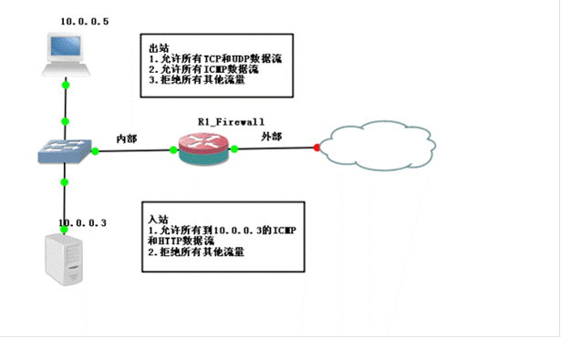

R1_Firewall的配置：

ac 110 per ip 10.0.0.0 0.0.0.255 any

ip inspect name OUTBOUND tcp

ip inspect name OUTBOUND udp

int fa0/0

ip access-group 110 in

ip inspect OUTBOUND in

ac 120 per icmp any host 10.0.0.3

ac 120 per tcp any hot 10.0.0.3 eq www

ip inspect name INBOUND tcp

int fa0/1

ip access-group 120 in

ip inspect INBOUND in

案例九：CBAC公司应用实例---三个接口的防火墙

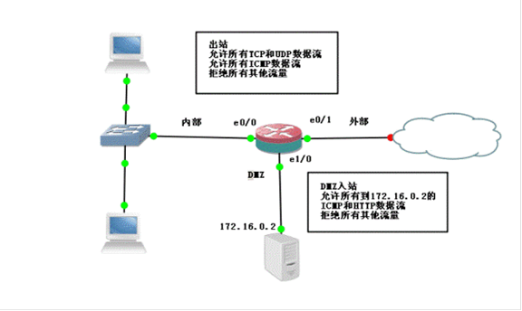

配置：

ac 110 per ip 10.0.0.0 0.0.0.255 any

ip inspect name OUTBOUND tcp

ip inspect name OUTBOUND udp

int e0/0

ip access-group 110 in

ip inspect OUTBOUND in

ac 120 per icmp any host 172.16.0.2

ac 120 per tcp any host 172.16.0.2 eq www

ip inspect name INBOUND tcp

int e0/1

ip access-group 120 in

ip inspect INBOUND in

ac 130 per icmp host 172.16.0.2 any

ac 140 per icmp any host 172.16.0.2

ac 140 per tcp any host 172.16.0.2 eq www

int e1/0

ip access-group 130 in

ip access-group 140 out //个人感觉这个可以不加的

案例十：版本45中的CBAC考点

R1，R3，R6，Sw1和Sw2需要telnet到R2的环回口地址150.4.Y.1，要求一台合适的设备配置访问控制以满足如下需求：

R1，R3，R6，Sw1和Sw2可以telnet到150.4.Y.1，其他到150.4.Y.1的流量会被阻塞；所有源自150.4.Y.1的流量将被阻塞，但是不包括从150.4.Y.1的返回telnet流量；Telnet会话超时时间为30分钟；所有Telnet的会话需要被审计

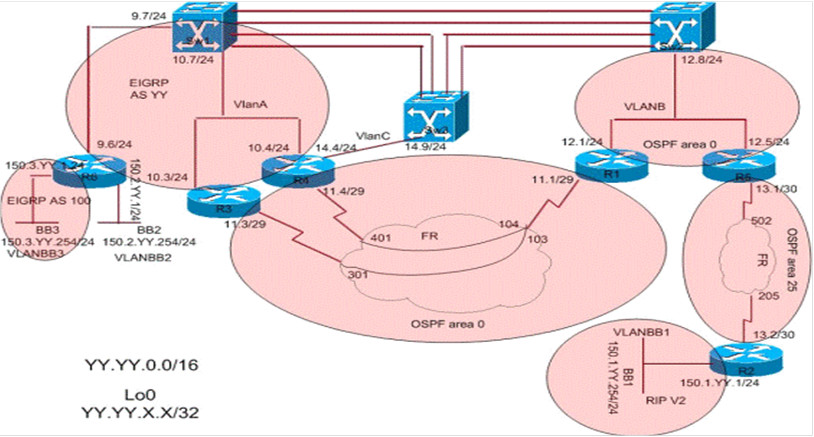

分析：R1，R3，R6，Sw1和Sw2要访问R2，沿途肯定要经过R5，所以最佳设备一定是R5

配置：

ac 110 per tcp any host 150.4.Y.1 eq telnet

ac 110 deny ip any host 150.4.Y.1

ac 110 per ip any any

ip inspect name CBAC telnet audit-trail on timeout 1800

int e0/0

ip access-group 110 in

ip inspect CBAC in

ac 120 deny ip host 150.4.Y.1 any

ac 120 per ip any any

int s0/0

ip access-group 120 in

扩展：假设这道题没有审计等功能，那能不能用ACL来做

解法：

ac 110 per tcp any host 150.4.Y.1 eq telnet

ac 110 deny ip an host 150.4.Y.1

ac 110 per ip any any

int e0/0

ip access-group 110 in

ac 120 per tcp host 150.4.Y.1 eq 23 any

ac 120 deny ip host 150.4.Y.1 any

ac 120 per ip an an

int s0/0

ip access-group 120 in

可以看出也是可以解的

那下一个问题：为什么要使用CBAC？答案：方便，原因是如果使用传统的ACL，要打很多的代码，并且很麻烦

附录：

记忆如下内容

1、增强的ACL 修改功能

2、扩展ACL 中的established 参数

用来做单向访问

可以这么理解established=tcp连接中的ack

缺点是仅能对使用tcp的应用程序

3、反射ACL(自反ACL)

弥补established的不足

只能使用扩展的命名访问列表来做

临时条目（300s）

4、动态ACL

只能使用扩展的访问列表做

临时条目（空闲时间和绝对时间）

5、基于时间的ACL

只能使用扩展的访问列表做

6、基于上下文的访问控制列表（CBAC）

只有具有防火墙特性集的IOS 才支持CBAC

实时警告和审核跟踪功能可以打开