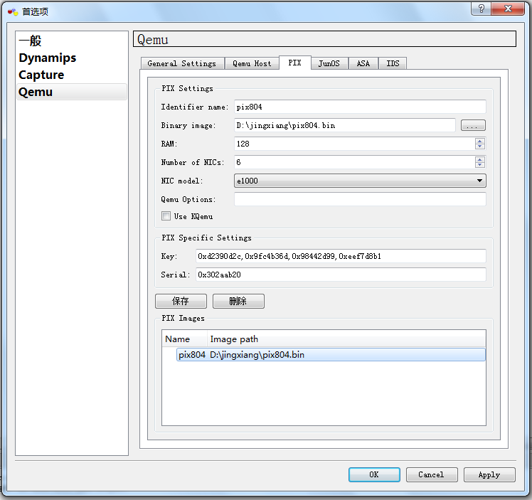

# PIX

PIX

2011年8月2日

22:19

PIX防火墙

关于防火墙许可

防火墙有以下几种许可形式，可以使用show version命令查看

1.Unrestricted（UR）：所有限制仅限于设备自身的性能，支持Failover

2.Restricted(R):防火墙的内存和允许使用的做多端口数有限制，不支持Failover

3.Failover（FO）：不能单独使用的防火墙，只能用于Failover

4.Failover-Active/Active（FO-AA）：只能和UR类型的防火墙一起使用，支持active/active failover

注意：FWSM内置UR许可

命令activation-key用于升级设备的许可，该许可和设备的serial number有关（可以在show version输出中看到，6.x为16字节，7.x为20字节）

PIX IOS与Router/Switch IOS配置命令上的一些区别

1. 路由器上只能在enable模式下show run，而在PIX上在任何地方都可以show run，用户模式不可以

2. PIX上在如何show命令出来的东西太多不能使用Tab键切断后面的输出，要使用字符Q

3.路由器上ACL使用反掩码，PIX上使用正掩码

配置密码

PIX默认密码是空

enable password 定义登陆密码

passwd 定义远程登录密码

所有防火墙的密码默认都是加密的，可以用show run看一下

接口基本配置

防火墙的接口都必须配置接口名称，接口IP地址和掩码，安全等级。

接口可以是物理接口，也可以是逻辑接口（vlan），从6.3开始支持SPAN、trunk，但只支持802.1Q封装，不支持DTP协商

一、对于FWSM，所有的接口都是逻辑接口，名字也是vlan后面加上vlanid。例如：FWSM位于6500的第三槽，配置三个接口，分别属于vlan 100，200，300.

Switch（config）#firewall vlan-group 1 100，200，300

Switch（config）#firewall module 3 vlan-group 1

Switch（config）#exit

Switch#session slot 3 processor 1

经过此配置后形成三个端口vlan 100，vlan 200，vlan 300

二、PIX 6.x

Firewall（config）#interface hardware-id [hardware-speed] [shutdown]

其中hardware-id可以用show version命令看到

三、PIX 7.x

Firewall（config）#interface hardware-id

Firewall（config-if）#speed {auto|10|100|nonegotiate}

Firewall（config-if）#duplex {auto|full|half}

Firewall（config-if）#[no] shutdown

给接口命名和接口安全级别

PIX使用ASA算法，这种算法使用到了安全级别

接口安全级别的范围是0到100（越大安全性越高），当使用命令nameif给接口分配名字的时候，安全级别默认就开启了。

默认情况下PIX中定义了两个默认的安全级别，一个是nameif名字为inside，安全级别为100，一个是nameif名字为outside，安全级别为0.当随便起了一个名字以后，安全级别就自动设置为0，可以手工修改。

一、FWSM 2.x

> Firewall（config）#nameif vlan-id if_name securitylevel
> 

二、PIX 6.x

> Firewall（config）#nameif {haredware-id | vlan-id} if_name securitylevel
> 

三、PIX 7.x

> Firewall（config）#interface hardware_id[.subinterface]
> 
> 
> Firewall（config-if）#nameif if_name
> 
> Firewall（config-if）#security-level level
> 

注意：show ip用于看接口地址，相当于IOS中的show ip int bri

配置Banner

> 命令：banner {exec | login | motd} text //对banner不能修改，只能用no来删除，或者clear banner来清除所有的banner（7.x clear configure banner）
> 
> 
> 配置telnet
> 
> 使用telnet命令
> 
> 注意点：从outside方向是telnet不进来的，只能从inside方向进来。如果想从outside方向进来要使用ssh
> 
> 命令：
> 
> telnet ip_address netmask if_name
> 
> telnet timeout minutes //配置telnet超时
> 
> 配置SSH
> 
> domain-name name
> 
> ca generate rsa key [modulus] //7.x使用crypto key generate rsa general-keys [modulus modulus]
> 
> ca save all //7.x自动保存
> 
> 验证命令：show ca mypubkey rsa //7.x使用show crypto key mypubkey rsa
> 
> ssh ip_address netmask if_name //配置ssh的访问许可
> 
> PDM/ASDM配置
> 
> 由于PDM存放位置固定，所以不需要指定镜像的位置
> 
> ASDM使用命令：asdm image device:/path
> 
> 然后配置访问许可： http ip_address subnet_mask if_name
> 
> 启用HTTP进程：http server enable
> 
> 使用[https://ip-address/admin](https://ip-address/admin)来访问
> 
> who监控telnet会话，kill telnet-id清除会话
> 
> show ssh sessions监控ssh会话，ssh disconnect session-id清除ssh会话
> 
> show pdm sessions监控pdm会话，pdm disconnect session-id清除pdm会话
> 
> 配置ACL
> 
> 防火墙的ACL配置跟IOS不同，子网掩码部分为正常的子网掩码，不需要使用反转的子网掩码。还支持Object group，包含IP地址组，ICMP类型组，IP协议或者端口组，并且支持嵌套。
> 
> 防火墙的ACL缺省是扩展模式的，7.x后也支持标准模式。
> 
> 使用两个命令，
> 
> 一个是access-list用来定义ACL，且只能定义基于名称的ACL，注意点是不使用反掩码，要使用正掩码
> 
> 一个是access-group用来应用，注意在路由器中是在接口下应用，在PIX中是在全局中应用
> 
> 例子：
> 
> 需求:禁止10.1.1.0/24网段到20.1.1.0/24网段的gre流量，并做记录，其他流量都允许，并且应用到inside接口下
> 
> 命令是：
> 
> access-list DENY_GRE extended deny gre 10.1.1.0 255.255.255.0 20.1.1.0 255.255.255.0 log
> 
> access-list DENY_GRE extended permit ip any any
> 
> access-group DENY_GRE in interface inside
> 
> 配置NAT/PAT
> 
> 两条命令
> 
> 第一条：nat命令
> 
> 第二条：global命令
> 
> 案例一（NAT）：
> 
> 需求：将10.1.1.0/24网段翻译成20.1.1.2-254
> 
> 配置：nat (inside) 1 10.1.1.0 255.255.255.0
> 
> global (outside) 1 20.1.1.2-254
> 
> 案例二（PAT）：
> 
> 需求：将10.1.1.0/24网段翻译成outside的接口
> 
> 配置：nat (inside) 1 10.1.1.0 255.255.255.0
> 
> global (outside) 1 interface
> 
> 启用PRF防止地址欺骗
> 
> Firewall（config）#ip verify reverse-path interface if_name
> 
> 配置静态路由协议
> 
> 使用命令
> 
> route 出接口 目的网络 目的网络掩码 下一跳IP地址 管理距离
> 
> 例子：
> 
> 静态缺省路由
> 
> route outside 0.0.0.0 0.0.0.0 202.100.1.2 1
> 
> 配置动态路由协议
> 
> 和路由器一样
> 
> 命令show route：用来看路由表
> 
> DHCP
> 
> 第一步：配置地址池
> 
> dhcpd address ip1 [-ip2] if_name（最多256个客户端）
> 
> 第二步：配置DHCP参数
> 
> dhcpd dns dns1 [dns2]
> 
> dhcpd wins wins1 [wins2]
> 
> dhcpd domain domain_name
> 
> dhcpd lease lease_length
> 
> dhcpd ping_timeout timeout
> 
> 第三步：启用DHCP服务
> 
> dhcpd enable if_name
> 
> 验证命令：show dhcpd ，show dhcpd bindings， show dhcpd statistics
> 
> 下面几步是配置DHCP中继
> 
> 第四步：配置DHCP中继
> 
> dhcprelay server dhcp_server_ip server_ifc（最多4个）
> 
> 第五步：配置中继参数
> 
> dhcprelay timeout seconds
> 
> dhcprelay setroute client_ifc
> 
> 第六步：启用中继
> 
> dhcprelay enable client_ifc
> 
> 验证命令：show dhcprelay statistics
> 
> 关于虚拟防火墙
> 
> 使用Security Context建立虚拟防火墙（7.x特性）
> 
> 从PIX 7.0和FWSM 2.2(1)开始，可以把物理的一个防火墙配置出多个虚拟的防火墙，每个防火墙称为context，这样一个防火墙就支持两种工作模式：single-context和multiple-context。
> 
> multiple-context模式分为三个功能模块：
> 
> 1.system execution space
> 

2.administrative context：被用来管理物理的防火墙

3.user contexts：虚拟出来的防火墙，所有配置防火墙的命令都适用

> 首先使用show activation-key命令来验证是否有multiple-context的许可，然后通过mode multiple命令和mode single命令在这两个模式之间进行切换，可以使用命令show mode看当前工作在什么模式。
> 
> 
> 透明模式
> 
> 从PIX 7.0和FWSM 2.2开始防火墙可以支持透明的防火墙模式，接口不需要配置地址信息，工作在二层。只支持两个几口inside和outside，当然可以配置一个管理接口，但管理接口不能用于处理用户流量，在多context模式下不能复用物理端口。
> 
> 命令show firewall用来看当前的工作模式
> 
> 命令firewall transparent用来进入透明模式
> 
> 注意点：
> 
> 1.防火墙有两种模式：路由模式、透明模式
> 
> 2.由于路由模式和透明模式工作方式不同，所以互相切换的时候会清除当前配置文件
> 
> Failover
> 
> 为了增强可用性，避免单点故障，提高性能等原因才引入了Failover特性。
> 
> 常用show命令
> 
> 命令show cpu usage：用来看CPU的负荷的，正常应该在80%一下，相当于IOS中的show process cpu命令
> 
> 命令show processes：用来显示防火墙当前活动进程，一般关注process和runtime两列
> 
> 命令show memory：用来看内存的利用情况
> 
> 命令show xlate count：用来看xlate表大小
> 
> 命令show conn count：用来看conn表大小
> 
> PIX 721默认的show run配置
> 
> pixfirewall# sh run
> 
> : Saved
> 
> :
> 
> PIX Version 7.2(1)
> 
> !
> 
> hostname pixfirewall
> 
> enable password 8Ry2YjIyt7RRXU24 encrypted
> 
> names
> 
> !
> 
> interface Ethernet0
> 
> shutdown
> 
> no nameif
> 
> no security-level
> 
> no ip address
> 
> !
> 
> interface Ethernet1
> 
> shutdown
> 
> no nameif
> 
> no security-level
> 
> no ip address
> 
> !
> 
> passwd 2KFQnbNIdI.2KYOU encrypted
> 
> ftp mode passive
> 
> pager lines 24
> 
> no asdm history enable
> 
> arp timeout 14400
> 
> timeout xlate 3:00:00
> 
> timeout conn 1:00:00 half-closed 0:10:00 udp 0:02:00 icmp 0:00:02
> 
> timeout sunrpc 0:10:00 h323 0:05:00 h225 1:00:00 mgcp 0:05:00 mgcp-pat 0:05:00
> 
> timeout sip 0:30:00 sip_media 0:02:00 sip-invite 0:03:00 sip-disconnect 0:02:00
> 
> timeout uauth 0:05:00 absolute
> 
> no snmp-server location
> 
> no snmp-server contact
> 
> snmp-server enable traps snmp authentication linkup linkdown coldstart
> 
> telnet timeout 5
> 
> ssh timeout 5
> 
> console timeout 0
> 
> !
> 
> !
> 
> prompt hostname context
> 
> Cryptochecksum:00000000000000000000000000000000
> 
> : end
> 
> 一：什么是DMZ
> 
> DMZ（Demilitarized Zone）即俗称的非军事区，与军事区和信任区相对应，作用是把WEB，e-mail，等允许外部访问的服务器单独接在该区端口，使整个需要保护的内部网络接在信任区端口后，不允许任何访问，实现内外网分离，达到用户需求。DMZ可以理解为一个不同于外网或内网的特殊网络区域，DMZ内通常放置一些不含机密信息的公用服务器，比如Web、Mail、FTP等。这样来自外网的访问者可以访问DMZ中的服务，但不可能接触到存放在内网中的公司机密或私人信息等，即使DMZ中服务器受到破坏，也不会对内网中的机密信息造成影响。
> 
> 二：为什么需要DMZ
> 
> 在实际的运用中，某些主机需要对外提供服务，为了更好地提供服务，同时又要有效地保护内部网络的安全，将这些需要对外开放的主机与内部的众多网络设备分隔开来，根据不同的需要，有针对性地采取相应的隔离措施，这样便能在对外提供友好的服务的同时最大限度地保护了内部网络。针对不同资源提供不同安全级别的保护，可以构建一个DMZ区域，DMZ可以为主机环境提供网络级的保护，能减少为不信任客户提供服务而引发的危险，是放置公共信息的最佳位置。在一个非DMZ系统中，内部网络和主机的安全通常并不如人们想象的那样坚固，提供给Internet的服务产生了许多漏洞，使其他主机极易受到攻击。但是，通过配置DMZ，我们可以将需要保护的Web应用程序服务器和数据库系统放在内网中，把没有包含敏感数据、担当代理数据访问职责的主机放置于DMZ中，这样就为应用系统安全提供了保障。DMZ使包含重要数据的内部系统免于直接暴露给外部网络而受到攻击，攻击者即使初步入侵成功，还要面临DMZ设置的新的障碍。
> 
> 三：DMZ网络访问控制策略
> 
> 当规划一个拥有DMZ的网络时候,我们可以明确各个网络之间的访问关系,可以确定以下六条访问控制策略。
> 
> 1.内网可以访问外网
> 
> 内网的用户显然需要自由地访问外网。在这一策略中，防火墙需要进行源地址转换。
> 
> 2.内网可以访问DMZ
> 
> 此策略是为了方便内网用户使用和管理DMZ中的服务器。
> 
> 3.外网不能访问内网
> 
> 很显然，内网中存放的是公司内部数据，这些数据不允许外网的用户进行访问。
> 
> 4.外网可以访问DMZ
> 
> DMZ中的服务器本身就是要给外界提供服务的，所以外网必须可以访问DMZ。同时，外网访问DMZ需要由防火墙完成对外地址到服务器实际地址的转换。
> 
> 5.DMZ不能访问内网
> 
> 很明显，如果违背此策略，则当入侵者攻陷DMZ时，就可以进一步进攻到内网的重要数据。
> 
> 6.DMZ不能访问外网
> 
> 此条策略也有例外，比如DMZ中放置邮件服务器时，就需要访问外网，否则将不能正常工作。在网络中，非军事区(DMZ)是指为不信任系统提供服务的孤立网段，其目的是把敏感的内部网络和其他提供访问服务的网络分开，阻止内网和外网直接通信，以保证内网安全。
> 
> 四：DMZ服务配置
> 
> DMZ提供的服务是经过了地址转换（NAT）和受安全规则限制的，以达到隐蔽真实地址、控制访问的功能。首先要根据将要提供的服务和安全策略建立一个清晰的网络拓扑，确定DMZ区应用服务器的IP和端口号以及数据流向。通常网络通信流向为禁止外网区与内网区直接通信，DMZ区既可与外网区进行通信，也可以与内网区进行通信，受安全规则限制。
> 
> 1 地址转换
> 
> DMZ区服务器与内网区、外网区的通信是经过网络地址转换（NAT）实现的。网络地址转换用于将一个地址域（如专用Intranet）映射到另一个地址域（如Internet），以达到隐藏专用网络的目的。DMZ区服务器对内服务时映射成内网地址，对外服务时映射成外网地址。采用静态映射配置网络地址转换时，服务用IP和真实IP要一一映射，源地址转换和目的地址转换都必须要有。
> 
> 2 DMZ安全规则制定
> 
> 安全规则集是安全策略的技术实现，一个可靠、高效的安全规则集是实现一个成功、安全的防火墙的非常关键的一步。如果防火墙规则集配置错误，再好的防火墙也只是摆设。在建立规则集时必须注意规则次序，因为防火墙大多以顺序方式检查信息包，同样的规则，以不同的次序放置，可能会完全改变防火墙的运转情况。如果信息包经过每一条规则而没有发现匹配，这个信息包便会被拒绝。一般来说，通常的顺序是，较特殊的规则在前，较普通的规则在后，防止在找到一个特殊规则之前一个普通规则便被匹配，避免防火墙被配置错误。 DMZ安全规则指定了非军事区内的某一主机（IP地址）对应的安全策略。由于DMZ区内放置的服务器主机将提供公共服务，其地址是公开的，可以被外部网的用户访问，所以正确设置DMZ区安全规则对保证网络安全是十分重要的。 FireWall可以根据数据包的地址、协议和端口进行访问控制。它将每个连接作为一个数据流，通过规则表与连接表共同配合，对网络连接和会话的当前状态进行分析和监控。其用于过滤和监控的IP包信息主要有：源IP地址、目的IP地址、协议类型（IP、ICMP、TCP、UDP）、源TCP/UDP端口、目的TCP/UDP端口、ICMP报文类型域和代码域、碎片包和其他标志位（如SYN、ACK位）等。 为了让DMZ区的应用服务器能与内网中DB服务器（服务端口4004、使用TCP协议）通信，需增加DMZ区安全规则， 这样一个基于DMZ的安全应用服务便配置好了。其他的应用服务可根据安全策略逐个配置。 DMZ无疑是网络安全防御体系中重要组成部分，再加上入侵检测和基于主机的其他安全措施，将极大地提高公共服务及整个系统的安全性。
> 
> **试验一.PIX 的基本操作**
> 
> 试验基本连接:PC 通过控制口来登录配置防火墙,在这里我们是通过访问我们的试验台
> 
> 来登录的.我们这个试验主要来操作下面的基本配置命令.
> 
> a.hostname设置名称命令
> 
> b.nameif设置接口名称和优先级
> 
> c.interface激活接口
> 
> d.ip add设置接口 IP 地址
> 
> e.route设置静态路由
> 
> f.passwd enable pass设置远程访问的密码
> 
> g.wr mem保持配置
> 
> h.wr erase清除配置
> 
> i.reload重新启动
> 
> 进入 PIX 系统；此时系统提示 pixfirewall>。
> 
> pixfirewall> en
> 
> Password: 直接进入没有密码，第一次，出厂没有被设置
> 
> pixfirewall# conf t
> 
> pixfirewall(config)# hostname fxh 为路由器配置名字
> 
> fxh(config)# sh nameif 查询接口名字
> 
> nameif ethernet0 outside security0
> 
> nameif ethernet1 inside security100
> 
> fxh(config)# sh interface 详细查询接口信息，看看是否链路层起来，是派查
> 
> 错误的必要命令
> 
> interface ethernet0 "outside" is administratively down, 说明没有启动接口 line
> 
> protocol is up
> 
> Hardware is i82558 ethernet, address is 0004.ac15.c562
> 
> MTU 1500 bytes, BW 10000 Kbit half duplex
> 
> 407 packets input, 50763 bytes, 0 no buffer
> 
> Received 407 broadcasts, 0 runts, 0 giants
> 
> 0 input errors, 0 CRC, 0 frame, 0 overrun, 0 ignored, 0 abort
> 
> 0 packets output, 0 bytes, 0 underruns
> 
> 0 output errors, 0 collisions, 0 interface resets
> 
> 0 babbles, 0 late collisions, 0 deferred
> 
> 0 lost carrier, 0 no carrier
> 
> input queue (curr/max blocks): hardware (128/128) software (0/0)
> 
> output queue (curr/max blocks): hardware (0/0) software (0/0)
> 
> interface ethernet1 "inside" is administratively down, line protocol is up
> 
> Hardware is i82558 ethernet, address is 0004.acc5.465b
> 
> MTU 1500 bytes, BW 10000 Kbit half duplex
> 
> 407 packets input, 50763 bytes, 0 no buffer
> 
> Received 407 broadcasts, 0 runts, 0 giants
> 
> 0 input errors, 0 CRC, 0 frame, 0 overrun, 0 ignored, 0 abort
> 
> 0 packets output, 0 bytes, 0 underruns
> 
> 0 output errors, 0 collisions, 0 interface resets
> 
> 0 babbles, 0 late collisions, 0 deferred
> 
> 0 lost carrier, 0 no carrier
> 
> input queue (curr/max blocks): hardware (128/128) software (0/0)
> 
> output queue (curr/max blocks): hardware (0/0) software (0/0)
> 
> fxh(config)# int e0 auto 自动启用接口命令
> 
> fxh(config)# int e1 auto
> 
> fxh(config)# sh inter
> 
> interface ethernet0 "outside" is up, line protocol is up
> 
> Hardware is i82558 ethernet, address is 0004.ac15.c562
> 
> MTU 1500 bytes, BW 10000 Kbit half duplex
> 
> 410 packets input, 51039 bytes, 0 no buffer
> 
> Received 410 broadcasts, 0 runts, 0 giants
> 
> 0 input errors, 0 CRC, 0 frame, 0 overrun, 0 ignored, 0 abort
> 
> 0 packets output, 0 bytes, 0 underruns
> 
> 0 output errors, 0 collisions, 0 interface resets
> 
> 0 babbles, 0 late collisions, 0 deferred
> 
> 0 lost carrier, 0 no carrier
> 
> input queue (curr/max blocks): hardware (128/128) software (0/0)
> 
> output queue (curr/max blocks): hardware (0/0) software (0/0)
> 
> interface ethernet1 "inside" is up, line protocol is up
> 
> Hardware is i82558 ethernet, address is 0004.acc5.465b
> 
> MTU 1500 bytes, BW 10000 Kbit half duplex
> 
> 410 packets input, 51039 bytes, 0 no buffer
> 
> Received 410 broadcasts, 0 runts, 0 giants
> 
> 0 input errors, 0 CRC, 0 frame, 0 overrun, 0 ignored, 0 abort
> 
> 0 packets output, 0 bytes, 0 underruns
> 
> 0 output errors, 0 collisions, 0 interface resets
> 
> 0 babbles, 0 late collisions, 0 deferred
> 
> 0 lost carrier, 0 no carrier
> 
> input queue (curr/max blocks): hardware (128/128) software (0/0)
> 
> output queue (curr/max blocks): hardware (0/0) software (0/0)
> 
> fxh(config)# inter e0 100full 手动启动接口的速率和双工模式
> 
> fxh(config)# inter e1 100full
> 
> fxh(config)# sh inter
> 
> interface ethernet0 "outside" is up, line protocol is down
> 
> Hardware is i82558 ethernet, address is 0004.ac15.c562
> 
> MTU 1500 bytes, BW 100000 Kbit full duplex
> 
> 414 packets input, 51558 bytes, 0 no buffer
> 
> Received 414 broadcasts, 0 runts, 0 giants
> 
> 0 input errors, 0 CRC, 0 frame, 0 overrun, 0 ignored, 0 abort
> 
> 0 packets output, 0 bytes, 0 underruns
> 
> 0 output errors, 0 collisions, 0 interface resets
> 
> 0 babbles, 0 late collisions, 0 deferred
> 
> 0 lost carrier, 0 no carrier
> 
> input queue (curr/max blocks): hardware (128/128) software (0/1)
> 
> output queue (curr/max blocks): hardware (0/0) software (0/0)
> 
> interface ethernet1 "inside" is up, line protocol is down
> 
> Hardware is i82558 ethernet, address is 0004.acc5.465b
> 
> MTU 1500 bytes, BW 100000 Kbit full duplex
> 
> 414 packets input, 51558 bytes, 0 no buffer
> 
> Received 414 broadcasts, 0 runts, 0 giants
> 
> 0 input errors, 0 CRC, 0 frame, 0 overrun, 0 ignored, 0 abort
> 
> 0 packets output, 0 bytes, 0 underruns
> 
> 0 output errors, 0 collisions, 0 interface resets
> 
> 0 babbles, 0 late collisions, 0 deferred
> 
> 0 lost carrier, 0 no carrier
> 
> input queue (curr/max blocks): hardware (128/128) software (0/1)
> 
> output queue (curr/max blocks): hardware (0/0) software (0/0)
> 
> fxh(config)# exit
> 
> fxh# sh run | in inter 快速的查询命令
> 
> interface ethernet0 100full
> 
> interface ethernet1 100full
> 
> fxh# conf t
> 
> fxh(config)# ip add outside 1.1.1.125 255.255.0 设置内部和外部接口的命令
> 
> fxh(config)# ip add inside 1.2.3.125 255.255.255.0
> 
> fxh(config)# sh ip add 查询设置地址的命令
> 
> System IP Addresses:
> 
> ip address outside 1.1.1.125 255.255.0.0
> 
> ip address inside 1.2.3.125 255.255.255.0
> 
> Current IP Addresses:
> 
> ip address outside 1.1.1.125 255.255.0.0
> 
> ip address inside 1.2.3.125 255.255.255.0
> 
> fxh(config)# ip add outside 1.1.1.125 255.255.255.0
> 
> fxh(config)# sh ip add
> 
> System IP Addresses:
> 
> ip address outside 1.1.1.125 255.255.255.0
> 
> ip address inside 1.2.3.125 255.255.255.0
> 
> Current IP Addresses:
> 
> ip address outside 1.1.1.125 255.255.255.0
> 
> ip address inside 1.2.3.125 255.255.255.0
> 
> fxh(config)# sh route
> 
> outside 1.1.1.0 255.255.255.0 1.1.1.125 1 CONNECT static
> 
> inside 1.2.3.0 255.255.255.0 1.2.3.125 1 CONNECT static
> 
> fxh(config)# route outside 0 0 1.1.1.124 建立路由的方法，可以让内部的数据
> 
> 穿越 PIX 到外部去。
> 
> fxh(config)# route inside 10.1.1.0 255.255.255.0 1.2.3.124 控制路由信息的静
> 
> 态路由建立
> 
> fxh(config)# passwd cisco 建立 telnet 和 ssh 登录的密码
> 
> fxh(config)# en pass cisco
> 
> fxh(config)# exit
> 
> fxh# disable
> 
> fxh> en
> 
> Password: *****
> 
> fxh# wri mem
> 
> 建立 enable 的密码
> 
> 保存配置信息
> 
> Building configuration...
> 
> Cryptochecksum: 3a115dcb 6d5645e4 94c3e380 687a5015
> 
> [OK]
> 
> fxh#
> 
> fxh#
> 
> fxh#
> 
> fxh# wr era 清除配置信息
> 
> Erase PIX configuration in flash memory? [confirm]
> 
> fxh#
> 
> fxh#
> 
> fxh#
> 
> fxh# reload 重新启动你的 PIX
> 
> **试验二 telnet 和 ssh 网管**
> 
> **TELNET 试验:**
> 
> 试验的目的是让内部网络的设备和外部网络的设备通过 TELNET 访问 PIX,并且作出配置
> 
> 第一步:内部与外部的主机与 PIX 的接口通信
> 
> 进入第一台路由器配置
> 
> Router>en
> 
> Router#conf t
> 
> Enter configuration commands, one per line. End with CNTL/Z.
> 
> Router(config)#host OUT 指定它的名称为 OUT
> 
> OUT(config)#int e0
> 
> OUT(config-if)#ip add 1.1.1.124 255.255.255.0
> 
> OUT(config-if)#no shut
> 
> OUT(config-if)#
> 
> FenJie_ACS_01>2
> 
> [Resuming connection 2 to rack01_pix ... ]
> 
> pixfirewall>
> 
> pixfirewall> en
> 
> Password:
> 
> pixfirewall# conf t
> 
> pixfirewall(config)# inte e0 auto 自动打开接口
> 
> pixfirewall(config)# inter e1 auto
> 
> pixfirewall(config)# ip add outside 1.1.1.125 255.255.255.0 接口的 IP 地址的配
> 
> 置
> 
> pixfirewall(config)# ip add inside 1.2.3.125 255.255.255.0
> 
> pixfirewall(config)# route outside 0 0 1.1.1.124
> 
> pixfirewall(config)#
> 
> FenJie_ACS_01>3
> 
> [Resuming connection 3 to rack01_r3 ... ]
> 
> Router#
> 
> Router#conf t
> 
> Enter configuration commands, one per line. End with CNTL/Z.
> 
> in(config)#host IN
> 
> IN(config)#int e0
> 
> IN(config-if)#ip add 1.2.3.124 255.255.255.0
> 
> IN(config-if)#no shut
> 
> IN(config-if)#
> 
> FenJie_ACS_01>2
> 
> [Resuming connection 2 to rack01_pix ... ]
> 
> pixfirewall(config)#
> 
> pixfirewall(config)#
> 
> FenJie_ACS_01>2
> 
> [Resuming connection 2 to rack01_pix ... ]
> 
> pixfirewall(config)# ping 1.1.1.124 进行 ping 的测试
> 
> 1.1.1.124 response received -- 10ms
> 
> 1.1.1.124 response received -- 0ms
> 
> 1.1.1.124 response received -- 0ms
> 
> pixfirewall(config)# ping 1.2.3.124
> 
> 1.2.3.124 response received -- 0ms
> 
> 1.2.3.124 response received -- 0ms
> 
> 1.2.3.124 response received -- 0ms
> 
> 第二步配置防火墙上的 TELNET 并且让内部网络的机器登录上来
> 
> PIX(config)# enable pass cisco 建立 enable 密码
> 
> PIX(config)# pass cisco
> 
> PIX(config)# telnet 0 0 inside
> 
> 建立 telnet 登录时候的密码验证
> 
> 开启路由器的 telnet，让所有的人都可以
> 
> telnet 进来这个命令我们一般不去这么用
> 
> PIX(config)# telnet 0 0 outside
> 
> PIX(config)# sh telnet
> 
> 0.0.0.0 0.0.0.0 out
> 
> 0.0.0.0 0.0.0.0 inside
> 
> 查看 telnet 信息
> 
> PIX(config)# clear telnet 清除刚才的 telnet 设置
> 
> PIX(config)# sh telnet
> 
> PIX(config)# telnet 1.2.3.124 255.255.255.0 建立 telnet 对应表，限制 telnet 访
> 
> 问，只能够 1.2.3.124 这个地址的访问。
> 
> PIX(config)# sh telnet 查看 telnet 配置信息
> 
> 1.2.3.0 255.255.255.0 inside
> 
> PIX(config)#
> 
> FenJie_ACS_01>3
> 
> [Resuming connection 3 to rack01_r3 ... ]
> 
> IN#1.2.3.125 从客户端登录测试并且成功的显示
> 
> Trying 1.2.3.125 ... Open
> 
> User Access Verification
> 
> Password:
> 
> Type help or '?' for a list of available commands.
> 
> PIX> en
> 
> Password: *****
> 
> PIX# q
> 
> Logoff
> 
> 退出
> 
> [Connection to 1.2.3.125 closed by foreign host]
> 
> 第三步,从外部接口的设备是不能访问的,因为外部的优先级别为 0,需要访问的话,必须进行
> 
> 配置
> 
> PIX(config)# telnet 1.1.1.124 255.255.255.255 outside 建立 telnet 映射表
> 
> PIX(config)#
> 
> FenJie_ACS_01>1
> 
> [Resuming connection 1 to rack01_r1 ... ]
> 
> OUT(config-if)#
> 
> OUT(config-if)#^Z
> 
> OUT#1.1.1.125
> 
> Trying 1.1.1.125 ...
> 
> 尝试从外部主机登录，失败了，原因是外部优先级别是 0，不可以登录到防
> 
> 火墙上，所以我们必须修改外部 pix 上的优先级接口的值。
> 
> FenJie_ACS_01>2
> 
> [Resuming connection 2 to rack01_pix ... ]
> 
> PIX(config)# sh nameif
> 
> nameif ethernet0 outside security0
> 
> nameif ethernet1 inside security100
> 
> nameif ethernet2 intf2 security4
> 
> PIX(config)# nameif e0 outside sec5 修改外部接口的安全值为 5，报错，因为，
> 
> outside 是一个特定的名称，你不可以去修改，必须改变 outside 的名称，然后
> 
> 才可以去修改，修改的值必须在 5 或者 5 以上才可以生效。
> 
> interface name "outside" is reserved for interface with security0
> 
> PIX(config)# nameif e0 out sec5
> 
> PIX(config)# sh nameif
> 
> nameif ethernet0 out security5
> 
> nameif ethernet1 inside security100
> 
> nameif ethernet2 intf2 security4
> 
> PIX(config)#
> 
> FenJie_ACS_01>1
> 
> [Resuming connection 1 to rack01_r1 ... ]
> 
> % Connection timed out; remote host not responding
> 
> OUT#1.1.1.125 尝试去登录，成功了。
> 
> Trying 1.1.1.125 ... Open
> 
> User Access Verification
> 
> Password:
> 
> Type help or '?' for a list of available commands.
> 
> PIX> en
> 
> Password: *****
> 
> PIX# q
> 
> Logoff
> 
> [Connection to 1.1.1.125 closed by foreign host]
> 
> **SSH 试验**
> 
> SSH 是一个加密的安全访问协议,我们下面需要建立一个域名
> 
> pix(config)# domain xdf.com 首先 SSH 需要一个域名
> 
> pix(config)# ca 建立一个 CA 密钥协商的命令与客户端相配套
> 
> CIERR: The ca command requires at least one option!
> 
> Usage: ca generate rsa key|specialkey <key_modulus_size>
> 
> [no] ca identity <ca_nickname> [<ca_ipaddress | hostname>
> 
> [:<ca_script_location>] [<ldap_ipaddress | hostname>]]
> 
> [show]
> 
> <retry_count>
> 
> ca
> 
> configure
> 
> <ca_nickname>
> 
> [ca|ra
> 
> <retry_period>
> 
> [crloptional]]
> 
> ca authenticate <ca_nickname> [<fingerprint>]
> 
> [no]
> 
> [ipaddress]
> 
> ca
> 
> enroll
> 
> <ca_nickname>
> 
> <challenge_password>
> 
> [serial]
> 
> [no] ca save all
> 
> show ca certificate
> 
> show ca mypubkey rsa
> 
> ca zeroize rsa
> 
> [no | show] ca crl [request <ca_nickname>]
> 
> [no | show] ca subject-name <ca_nickname> [<X.500 string>]
> 
> [no | show] ca verifycertdn [<X.500 string>]
> 
> pix(config)# ca gen rsa key 512
> 
> Keypair generation process begin.
> 
> Success.
> 
> pix(config)# ssh 1.1.1.124 255.255.255.255 outside 鉴定一个使用 ssh 访问的主
> 
> 机或网络，上面的命令的意思是说让一个外部的接口地址为 1.1.1.124 的可以
> 
> ssh 访问。
> 
> pix(config)# ssh 1.2.3.124 255.255.255.255 inside
> 
> pix(config)# exit
> 
> pix# sh run | in pass 查看一下 SSH 加密后的密码状态
> 
> enable password 2KFQnbNIdI.2KYOU encrypted
> 
> passwd 2KFQnbNIdI.2KYOU encrypted
> 
> pix#
> 
> FenJie_ACS_02>1
> 
> [Resuming connection 1 to rack04_r1 ... ]
> 
> IN>en
> 
> IN#ssh -l pix 1.2.3.125 在 IN 的主机上做 SSH 测试
> 
> Trying 1.2.3.125...Open
> 
> Password:
> 
> pix>
> 
> pix> en
> 
> Password: *****
> 
> pix#
> 
> FenJie_ACS_02>3
> 
> [Resuming connection 3 to rack04_r3 ... ]
> 
> 00
> 
> ^
> 
> OUT(config)#exit
> 
> OUT#ssh 0
> 
> OUT#ssh -l pix 1.1.1.125 在 out 的主机上做 SSH 测试
> 
> Trying 1.1.1.125...Open
> 
> Password:
> 
> Type help or '?' for a list of available commands.
> 
> pix>
> 
> pix> en
> 
> Password: *****
> 
> pix# exit
> 
> Logoff
> 
> [Connection to 1.1.1.125 closed by foreign host]
> 
> OUT#
>