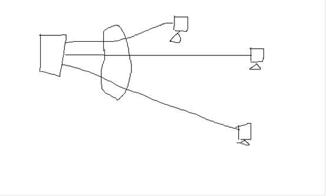
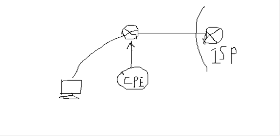
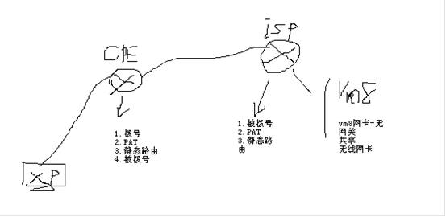

# PPPOE

PPPOE

2011年8月2日

21:40

interface Loopback0

ip address 8.8.8.8 255.255.255.0

interface Loopback100

ip address 100.1.1.1 255.255.255.0

Vpdn enable（启用VPDN：虚拟专用拨号网络）

bba-group pppoe global

virtual-template 10

interface FastEthernet0/0

pppoe enable group global

interface Virtual-Template10

ip address 202.100.1.1 255.255.255.0

peer default ip address dhcp-pool DHCP

ppp authentication chap callin

Service dhcp

no ip dhcp conflict logging

ip dhcp excluded-address 202.100.1.1

ip dhcp pool DHCP

network 202.100.1.0 255.255.255.0

default-router 202.100.1.1

dns-server 8.8.8.8

ip dns server

ip host [www.baidu.com](http://www.baidu.com/) 100.1.1.1

username cisco password 0 cisco

===========================

配置CPE作为PPPoE客户端5步走：

1.配置Ethernet接口

int fa0/1

no ip address

pppoe enable

pppoe-client dial-pool-number 1

no sh

2.配置dialer接口

int dialer 10

ip address negotiated

en ppp

ppp authentication chap callin

ppp chap hostname cisco

ppp chap password cisco

dialer pool 1

3.配置PAT

4.配置DHCP

5.配置静态缺省路由

ip dhcp pool MyPool //为客户端建立一个DHCP地址池

network 10.0.0.0 255.0.0.0

default-router 10.0.0.1 //指定默认网关!

interface Ethernet0/1

no ip address

pppoe enable //激活PPOE

pppoe-client dial-pool-number 1 //将该接口绑定到拨号接口从而设置PPPOE客户端的封装!

interface Ethernet0/0

ip address 10.0.0.1 255.0.0.0

ip nat inside!

interface Dialer0

ip address negotiated //使用IPCP从服务提供商处获得一个动态地址

encapsulation ppp //为拨号接口指定PPP封装

dialer pool 1 //指定分配给接口的池

ip mtu 1492 //将最大以太网有效载荷从1500减小到1492

ip nat outside

ppp authentication chap callin

ppp chap password mysecret!

ip nat inside source list 101 interface Dialer0 overload

access-list 101 permit ip 10.0.0.0 0.255.255.255 any

ip route 0.0.0.0 0.0.0.0 Dialer0 //配置一条缺省路由

import all //承接上面获得的DNS

================================

R1#sh run

Building configuration...

Current configuration : 1236 bytes

!

version 12.4

service timestamps debug datetime msec

service timestamps log datetime msec

no service password-encryption

!

hostname R1

!

boot-start-marker

boot-end-marker

!

!

no aaa new-model

memory-size iomem 5

!

!

ip cef

no ip domain lookup

ip host [www.baidu.com](http://www.baidu.com/) 100.1.1.1

no ip dhcp use vrf connected

no ip dhcp conflict logging

ip dhcp excluded-address 202.100.1.1

!

ip dhcp pool DHCP

network 202.100.1.0 255.255.255.0

default-router 202.100.1.1

dns-server 8.8.8.8

!

!

!

vpdn enable

!

!

!

!

!

!

!

!

!

!

!

!

!

!

!

username cisco password 0 cisco

!

!

!

!

!

!

bba-group pppoe global

virtual-template 10

!

!

interface Loopback0

ip address 8.8.8.8 255.255.255.0

!

interface Loopback100

ip address 100.1.1.1 255.255.255.0

!

interface FastEthernet0/0

no ip address

duplex auto

speed auto

pppoe enable group global

!

interface FastEthernet1/0

no ip address

shutdown

duplex auto

speed auto

!

interface Virtual-Template10

ip address 202.100.1.1 255.255.255.0

peer default ip address dhcp-pool DHCP

ppp authentication chap callin

!

ip http server

no ip http secure-server

!

!

ip dns server

!

!

!

!

control-plane

!

!

!

!

!

!

!

!

!

!

line con 0

exec-timeout 0 0

logging synchronous

line aux 0

line vty 0 4

!

!

end

=================

R2#sh run

Building configuration...

Current configuration : 1236 bytes

!

version 12.4

service timestamps debug datetime msec

service timestamps log datetime msec

no service password-encryption

!

hostname R2

!

boot-start-marker

boot-end-marker

!

!

no aaa new-model

memory-size iomem 5

!

!

ip cef

no ip domain lookup

no ip dhcp use vrf connected

no ip dhcp conflict logging

ip dhcp excluded-address 10.1.1.1

!

ip dhcp pool DHCP

import all

network 10.1.1.0 255.255.255.0

default-router 10.1.1.1

!

!

!

vpdn enable

!

!

!

!

!

!

!

!

!

!

!

!

!

!

!

!

!

!

!

!

!

!

interface FastEthernet0/0

no ip address

duplex auto

speed auto

pppoe enable group global

pppoe-client dial-pool-number 1

!

interface FastEthernet1/0

ip address 10.1.1.1 255.255.255.0

ip nat inside

ip virtual-reassembly

duplex auto

speed auto

!

interface Dialer0

ip address negotiated

ip nat outside

ip virtual-reassembly

encapsulation ppp

dialer pool 1

ppp chap hostname cisco

ppp chap password 0 cisco

ppp ipcp dns accept

!

ip http server

no ip http secure-server

ip route 0.0.0.0 0.0.0.0 Dialer0

!

!

ip nat inside source list 10 interface Dialer0 overload

!

access-list 10 permit 10.1.1.0 0.0.0.255

!

!

!

control-plane

!

!

!

!

!

!

!

!

!

!

line con 0

exec-timeout 0 0

logging synchronous

line aux 0

line vty 0 4

!

!

End

PBX，电话路由

电路交换 独占性

分组交换 qus

拨号

电话线的接口 RJ11

Splitter 语音分离器

调制解调器 调制和解调 数模转换

Splitter 无缘的 不能对信号放大 只起到信号分离作用

Vpdn enable 打开拨号功能

Bba-group pppoe global

> Virtual-template 10 虚拟接口
> 

Exit

Int virtual-template 10

> Ip add 202.1.1.1 255.255.255.0
> 
> 
> En ppp
> 
> Ppp authentication chap callin /不主动发送挑战消息
> 
> Peer default ip address pool POOL ！可以配置pool或dhcp
> 

No shu

Exit

Username xz7613279@adsl password cisco

Int fa0/0

> Pppoe enable group global
> 

No shut

Ip local pool POOL 202.1.1.100 202.1.1.200

Ip name-server 1.1.1.1

End

Vpdn enable

Bba-group pppoe global

> Virtual-template 10 虚拟接口
> 

Exit

Int virtual-template 10

> Ip add 202.1.1.1 255.255.255.0
> 
> 
> En ppp
> 
> Ppp authentication chap callin
> 
> Peer default ip address dhcp-pool DHCP
> 

No shu

Exit

Server dhcp

No ip dhcp cinflict logging

Ip dhcp excluded-address 202.1.1.

Ip dhcp pool DHCP

> Network 202.1.1.0、
> 
> 
> Dns-server 1.1.1.1
> 

Exit

Username xz7613279@adsl password cisco

Int fa0/0

> Pppoe enable group global
> 

No shut

End

1.拨号

2.PAT

3.静态缺省路由

4.DHCP服务器

CPE 1.拨号 2.PAT 3.静态缺省路由 4.DHCP

Ho ISP

Vpdn enable

Bba-group pppoe global

Virtual-template 10

Exit

Int virtual-template 10

> Ppp authentication chap callin
> 
> 
> Peer default ip address pool POOL
> 

No shut

Exit

Local pool POOL 202.1.1.100 202.1.1.200

Ip name-server 1.1.1.1

Username cisco password cisco

Int fa0/0

> Pppoe enable group global
> 

No shut

Exit

Ho CPE

Vpdn enable

Int fa1/0

> Pppoe enable
> 
> 
> Pppoe-client dial-pool-number 1
> 

No shut

Exit

Int dialer 0 ！拨号接口

> Ip address negotiated
> 
> 
> En ppp
> 
> Ppp chap hostname cisco
> 
> Ppp chap password cisco
> 
> Dialer pool 1 ！与前边的号应相同
> 

Exit

Server dhcp

No ipdhcp conflict logging

Ip dhcp excluded-address 192.168.1.1

Ip dhcp pool DHCP

> Netw 192.168.1.0/24
> 
> 
> Import all
> 

Exit

Int fa0/0

Ip add 192.168.1.1 255.255.255.0

No shut

Exit

Int dialer 0

> Ppp ipcp dns request accept ！向ISP请求不是全0的dns地址
> 

Shut

No shut

Ac 10 per 193.168.1.0 0.0.0.255

Ip nat inside source list 10 interface dialer 0

Int dialer 0

Ip nat outside

Exit

Int fa0/0

Ip nat inside

Exit

Ip route 0.0.0.0 0.0.0.0 dialer 0

Ho PC

No ip routing

Int fa0/0

Ip add dhcp

Ip dhcp pool POOL

Default-router 192.168.1.1

No shut

Ip domain lookup

拓展：

ISP

Ho ISP

Vpdn enable

Bba-group pppoe global

> Virtual-template 10
> 

Exit

Int virtual-template 10

> Ppp authentication chap callin
> 
> 
> Peer default ip address pool POOL
> 

No shut

Exit

Local pool POOL 202.1.1.100 202.1.1.200

Ip name-server 1.1.1.1

Username cisco password cisco

Int fa0/0

> Pppoe enable group global
> 

No shut

Exit

IPsec VPN的口诀：认证，完整性，机密性

关于认证

1. 用户名，密码

2. OTP（one-time password，一次性密钥）

3. 生物密钥

4. 预共享密钥

5. 数字证书

关于加密机制：

1. 对称密钥：基于异或运算

相异为一

优点：速度快

缺点：分发密钥比较麻烦

算法：DES,3DES,AES

2. 非对称加密：基于大素数因式分解

Public key(公钥)

Private key（私钥）

特点：

1.这两个key从同一个算法中产生

2.两个人互相不能推出对方

3.公钥加密，私钥能够解密

私钥加密，公钥能够解密

用途：

1. 要来加密与解密，用公钥进行加密，私钥进行解密---说实话，没人用

2. 要来验证身份，不可抵赖性，用私钥进行加密，用公钥进行解密---

3. 分发密钥

算法RSA

3.单向散列算法---实现数据完整性

代表：MD5,SHA

什么是完整性？

就是数据在传输的过程中没有被篡改

IPsec的3大协议：

1. IKE：用来协商参数

2. ESP：认证，完整性，机密性

3. AH：认证，完整性

SA：安全关联

其实说白了就是一些参数：如，用什么加密，用什么保证数据完整性，用什么方式传输

IKE分为两个阶段：

第一个阶段用来协商5个参数，也就是IKE SA

(1) authentication ----认证，默认是数字证书，一般使用预共享

(2)