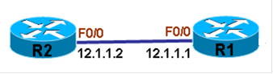

# Telnet

Telnet

2011年7月7日

15:52

**Privilege Levels**

> 概述
> 
> 
> 在Cisco设备中，将所有用户的操作权限分为0-15共16个等级，0为最低等级，15为最高等级。等级越高，能执行的命令就越多，权限就越大。要给用户赋于等级，可以在配置用户名或者密码时赋予。
> 
> 在Cisco设备中，有一种最初级的模式，称为用户模式，即User EXEC mode，默认表示为Router>，在这个模式下，默认等级是1，能执行的命令命令是相当少的，而需要注意的是，在这个模式下，永远只能执行等级为1的命令，如果要将等级提高到更高，就需要手动进入更高等级的模式，这个模式被称为特权模式，即Privileged EXEC mode，表示为Router#，通常此模式被称为enable模式。在没有指定等级而进入enable模式后，默认等级为15，也就表示可以完全控制设备。如果要进入比1级更高的模式而又不是15级，可以在进入enable模式时手工指定要进入的等级。除此之外，在创建本地用户数据库时，也可以为相应用户指定相应等级，如果不指定，默认用户等级为1级。
> 

通过以上方法为相应用户或密码分配等级之后，他们所能执行的命令也只是相应等级范围内的，比如5级的用户是不能执行15级的命令的，但是可以手工赋予每个等级可以执行哪些命令，如让5级的用户能执行某15级的命令，如果5级用户能执行某15级的命令，那么6-15也都是可以执行的。

注：如果15级Privileged EXEC mode没有密码，默认只有本地终端直连可以登陆，VTY是不能登陆的。

**配置**

**1.查看User EXEC mode的默认等级**

r1>show privilege

Current privilege level is 1

r1>

说明：从结果中看出，在User EXEC mode下，默认的等级为1级，也永远只能执行1级的命令。

**2.查看Privileged EXEC mode的默认等级**

**（1） 不指定等级登陆Privileged EXEC mode**

r1>enable

r1#

**（2）查看查看Privileged EXEC mode的默认等级**

r1#show privilege

Current privilege level is 15

r1#

**说明：**从结果中看出，在Privileged EXEC mode下，默认的等级为15级

**3.创建不同等级的密码**

**（1）创建一个5级的密码，为cisco5**

注：只有在创建secret密码时，才能指定等级，password是不可以的。

r1(config)#enable secret level 5 cisco5

**（2）创建一个6级的密码，为cisco6**

r1(config)#enable secret level 6 cisco6

**4.测试5级的密码**

**（1）登陆5级的密码**

r1>enable 5

Password:                         输入cisco5

r1#

**（2）查看当前等级**

r1#show privilege

Current privilege level is 5

r1#

**说明：**从结果中看出，当前等级为5级。

**（3） 查看show run配置**

r1#show run

^

% Invalid input detected at '^' marker.

r1#

**说明：**从结果中看出， 5级用户是不能执行show run命令的。

**5.测试6级的密码**

**（1）登陆6级的密码**

r1>enable 6

Password:                         输入cisco6

r1#

**（2）查看当前等级**

r1#show privilege

Current privilege level is 6

r1#

**说明：**从结果中看出，当前等级为6级。

**（4）查看show run配置**

r1#show run

^

% Invalid input detected at '^' marker.

r1#

**说明：**从结果中看出， 6级用户也是不能执行show run命令的。

**6.赋予5级用户可以执行show run命令**

**说明：**要赋予某个等级用户可以执行某个命令时，必须使用15级的等级来指定，还必须说明该等级是在哪个模式下执行命令的。

r1(config)#privilege exec level 5 show run

**说明：**赋予5级用户可以在exec执行show run 命令

**7.测试5级用户的命令**

r1>enable 5

Password:

r1#show run

Building configuration...

Current configuration : 55 bytes

!

boot-start-marker

boot-end-marker

!

end

r1#

**说明：**可以看到,5级用户已经可以执行show run命令，但要注意的是，该等级只能查看权限范围内能够配置的参数情况。

**8.查看6级是否可以执行show run**

r1>enable 6

Password:

r1#

r1#

r1#sh run

Building configuration...

Current configuration : 55 bytes

!

boot-start-marker

boot-end-marker

!

!

end

r1#

**说明：**当一条命令赋予某个等级之后，比此等级更高的等级同样获得该命令的执行权。

**9.创建默认等级的本地用户数据库**

**（1）配置用户名和密码**

r1(config)#username aaa password bbb

**（2）登陆已配置的用户名和密码**

r1>login

Username: aaa

Password:                  输入密码bbb

r1>

**(3)查看默认用户名的等级**

R1>show privilege

Current privilege level is 1

R1>

**说明：**可以看到创建的用户默认是1级

**10.创建等级为15的用户**

**（1）创建用户**

R1(config)#username ccc privilege 15 password ddd

**（2）登陆用户**

r2>login

Username: ccc

Password:

r2#

**（3） 查看该用户等级**

R1#show privilege

Current privilege level is 15

R1#

**说明：**可以看到创建的用户是15级

**Autocommand**

**概述**

有时，当客户的网络出现故障时，需要远程工程师协助或指导客户解决故障，这时就需要远程工程师telnet到客户的网络设备上，但是却并不希望远程工程师去直接更改用户设备的配置，在这种情况下，就可以在用户的设备上为远程工程师配置一个用户，通过这样的用户登陆设备之后，可以自动执行远程工程师想要执行的命令，从而达到了远程工程师查看设备配置的目的，又不违反修改配置的规矩。

要实现这样的功能，就可以在设备上配置Autocommand的功能，这样，当相应的用户telnet到设备时，就可以自动执行其想要的命令。

这样的Autocommand可以配置为所有VTY连上来的人执行，即配置在VTY接口下，也可以单独为某个用户执行，即配置在用户名之后。但这样的命令都只能执行一条。

**配置**

> 1.在VTY下为所有用户配置自动执行命令
> 
> 
> **（1）在R2上配置用户名和密码**
> 
> r2(config)#username ccie password cisco
> 
> **（2） 配置为所有VTY用户自动执行命令**
> 
> **说明：**要为所有VTY用户执行命令，就配置在VTY接口下，这里配置自动执行命令为show ip interface brief
> 
> r2(config)#line vty 0 935
> 
> r2(config-line)#login local
> 
> r2(config-line)#autocommand show ip interface brief
> 
> **（3）测试结果**
> 
> **说明：**从R1 telnet到R2，输入正确用户名和密码，即可看到命令执行后的输出
> 
> r1#telnet 12.1.1.2
> 
> Trying 12.1.1.2 ... Open
> 
> User Access Verification
> 
> Username: ccie
> 
> Password:
> 
> Interface                  IP-Address      OK? Method Status                Protocol
> 
> FastEthernet0/0            12.1.1.2        YES manual up                    up
> 
> FastEthernet0/1            unassigned      YES unset  administratively down down
> 
> Serial1/0                  unassigned      YES unset  administratively down down
> 
> Serial1/1                  unassigned      YES unset  administratively down down
> 
> Serial1/2                  unassigned      YES unset  administratively down down
> 
> Serial1/3                  unassigned      YES unset  administratively down down
> 
> [Connection to 12.1.1.2 closed by foreign host]
> 
> r1#
> 
> **说明：**从结果中可以看出，R1 telnet到R2后，并不需要输入命令，就弹出之前命令的自动执行命令的输出结果，这样即达到了查看配置的目的，又不违反更改配置的规矩。
> 
> **2.为单个用户配置自动执行命令**
> 
> **（1）配置用户名**
> 
> r2(config)#username test password test
> 
> **（2）为单个用户配置自动执行命令**
> 
> **说明：**这里配置自动执行命令：show ip route
> 
> r2(config)#username test autocommand show ip route
> 
> **（3）从R1上telnet到R2做测试**
> 
> r1#telnet 12.1.1.2
> 
> Trying 12.1.1.2 ... Open
> 
> User Access Verification
> 
> Username: test
> 
> Password:
> 
> Codes: C - connected, S - static, R - RIP, M - mobile, B - BGP
> 
> D - EIGRP, EX - EIGRP external, O - OSPF, IA - OSPF inter area
> 
> N1 - OSPF NSSA external type 1, N2 - OSPF NSSA external type 2
> 
> E1 - OSPF external type 1, E2 - OSPF external type 2
> 
> i - IS-IS, su - IS-IS summary, L1 - IS-IS level-1, L2 - IS-IS level-2
> 
> ia - IS-IS inter area, * - candidate default, U - per-user static route
> 
> o - ODR, P - periodic downloaded static route
> 
> Gateway of last resort is not set
> 
> 12.0.0.0/24 is subnetted, 1 subnets
> 
> C       12.1.1.0 is directly connected, FastEthernet0/0
> 
> [Connection to 12.1.1.2 closed by foreign host]
> 
> r1#
> 
> **说明：**可以看到R1从VTY连上R2时，输入相应的 用户名和密码后，便自动执行了相应的命令，并且证明用户的命令优先于接口的命令。
>