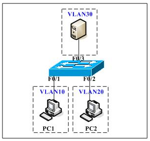

# VLAN之间ACL和VACL的区别

VLAN之间ACL和VACL的区别

2011年8月2日

22:14

Cisco交换机上如何实现VLAN之间的访问控制，在三层交换机上直接把ACL应用到相应VLAN的虚端口就OK了,其实VLAN访问控制列表（VACL）和VLAN之间的访问控制列表其实在实现方式上是有很大不同的，虽然从字面上看两者差不多。

我们常说的VLAN之间的访问控制，它的实现方式是将ACL直接应用到VLAN的虚端口上，与应用到物理端口的ACL实现方式是一样的。

而VLAN访问控制（VACL），也称为VLAN访问映射表，它的实现方式与前者完全不同。它应用于VLAN中的所有通信流，支持基于ETHERTYPE和MAC地址的过滤，可以防止未经授权的数据流进入VLAN.目前支持的VACL操作有三种：转发（forward），丢弃（drop），重定向（redirect）。

VACL很少用到，在配置时要注意以下几点：

1） 最后一条隐藏规则是deny ip any any，与ACL相同。

bitsCN_com

2） VACL没有inbound（入站）和outbound（出站）之分，区别于ACL.

3） 若ACL列表中是permit，而VACL中为drop，则数据流执行drop.

4） VACL规则应用在NAT之前。

5） 一个VACL可以用于多个VLAN中；但一个VLAN只能与一个VACL关联。

6） VACL只有在VLAN的端口被激活后才会启用，否则状态为inactive.

下面，我以Cisco3550交换机作为实例来详细描述一下两者之间不同的实现方式。

网络基本情况是划分了三个vlan：vlan10、vlan20和vlan30，vlan虚端口的IP地址分别为192.168.10.1/24、192.168.20.1/24和192.168.30.1/24.

访问控制要求：vlan10和vlan20之间不能访问，但都能访问vlan30

（一） 通过VLAN之间ACL方式实现******** 配置VLAN ********

Switch(vlan)# vlan 10 // 创建vlan 10

Switch(vlan)# vlan 20

Switch(vlan)# vlan 30

Switch(vlan)# int vlan 10

Switch(config-if)# ip address 192.168.10.1 255.255.255.0 // 配置vlan10虚端口IP

dl.bitsCN.com网管软件下载

Switch(config-if)# int vlan 20

Switch(config-if)# ip address 192.168.20.1 255.255.255.0

Switch(config-if)# int vlan 30

Switch(config-if)# ip address 192.168.30.1 255.255.255.0

- ******* 配置ACL ********

Switch(config)# access-list 101 permit ip 192.168.10.0 0.0.0.255 192.168.30.0 0.0.0.255

Switch(config)# access-list 102 permit ip 192.168.20.0 0.0.0.255 192.168.30.0 0.0.0.255

- ******* 应用ACL至VLAN端口 ********

Switch(config)# int vlan 10

Switch(config-if)# ip access-group 101 in

Switch(config)# int vlan 20

Switch(config-if)# ip access-group 102 in

- ******* 完毕 ********

（二） 通过VACL方式实现

- ******* 配置VLAN ********

（同上）

- ******* 配置ACL ********

Switch(config)# access-list 101 permit ip 192.168.10.0 0.0.0.255 192.168.30.0 0.0.0.255

Switch(config)# access-list 101 permit ip 192.168.30.0 0.0.0.255 192.168.10.0 0.0.0.255

（不同之处：因为VACL对数据流没有inbound和outbound之分，所以要把允许通过某vlan的IP数据流都permit才行。VLAN10允许与VLAN30通讯，而数据流又是双向的，所以要在ACL中增加VLAN30的网段）

Switch(config)# access-list 102 permit ip 192.168.20.0 0.0.0.255 192.168.30.0 0.0.0.255

Switch(config)# access-list 102 permit ip 192.168.30.0 0.0.0.255 192.168.20.0 0.0.0.255

- ******* 配置VACL ********

第一步：配置vlan access map

Switch(config)# vlan access-map test1 //定义一个vlan access map，取名为test1

Switch(config-vlan-access)# match ip address 101 // 设置匹配规则为acl 101

Switch(config-vlan-access)# action forward // 匹配后，设置数据流转发（forward）

Switch(config)# vlan access-map test2 //定义一个vlan access map，取名为test2

Switch(config-vlan-access)# match ip address 102 // 设置匹配规则为acl 102 bitsCN_com

Switch(config-vlan-access)# action forward // 匹配后，设置数据流转发（forward）

第二步：应用VACL

Switch(config)# vlan filter test1 vlan-list 10 //将上面配置的test1应用到vlan10中

Switch(config)# vlan filter test2 vlan-list 20 //将上面配置的test1应用到vlan20中

- ******* 完毕 ********

以上就是关于VLAN之间ACL和VACL的简单配置实例。我个人认为一般情况下，通过VLAN之间ACL实现访问控制比较方便，但是当VLAN的端口比较分散时，采用VACL相对而言就要简单很多。不过使用VACL的前提是交换机支持此功能，目前可能只有Cisco 3550、4500和6500系列的交换机支持。