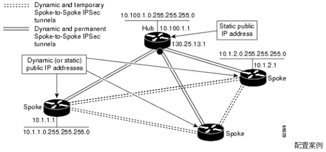
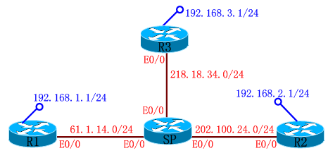

# DMVPN

DMVPN

2011年8月2日

22:07

DMVPN----Dynamic Multipoint VPN

动态多点VPN (DMVPN) -顾名思义：DMVPN应用在多点到多点的复杂VPN网络环境中。

DMVPN的动态连接关系是通过hub-spokes模式来实现，它可以在两个或多个DMVPN成员的各自子网间动态建立基于GRE over ipsec连接的路由路径。根据目的前缀和下一跳结合路由协议来推断调用的GRE隧道和相关ipsec 保护策略。

DMVPN还要结合mGRE(Multipoint GRE interfaces)和NHRP（Next Hop Resolution Protocol）等相关知识。

大致流程：

1． 首先通过mGRE的封装代替p-t-p GRE封装来减少手动tunnel 数量及有效结合NHRP。

2． NHRP结合动态路由协议来支持mGRE的下一跳动态解析功能，以便根据路由协议动态建立保护网络间的临时tunnel.(保护网络要路由通告出去)

3． 在mGRE下采用ipsec profile 实现 ipsec automatic proxy 功能；保护gre封装流量，加密根据NHRP和动态路由协议建立起来的保护网络间的临时tunnel。（由于是动态方式，IKE isakmp remote peers 为 0.0.0.0）

Hub Configuration for DMVPN

crypto isakmp policy 1

authentication pre-share

crypto isakmp key ikecisco address 0.0.0.0

!

crypto ipsec transform-set myset esp-des esp-md5-hmac

mode transport

!

crypto ipsec profile vpnprof

set transform-set myset

!

interface Tunnel0

bandwidth 1000

ip address 10.0.0.1 255.255.255.0

ip mtu 1416（确保大包在加密之前分片，目的设备正常重组）

ip nhrp authentication nhrp-pwd（nhrp认证，在匹配后，调用mGRE属性）

ip nhrp map multicast dynamic（启用NHRP自动加入分支路由器到多播NHRP映射组中）

ip nhrp network-id 99（启用NHRP,在匹配后，调用mGRE属性）

ip nhrp holdtime 300

no ip split-horizon eigrp 1（当使用EIGRP协议时，屏蔽水平分割）

no ip next-hop-self eigrp 1 (当使用EIGRP时，直接建立动态SPOKE-TO-SPOKE隧道)

delay 1000

tunnel source Ethernet0

tunnel mode gre multipoint（设置隧道接口的封装模式为mGRE）

tunnel key cisco (tunnel 认证)

tunnel protection ipsec profile vpnprof(为隧道接口指定IPSEC模板)

!

interface Ethernet0

ip address 172.17.0.1 255.255.255.0

!

interface Ethernet1

ip address 192.168.0.1 255.255.255.0

!

router eigrp 1

network 10.0.0.0 0.0.0.255 area 0

network 192.168.0.0 0.0.0.255 area 0

Spoke Configuration for DMVPN

crypto isakmp policy 1

authentication pre-share

crypto isakmp key ikecisco address 0.0.0.0

!

crypto ipsec transform-set myset esp-des esp-md5-hmac

mode transport

!

crypto ipsec profile vpnprof

set transform-set myset

!

interface Tunnel0

bandwidth 1000

ip address 10.0.0.2 255.255.255.0

ip mtu 1416

ip nhrp authentication nhrp-pwd

ip nhrp map 10.0.0.1 172.17.0.1（为NHRP server hub 隧道地址10.0.0.1做物理地址绑定）

ip nhrp map multicast 172.17.0.1（在分支和HUB之间启动动态路由协议，并发送多播包到HUB路由器上）

ip nhrp network-of 99

ip nhrp holdtime 300

ip nhrp nhs 10.0.0.1（配置HUB路由器作为NHRP的下一跳服务器）

delay 1000

tunnel source Ethernet0

tunnel mode gre multipoint

tunnel key cisco

tunnel protection ipsec profile vpnprof

!

interface Ethernet0

ip address 172.16.0.2 255.255.255.0

!

interface Ethernet1

ip address 192.168.1.1 255.255.255.0

!

router eigrp 1

network 10.0.0.0 0.0.0.255

network 192.168.1.0 0.0.0.255

实验1:

第一步: 建立 Dynamic Multipoint

HUB-R3(config)#interface tunnel 0

HUB-R3(config-if)#ip address 172.16.1.3 255.255.255.0

HUB-R3(config-if)#tunnel source ethernet 0/0

HUB-R3(config-if)#tunnel mode gre multipoint <===点到多点(不需要配置:"tunnel"的"destination")

对比: HUB-R3(config-if)#tunnel mode gre ip <===点到点,默认配置(需要配置:"tunnel"的"destination")

HUB-R3(config-if)#tunnel key 12345 <===在多点中:"key"是必配(在点到点中:"tunnel"的"key"可不配)

SPOKE-R1(config)#interface tunnel 0

SPOKE-R1(config-if)#ip address 172.16.1.1 255.255.255.0

SPOKE-R1(config-if)#tunnel source ethernet 0/0

SPOKE-R1(config-if)#tunnel mode gre multipoint

SPOKE-R1(config-if)#tunnel key 12345

NHRP配置:

HUB-R3(config)#interface tunnel 0

HUB-R3(config-if)#ip nhrp network-id 100 <===="network-id"号,可任意(但:HUB/SPOKE端要在同一个"network-id"里面)

- --------------------------------------

SPOKE-R1(config)#interface tunnel 0

SPOKE-R1(config-if)#ip nhrp network-id 100

SPOKE-R1(config-if)#ip nhrp nhs 172.16.1.3 <===HUB的"tunnel"地址( nhs: nh server )

SPOKE-R1(config-if)#ip nhrp map 172.16.1.3 218.18.34.3 <==="tunnel"地址与公网地址的映射

"tunnel"地址 公网地址

- ---------------------------------------------

HUB-R3#show ip nhrp <====动态映射

172.16.1.1/32 via 172.16.1.1, Tunnel0 created 00:06:11, expire 01:53:48

Type: dynamic, Flags: authoritative unique registered

NBMA address: 61.1.14.1

- ---------------------------------------------

SPOKE-R1#show ip nhrp <====静态映射

172.16.1.3/32 via 172.16.1.3, Tunnel0 created 00:04:21, never expire

Type: static, Flags: authoritative used

NBMA address: 218.18.34.3 <===当"SPOKE"端的路由器重启后,就会到"SERVER"端的路由器上去注册,所以SERVER端的路由器的IP地址一定要是静态的IP地址.

- -----------------------------------------------------------------------

SPOKE-R1#show ip nhrp nhs <===查映射(只能在"SPOKE"端使用)

Legend:

E=Expecting replies

R=Responding

Tunnel0:

172.16.1.3 RE <===有响应

- -----------------------------------------------------------------------

宣告:

SPOKE-R1(config)#router eigrp 100

SPOKE-R1(config-router)#no auto-summary

SPOKE-R1(config-router)#network 192.168.1.0 0.0.0.255

SPOKE-R1(config-router)#network 172.16.1.0 0.0.0.255

- -----------------------------------------------------

HUB-R3(config-if)#router eigrp 100

HUB-R3(config-router)#no auto-summary

HUB-R3(config-router)#net 192.168.3.0 0.0.0.255

HUB-R3(config-router)#net 172.16.1.0 0.0.0.255

发组播包:

HUB-R3(config)#interface tunnel 0

HUB-R3(config-if)#ip nhrp map multicast dynamic <===动态地发组播包(HUB)

SPOKE-R1(config)#interface tunnel 0

SPOKE-R1(config-if)#ip nhrp map multicast 218.18.34.3 <====静态地发组播包(SPOKE)

- -----------------------------------------------------------

出现问题:"HUB-R3"有neighbor,但"SPOKE-R1"没有neighbor ??

HUB-R3(config-if)#

- Mar 1 00:44:49.071: %DUAL-5-NBRCHANGE: IP-EIGRP(0) 100: Neighbor 172.16.1.1 (Tunnel0) is up: new adjacency

HUB-R3#show ip eigrp neighbors

IP-EIGRP neighbors for process 100

H Address Interface Hold Uptime SRTT RTO Q Seq

(sec) (ms) Cnt Num

0 172.16.1.1 Tu0 14 00:00:38 1 5000 1 0

SPOKE-R1#show ip eigrp neighbors

IP-EIGRP neighbors for process 100

解决: 1. 先将"HUB"和"SPOKE"端的TUNNEL接口"shut down"

2. 然后"no shut down"HUB端的接口

3. 再"no shut down"SPOKE端的接口

SPOKE-R1#show ip route eigrp

D 192.168.3.0/24 [90/297372416] via 172.16.1.3, 00:00:19, Tunnel0

- ------------------------------------------------------------

关闭HUB的"tunnel"接口的水平分割:

HUB-R3(config)#interface tunnel 0

HUB-R3(config-if)#no ip split-horizon eigrp 100 <===关闭EIGRP的"tunnel"接口的水平分割

或者 HUB-R3(config-if)#no ip split-horizon <===这是关闭RIP的水平分割

- ---------------------------------------------------------------------------------------

出现问题: 在"SPOKE-R1"路由器上去往"SPOKE-R2"路由器的数据包要经过"HUB-R3"路由器 ??

SPOKE-R1#show ip route eigrp 下一跳

D 192.168.2.0/24 [90/310172416] via 172.16.1.3, 00:31:09, Tunnel0 <===在"SPOKE-R1"路由器上去往"SPOKE-R2"路由器的数据包要经过"HUB-R3"路由器

D 192.168.3.0/24 [90/297372416] via 172.16.1.3, 00:31:09, Tunnel0

解决:

HUB-R3(config)#interface tunnel 0

HUB-R3(config-if)#no ip next-hop-self eigrp 100 <===只有12.3以上版本的路由器才有此命令

SPOKE-R2#show ip route eigrp

D 192.168.1.0/24 [90/310172416] via 172.16.1.1, 00:03:46, Tunnel0

D 192.168.3.0/24 [90/297372416] via 172.16.1.3, 00:03:47, Tunnel0

SPOKE-R2#show ip nhrp

172.16.1.1/32 via 172.16.1.1, Tunnel0 created 00:00:17, expire 01:47:40 <===PING了之后才会出现

Type: dynamic, Flags: router

NBMA address: 61.1.14.1

172.16.1.3/32 via 172.16.1.3, Tunnel0 created 00:52:16, never expire

Type: static, Flags: authoritative used

NBMA address: 218.18.34.3

- ---------------------------------------------------------------------------------------

第二步: 建立 VPN

IKE Phase I Policy:

HUB-R3(config)#crypto isakmp policy 1

HUB-R3(config-isakmp)#authentication pre-share

HUB-R3(config)#crypto isakmp key 0 wolf address 0.0.0.0 0.0.0.0

IPSec Phase II Policy:

HUB-R3(config)#crypto ipsec transform-set cisco esp-des esp-sha-hmac

HUB-R3(cfg-crypto-trans)#mode transport

HUB-R3(config)#crypto ipsec profile huawei

HUB-R3(config-crypto-map)#set transform-set cisco

接口调用:

HUB-R3(config)#interface tunnel 0

HUB-R3(config-if)#tunnel protection ipsec profile huawei

更改MTU值:

SPOKE-R1(config)#int tunnel 0

SPOKE-R1(config-if)#ip mtu 1436 <===更改"tunnel"的MTU值(MTU大于1436将会分片),CISCO建议为:1400