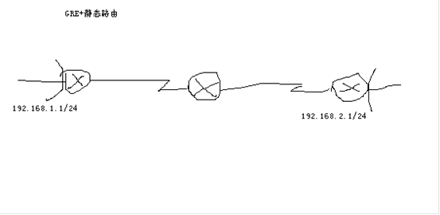
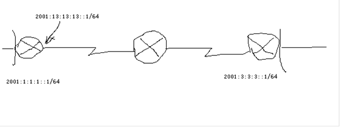

# GRE

GRE

2011年8月2日

22:01

一、GRE（静态地址）+静态路由

R1

Int tunnel 10

Ip add 172.16.1.1 255.255.255.0

Tunnel source s1/1

Tunnel destination 23.1.1.2

Tunnel mode gre ip （默认是GRE）

Ip route 192.168.2.0 255.255.255.0 tunnel 10

R3

Int tunnel 10

> Ip add 172.16.1.2 255.255.255.0
> 
> 
> Tunnel source s1/0
> 
> Tunnel destination 12.1.1.1
> 

Ip route 192.168.1.0 255.255.255.0 tunnel 10

Ping 192.168.2.1 source 192.168.1.1

**IP头|DATA** 其中IP头的源地址是192.168.1.1 目标地址192.169.2.1

查表可知道要去192.168.2.1，那么要通过tunnel10走包，那么此时要加新IP头

**新IP头|GRE头|IP头|DATA** 其中新IP头源地址12.1.1.1，目标地址23.1.1.2走包

当数据包到达R2时，会查23网段

二、GRE（借用地址）+静态路由

R1

Int tunnel 10

Ip unnumbered s1/1 //借用s1/1地址作为tunnel10接口下的地址，想借用那个就借用哪个

Tunnel sources1/1

Tunnel destination 23.1.1.2

Ip route 192.168.2.0 255.255.255.0 tunnel 10

三、GRE（静态配置地址）+动态路由（用RIP举例）

R1

Int tunnel 10

> Ip add 172.16.1.1 255.255.255.0
> 
> 
> Tunnel source s1/1
> 
> Tunnel destination 23.1.1.2
> 

Route rip

> V 2
> 
> 
> No au
> 
> Net 172.16.0.0
> 
> Net 192.168.1.0
> 

四、、GRE（借用地址）+动态路由（只能用OSPF）

借用地址与原地址相同，不能使用net方式，所以只能使用OSPF在接口下加入

Generic routing encapsulation 通用路由封装

IPv6头|DATA

配置隧道：IP头|IPv6头|DATA

GRE隧道：IP头|GRE头|IPv6头|DATA

看起来两者的效果相同，但是，配置隧道和GRE隧道都是可以跑路由协议的，但有一个路由协议比较特别，就是ISIS,ISISI是一个3层协议

帧头|ISIS路由包

此时会发现使用配置隧道使不能运行ISIS协议的，而GRE是通用路由封装，所有数据都可以放进GRE中进行传输

实验：用GRE传输IPv6，路由协议使用ISIS

Int tunnrl 10

Ipv add fe80：：2 link-local

Router isis

> Net 49.0001.0000.0000.0001.00
> 

Exit

Int tunnel

> Ipv router isis
> 

Exit

Configure GRE over IPsec

GRE为什么要和IPsec结合在一起？

原因

GRE的两个优点：

通用路由封装，IPv4，IPv6，IPX，AppleTalk等都可以封装

可以运行路由协议

GRE的1个缺点：

安全性差

IPsec的1个优点;

安全性好

IPsec的2个缺点：

只能封装IPv4

不能使用路由协议

原始数据：IP头|DATA

GRE over IPsec+隧道模式+ESP；

新新IP头|ESP头|新IP头|GRE头|IP头|DATA|ESP尾|ESP认证

GRE over IPsec+传输模式+ESP；

新IP头|ESP头|GRE头|IP头|DATA|ESP尾|ESP认证

GRE over IPsec+隧道模式+AH；

新新IP头|AH头|新IP头|GRE头|IP头|DATA

GRE over IPsec+传输模式+AH；

新IP头|AH头 |GRE头|IP头|DATA

192.168.3.0网段能ping通192.168.2.0的过程：

查表知出接口是tunnel，说明要打双IP头，此时源地址24.1.1.2，目标地址12.1.1.1，协议号是gre（47），符合感兴趣流条件 ，此时进行IPsec的封装，由于是传输模式，所以不会再添加新IP头了。

包可以顺利到达R1，解包，发现目标地址192.168.2.0网段，那么查表，发现出接口又是tunnel，此时。。。

NAT与站点到站点IPSecVPN的共存

假设：IPSec先于NAT

Ping 192.168.2.1 source 192.168.1.1

IP头|DATA IP头中源地址192.168.1.1目标地址192.168.2.1

符合感兴趣流，此时会进行IPSec

新IP头|ESP头|IP头|DATA|ESP尾|ESP认证

其中新IP头源地址12.1.1.1目标地址23.1.1.2

源地址12.1.1.不在NAT的转换范围之内，所以这种假设不成立

假设：NAT先于IPSec

Ping 192.168.2.1 source 192.168.1.1

IP头|DATA IP头中源地址192.168.1.1目标地址192.168.2.1

此时源地址在NAT的转换范围之内，会转换成12.1.1.1

IP头|DATA IP头中的源地址12.1.1.1 目标地址192.168.2.1

此时这个范围不属于IPSec感兴趣流，所以U.U.U

解决方案：

改IPSec的感兴趣流

R1：ac 110 per ip host 12.1.1.1 192.168.2.0 0.0.0.255

R2：ac 110 per ip 23.1.1.0 0.0.0.255 host 12.1.1.1

不可能实现，说白了就是包回来了，但回包的源地址不是原目标地址，丢弃之，不通

改NAT的范围

目标：使192.168.1.0/24到192.168.2.0/24的数据包不经过NAT就可以了

Ac 120 deny ip 192.168.1.0 0.0.0.255 192.168.2.0 0.0.0.255

Ac 120 per ip 192.168.1.0

NAT与GRE over IPSec的共存

GRE--- NAT--- IPSec

Ping 192.168.2.1source 192.168.1.1

IP头|DATA

新IP头|GRE头|IP头|DATA 其中新IP头的源IP地址12.1.1.1目标地址23.1.1.2

发现12.1.1.1不在NAT的范围之内

。。。结论：NAT与GRE over IPSec天生就是共存的