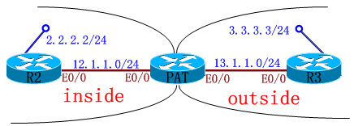
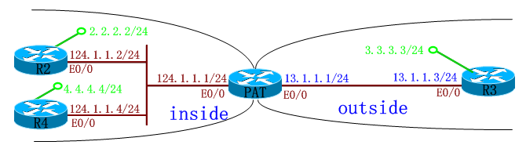
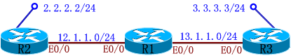
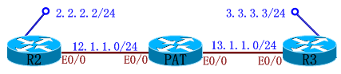

# IPSEC穿越PAT

IPSEC穿越PAT

2011年8月2日

22:06

IPSEC穿越PAT(应用层网关)

技术特点:

正常的IPSEC VPN 是不能穿越PAT的,CISCO的IPSEC VPN为了穿越PAT提供了很多扩展的功能.

例如: Nat - t , ipsec over udp ,ipsec over tcp , 应用层网关.

我们这个试验主要要演示应用层网关的功能,它是NAT设备提供的一种扩展功能.其他功能会在advance vpn部分讲解.

实验1:

PAT(config)#ip access-list extended pat <====="pat"是一个名字

PAT(config-ext-nacl)#permit ip 12.1.1.0 0.0.0.255 any

PAT(config)#int e0/0.12

PAT(config-subif)#ip nat inside

PAT(config)#int e0/0.13

PAT(config-subif)#ip nat outside

PAT(config)#ip nat inside source list pat interface ethernet 0/0.13 overload <===一段地址(12.1.1.0 0.0.0.255 any)PAT成一个接口

IKE Phase I Policy:

R2(config)#crypto isakmp policy 3

R2(config-isakmp)#authentication pre-share

R2(config-isakmp)#hash md5

R2(config-isakmp)#encryption 3des

R2(config-isakmp)#group 2

R2(config)#crypto isakmp key 0 wolf address 13.1.1.3

- -------------------------------------------------------

R3(config)#crypto isakmp policy 3

R3(config-isakmp)#authentication pre-share

R3(config-isakmp)#hash md5

R3(config-isakmp)#encryption 3des

R3(config-isakmp)#group 2

R3(config)#crypto isakmp key 0 wolf address 13.1.1.1 <===PAT设备"outside"接口

问: 为什么"R3"不能直接PING通"R2"呢??

答: 由于"13.1.1.1"是PAT设备的接口,但PAT设备又没有与"R3"建立VPN.

IPSec Phase II Policy:

R2(config)#crypto ipsec nat-transparency udp-encapsulation <===此命令为:打开"NAT-T".在26系列(版本:12.2)及以上路由器默认启用,"show run"也看不到

R2(config)#crypto ipsec transform-set cisco esp-des esp-sha-hmac

R2(cfg-crypto-trans)#mode tunnel

R2(config)#access-list 101 permit ip 2.2.2.0 0.0.0.255 3.3.3.0 0.0.0.255

R2(config)#crypto map huawei 10 ipsec-isakmp

R2(config-crypto-map)#set peer 13.1.1.3

R2(config-crypto-map)#set transform-set cisco

R2(config-crypto-map)#set pfs

R2(config-crypto-map)#match address 101

- ----------------------------------------------

R3(config)#crypto ipsec transform-set cisco esp-des esp-sha-hmac

R3(cfg-crypto-trans)#mode tunnel

R3(config)#access-list 101 permit ip 3.3.3.0 0.0.0.255 2.2.2.0 0.0.0.255

R3(config)#crypto map huawei 10 ipsec-isakmp

R3(config-crypto-map)#set peer 13.1.1.1 <===PAT设备"outside"接口

R3(config-crypto-map)#set transform-set cisco

R3(config-crypto-map)#set pfs

R3(config-crypto-map)#match address 101

Apply VPN Configuration

R2(config)#interface ethernet 0/0

R2(config-if)#crypto map huawei

- -----------------------------------

R3(config)#interface ethernet 0/0

R3(config-if)#crypto map huawei

调试:

R2#ping 3.3.3.3 source loopback 0 <===只有"inside"发起连接,才能建立IPSEC道

R3#ping 2.2.2.2 source loopback 0 即只有"R2"先PING"R3",建立IPSEC道,"R3"才能PING通"R2"

PAT#show ip nat translations <===转换项

Pro Inside global Inside local Outside local Outside global

udp 13.1.1.1:4500 12.1.1.2:4500 13.1.1.3:4500 13.1.1.3:4500

- ----------------------------------------------------------------------------

R2#show cry ipsec sa

interface: Ethernet0/0

Crypto map tag: huawei, local addr. 12.1.1.2

protected vrf:

local ident (addr/mask/prot/port): (2.2.2.0/255.255.255.0/0/0)

remote ident (addr/mask/prot/port): (3.3.3.0/255.255.255.0/0/0)

current_peer: 13.1.1.3:4500

PERMIT, flags={origin_is_acl,}

#pkts encaps: 106, #pkts encrypt: 106, #pkts digest 106

#pkts decaps: 106, #pkts decrypt: 106, #pkts verify 106

#pkts compressed: 0, #pkts decompressed: 0

#pkts not compressed: 0, #pkts compr. failed: 0

#pkts not decompressed: 0, #pkts decompress failed: 0

#send errors 1, #recv errors 0

local crypto endpt.: 12.1.1.2, remote crypto endpt.: 13.1.1.3

path mtu 1500, ip mtu 1500, ip mtu idb Ethernet0/0

current outbound spi: 56ABE0AE

inbound esp sas:

spi: 0x71A6F86C(1906767980)

transform: esp-des esp-sha-hmac ,

in use settings ={Tunnel UDP-Encaps, } <===标准的NAT-T封装

slot: 0, conn id: 2000, flow_id: 1, crypto map: huawei

sa timing: remaining key lifetime (k/sec): (4491694/1405)

IV size: 8 bytes

replay detection support: Y

inbound ah sas:

inbound pcp sas:

outbound esp sas:

spi: 0x56ABE0AE(1454104750)

transform: esp-des esp-sha-hmac ,

in use settings ={Tunnel UDP-Encaps, }

slot: 0, conn id: 2001, flow_id: 2, crypto map: huawei

sa timing: remaining key lifetime (k/sec): (4491694/1404)

IV size: 8 bytes

replay detection support: Y

outbound ah sas:

outbound pcp sas:

实验2: 穿越PAT时,包结构: ...| UDP | ESP | DATA |...

配置:

......

R3(config)#access-list 101 permit ip 3.3.3.0 0.0.0.255 2.2.2.0 0.0.0.255

R3(config)#access-list 101 permit ip 3.3.3.0 0.0.0.255 4.4.4.0 0.0.0.255

......

R3#show access-lists 101

Extended IP access list 101

10 permit ip 3.3.3.0 0.0.0.255 2.2.2.0 0.0.0.255

20 permit ip 3.3.3.0 0.0.0.255 4.4.4.0 0.0.0.255

PAT#show ip nat translations

Pro Inside global Inside local Outside local Outside global

udp 13.1.1.1:1024 124.1.1.4:4500 13.1.1.3:4500 13.1.1.3:4500

udp 13.1.1.1:4500 124.1.1.2:4500 13.1.1.3:4500 13.1.1.3:4500

端口号:第一个包过来端口号:为"4500"(规定)；第二个包过来端口号:为"1024"(随机产生)

udp 13.1.1.1:500 124.1.1.4:500 13.1.1.3:500 13.1.1.3:500

端口号为:"500",是IKE的协商包.

- -------------------------------------------

R3#show crypto engine connections active

ID Interface IP-Address State Algorithm Encrypt Decrypt

1 Ethernet0/0 13.1.1.3 set HMAC_MD5+3DES_56_C 0 0

2000 Ethernet0/0 13.1.1.3 set HMAC_SHA+DES_56_CB 0 114

2001 Ethernet0/0 13.1.1.3 set HMAC_SHA+DES_56_CB 114 0

2002 Ethernet0/0 13.1.1.3 set HMAC_SHA+DES_56_CB 0 104

2003 Ethernet0/0 13.1.1.3 set HMAC_SHA+DES_56_CB 104 0

假设输入以下命令,

R2(config)#no crypto ipsec nat-transparency udp-encapsulation <===关闭"NAT-T",只剩下"ESP"

R2#clear crypto isakmp

R2#clear crypto sa

R3(config)#no crypto ipsec nat-transparency udp-encapsulation

R3#clear crypto isakmp

R3#clear crypto sa

R4(config)#no crypto ipsec nat-transparency udp-encapsulation

R4#clear crypto isakmp

R4#clear crypto sa

原来:

R2#show crypto ipsec sa

inbound esp sas:

spi: 0x6BA32953(1805855059)

transform: esp-des esp-sha-hmac ,

in use settings ={Tunnel UDP-Encaps, } <===包结构: ...| UDP | ESP | DATA |...

slot: 0, conn id: 2000, flow_id: 1, crypto map: huawei

sa timing: remaining key lifetime (k/sec): (4547307/3587)

IV size: 8 bytes

replay detection support: Y

现在:

R2#show crypto ipsec sa

inbound esp sas:

spi: 0x7E919BB2(2123471794)

transform: esp-des esp-sha-hmac ,

in use settings ={Tunnel, } <====没有"UPD"封装,只剩下"ESP"了

slot: 0, conn id: 2000, flow_id: 1, crypto map: huawei

sa timing: remaining key lifetime (k/sec): (4477757/3134)

IV size: 8 bytes

replay detection support: Y

问: 为什么在不是"NAT-T"的情况下,一样可以PING通?

答: PAT设备是根据 "ESP"的"SPI"号,去区分哪个"SPI"号属于哪个IP地址.

PAT(config)#crypto ipsec nat-transparency spi-matching <===打开"SPI"功能

PAT#clear ip nat translation * <===清除转换项

PAT#show ip nat translations

Pro Inside global Inside local Outside local Outside global

esp 13.1.1.1:0 124.1.1.2:0 13.1.1.3:0 13.1.1.3:29E28D9E

esp 13.1.1.1:0 124.1.1.2:85043DDB 13.1.1.3:0 13.1.1.3:0

"ESP"的"SPI"号

esp 13.1.1.1:0 124.1.1.4:27D433F 13.1.1.3:0 13.1.1.3:0

icmp 13.1.1.1:5 124.1.1.2:5 13.1.1.3:5 13.1.1.3:5

"ICMP"的"SPI"号("inside"的路由器去PING"outside"的Peer地址)

icmp 13.1.1.1:9 124.1.1.4:9 13.1.1.3:9 13.1.1.3:9

udp 13.1.1.1:2 124.1.1.2:500 13.1.1.3:500 13.1.1.3:500

esp 13.1.1.1:0 124.1.1.4:0 13.1.1.3:0 13.1.1.3:AD7912D1

udp 13.1.1.1:4500 124.1.1.2:4500 13.1.1.3:4500 13.1.1.3:4500

udp 13.1.1.1:500 124.1.1.4:500 13.1.1.3:500 13.1.1.3:500

IPSEC穿越PAT(应用层网关)

1. 静态转换 ---- 在PAT设备上,每一个接口/子接口(outside接口),只能对应一个"inside"的IP地址.

从内部发起:

PAT(config)#ip nat inside source static esp 124.1.1.2 interface ethernet 0/0.13 <==根据实验2的图

内网的路由器接口地址 PAT设备的"outside"接口

PAT#show ip nat translations

Pro Inside global Inside local Outside local Outside global

esp 13.1.1.1:0 124.1.1.2:0 13.1.1.3:0 13.1.1.3:0

udp 13.1.1.1:5 124.1.1.4:500 13.1.1.3:500 13.1.1.3:500

udp 13.1.1.1:6 124.1.1.4:500 13.1.1.3:500 13.1.1.3:500

esp 13.1.1.1:0 124.1.1.2:0 --- ---

udp 13.1.1.1:500 124.1.1.2:500 13.1.1.3:500 13.1.1.3:500

udp 13.1.1.1:500 124.1.1.2:500 13.1.1.3:500 13.1.1.3:500

从外部发起:

内网的路由器接口地址的IKE协商包端口号

PAT(config)#ip nat inside source static udp 124.1.1.2 500 interface ethernet 0/0.13 500

PAT设备的"outside"接口的IKE协商包端口号

PAT#show run | in static

ip nat inside source static udp 124.1.1.2 500 interface Ethernet0/0.13 500

ip nat inside source static esp 124.1.1.2 interface Ethernet0/0.13

ACL

实验3:

在R1的左边的端口上配置一条ACL:

R1(config)#ip access-list extended ACLR1IN

R1(config-ext-nacl)#permit udp host 12.1.1.2 host 13.1.1.3 eq 500 <===放行协商包

R1(config-ext-nacl)#permit esp host 12.1.1.2 host 13.1.1.3 <===放行数据流

R1(config)#int e0/0.12

R1(config-subif)#ip access-group ACLR1IN in

在R2的右边的端口上配置一条ACL:

R2(config)#ip access-list extended ACLR2IN

R2(config-ext-nacl)#permit udp host 13.1.1.3 host 12.1.1.2 eq 500

R2(config-ext-nacl)#permit esp host 13.1.1.3 host 12.1.1.2

R2(config-ext-nacl)#deny ip any any log <===加上"log",会弹出LOG信息(不一定要加在这里,只要是permit/deny语句都可以加)

R2(config-ext-nacl)#int e0/0

R2(config-if)#ip access-group ACLR2IN in

在此前是PING不通的,因为两次检查访问列表(解密前/后各检查一次):

显示:

R2#

- Mar 1 01:01:49.411: %SEC-6-IPACCESSLOGDP: list ACLR2IN denied icmp 3.3.3.3 -> 2.2.2.2 (8/0), 1 packet

还需要配置上以下命令:

R2(config)#ip access-list extended ACLR2IN

R2(config-ext-nacl)#5 permit ip 3.3.3.0 0.0.0.255 2.2.2.0 0.0.0.255 <===解密后的数据还要再检验一次

R2#show ip access-lists

Extended IP access list 101

10 permit ip 2.2.2.0 0.0.0.255 3.3.3.0 0.0.0.255 (93 matches)

Extended IP access list ACLR2IN

5 permit ip 3.3.3.0 0.0.0.255 2.2.2.0 0.0.0.255 (12 matches)

40 permit udp host 13.1.1.3 host 12.1.1.2 eq isakmp (15 matches)

50 permit esp host 13.1.1.3 host 12.1.1.2 (4 matches)

100 deny ip any any

如上图:PAT设备,在R3上需要放行"UDP"的"4500"号端口