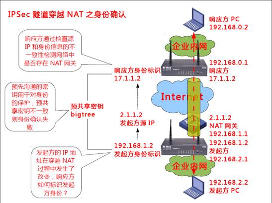
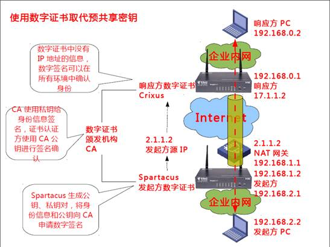
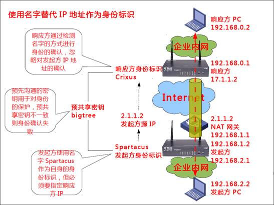
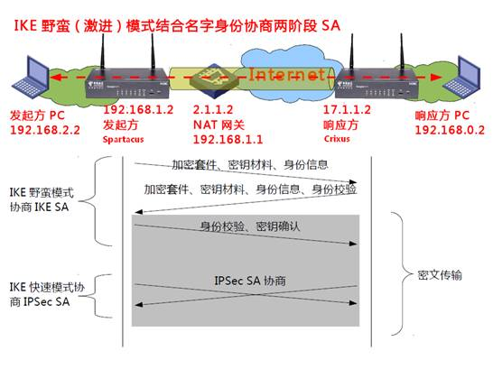
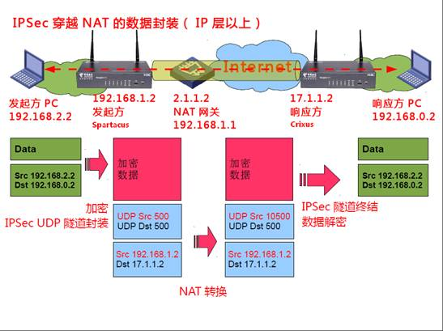

# IPSec穿越NAT

IPSec穿越NAT

2014年6月27日

17:18

**技术点详解---IPSec穿越NAT**

IPSec在NAT环境中的部署是VPN的热门难点技术之一，本专栏针对该问题进行原理性探讨，为后续VPN部署方案做下铺垫。

**IPSec VPN穿越NAT会遇到哪些问题**

IPSec VPN穿越NAT遇到的问题主要有2个：

1.   穿越NAT后的身份确认：在IP网络中IP地址是最好的身份标识，IPSec VPN中标准身份标识也是IP地址，如上图所示，从前几期专栏的介绍中我们可以得知，NAT处理过程中会改变IP地址，因此IPSec的身份确认机制必须能够适应IP地址变化；目前解决此问题的方法主要有两种，第一种是使用数字证书替代IP地址作为身份标识，第二种是使用字符串取代IP地址作为身份标识；我国内市场范围内，第二种方法更为常见，部署也更为简单，所以本期主要对第二种方法着重进行介绍。

2.   IP地址复用： 从上期专栏中，IPSec由AH和ESP两个协议组成，其中AH无法穿越NAT，ESP从理论上可以穿越NAT，但是ESP的IP协议号是50，并不是基于UDP和TCP的协议，因此当NAT网关背后存在多个ESP应用端时，无法只根据协议号进行反向映射，为了使ESP能够在NAT环境中进行地址复用，ESP必须做出改变。

**IKE身份确认及野蛮（激进）模式协商**

IPSec的身份确认最常见是通过IKE协议代劳，IKE支持的身份认证机制有两种：

1.   数字证书方式，通过CA数字证书体系确认身份，是最为安全、可靠的方式。

2.   身份标识+预共享密钥方式，通过发起方和响应方预先配置相同的密钥，如bigtree，完成双方对彼此身份的认证，这是最为常见的方式；在预共享秘密钥认证机制中，身份标识则可以分为几类：

> a)   指定IP地址，使用IP地址作为身份标识，是IKE的默认方式，响应方只允许指定IP地址发起协商，安全性比较高；
> 
> 
> b)   指定IP地址范围，这种方式依然使用IP地址作为身份标识，由于发起方必须要指定IP地址，否则无法发起协商，指定IP地址范围是响应方特性，如响应方可以指定2.0.0.0/8范围内的地址都可以发起协商，而不是只允许2.1.1.2发起协商，能够减少配置，但安全性略有下降；
> 
> c)   什么都不指定，也是使用IP地址作为身份标识，但允许任意IP地址发起协商，只要预共享密钥一致，双方就能够通过身份确认，通常适用于发起方动态获取公网地址，如PPPoE接入互联网方式，还适用于发起方众多，而响应方不想单独为每个发起方单独指定预共享密钥，这种方式虽然不是非常安全，但是可以简化配置，安全性再次下降；
> 
> d)   指定对端名字，发起方和响应方都预先配置好本端名字，使用该名字作为身份标识，与指定IP地址类似，通过指定对端名字方式，即使双方预共享密钥一致，只要对端名字不合法，立即中断协商，由于名字未与IP地址进行绑定，而且名字在网络中明文传递，估安全性不如指定IP地址方式高，但这种身份标识方式可以穿越NAT。
> 

在上图中，发起方Spartucus和响应方Crixus都是用CA颁布的数字证书作为身份标识，通过数字证书体系检验对方身份的真伪，由于数字证书中的身份信息并不包含IP地址信息，所以使用数字证书是可以轻松穿越NAT的。

在预共享密钥身份确认体系中，使用名字作为身份标识，也能穿越NAT，由于该方式不需要搭建CA服务器，在穿越NAT的应用场景中，该方式使用较广。

如果要使用名字作为身份标识，那么IKE协商就必须要使用一种特殊的协商方式——野蛮模式（Aggressive Mode）或者叫激进模式：

1.   发起方协商的第一条信息就包含身份信息，并且是明文显示，因此有身份泄露的隐患；

2.   响应方根据发起方的身份信息进行确认，并使用预共享密钥信息计算hash；

3.   发起方根据响应方的身份信息也进行hash计算，与响应方提供的hash进行比较，如果一致则身份确认通过，进行IKE SA密钥种子确认，如果不一致则双方协商结束；

4.   IKE SA协商完毕之后，利用该SA协商IPSec SA，从第三条报文开始都是加密的，但双方身份信息都使用明文传送。

在上一期专栏中，我们介绍了常规的IKE协商方式，称为主模式（Main Mode），它正常情况下需要6条报文协商出IKE SA，预共享认证方式只能使用IP地址作为身份标识；而野蛮模式只需要3条报文就能实现，预共享认证中既可以使用IP地址也可以使用名字方式作为身份标识。主模式穿越NAT只能使用数字证书认证方式。

IKE协商IPSec SA的过程称为快速模式（Quick Mode），和野蛮模式一样只需要3条报文即可协商完成，在我们的专栏中，为了介绍简便，通常只画出2条报文交互的示意。

**IPSec UDP封装穿越NAT**

从前面几期专栏的反复介绍可以得知，基于UDP、TCP的应用可以在NAT出口进行复用，不会有麻烦，那么在IPSec中是否如此呢？IPSec是一个框架协议，直接构建在IP层之上，具体协议由AH和ESP组成，ESP协议号50，AH协议号51，它们都没有类似于UDP/TCP端口号的概念，因此也就没有NAT复用标识，ESP要穿越NAT还需要想其它办法，而AH则因为保护源IP地址的关系，在NAT穿越中属于天生无法支持。

ESP穿越NAT其实很简单，通过借用UDP的方式，巧妙地实现了NAT地址复用，它使用的是UDP端口500（IKE协商协议ISAKMP所使用端口），ESP在什么时候会进行UDP封装呢？它是通过IKE协商时检测出来的：

1.   发起方Spartacus在协商报文中携带自己的WAN口IP地址信息192.168.1.2；

2.   Spartacus的协商报文经过NAT处理后其源IP地址变成了2.1.1.2；

3.   响应方Crixus接收到协商报文后发现源地址2.1.1.2和协商报文中的IP地址信息192.168.1.2不一致，即判断中间经过了NAT设备，并告知Spartacus，双方要使用UDP封装；如果Crixus没有检测到NAT转换，那么继续使用原生的非UDP封装模式。